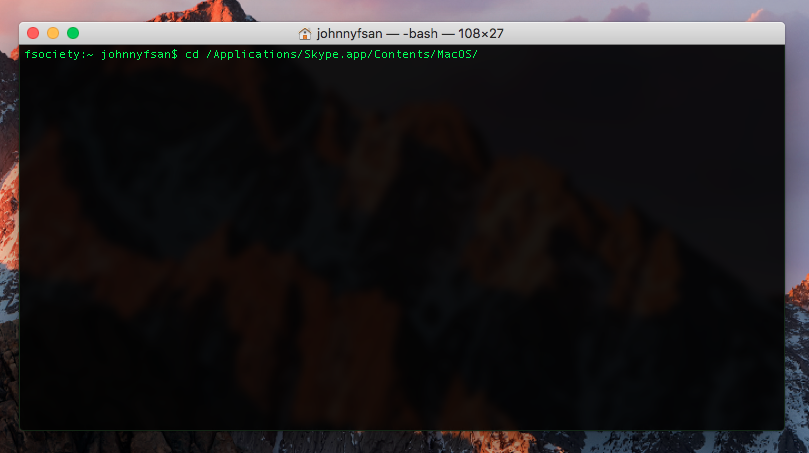
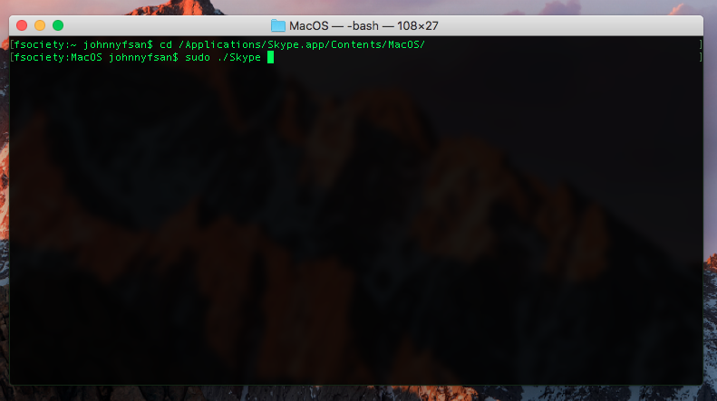
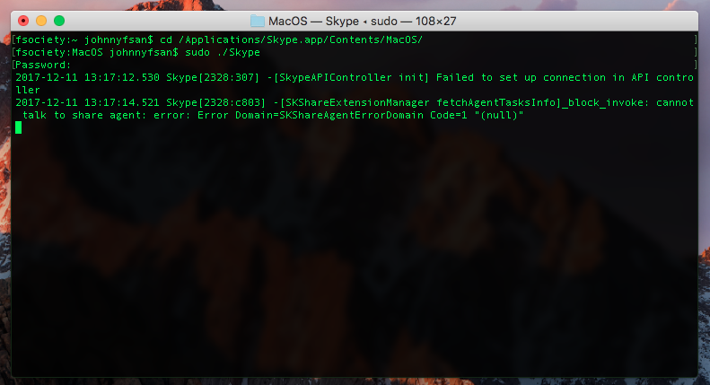
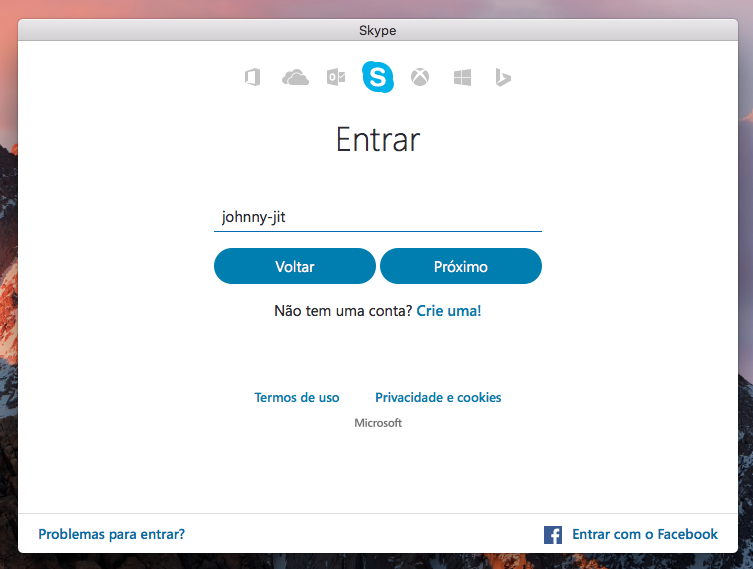
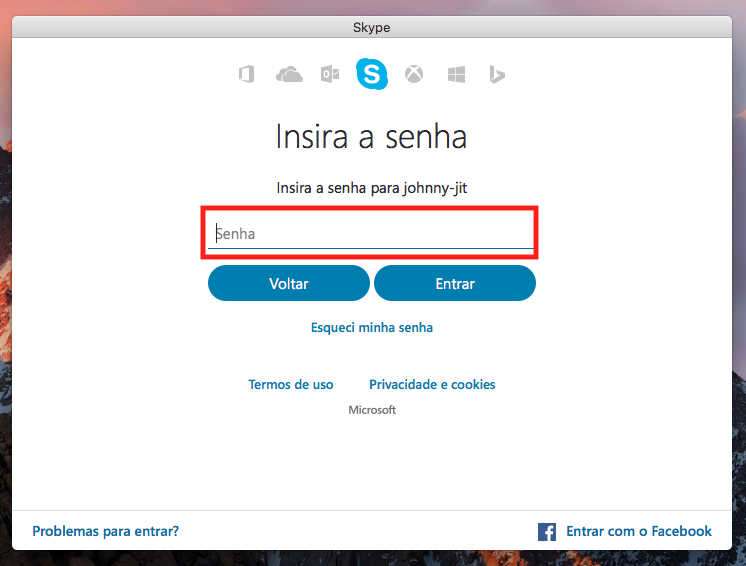
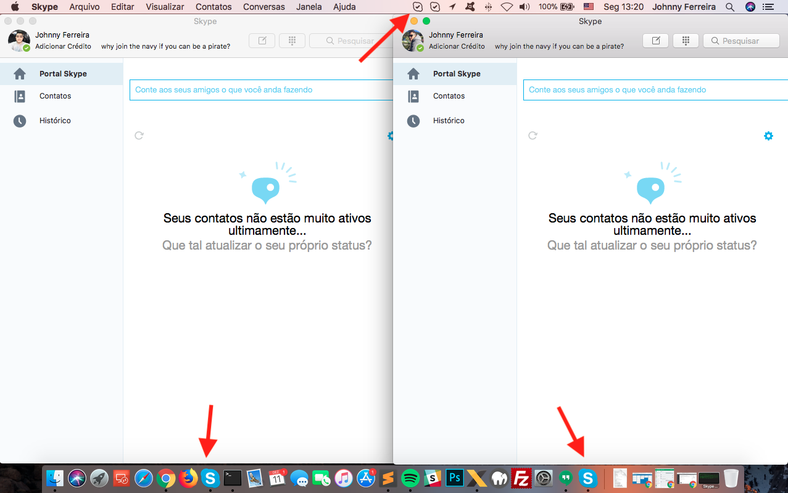

- - - - - -


Olá, tudo bem?

Se você está precisando abrir duas ou mais instancias do Skype no meu Mac OS, está no lugar certo. 😎

Antes de tudo você já tem uma conta conectada no Skype, até ai tudo bem, mas se você precisa conectar uma segunda conta, e não quer utilizar o Skype Web, porque é mais limitado e etc, faça o seguinte:

Vá até o Launchpad na dock do Mac OS X:


Digite “terminal”


No terminal digite:

```
cd /Applications/Skype.app/Contents/MacOS/
```



Em seguida digite:

```
sudo ./Skype
```



Na sequência informe a senha do seu usuário:



Informe o login da sua conta Skype:



Insira sua senha de acesso a conta Skype:



Pronto, agora temos duas instâncias do Skype para uso no Mac OS X:



Caso feche o terminal utilizado para o procedimento acima, seu Skype será encerrado.

Dúvidas, comentário e sugestões postem nos comentários…  
👋🏼 Valeu! e até a próxima!

- - - - - -

**Johnny Ferreira**  
<johnny.ferreira.santos@gmail.com>  
<http://www.tidahora.com.br>

- - - - - -