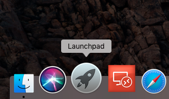
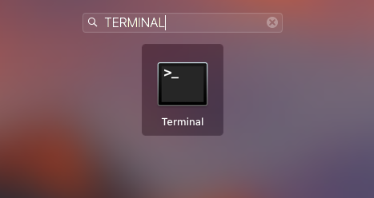
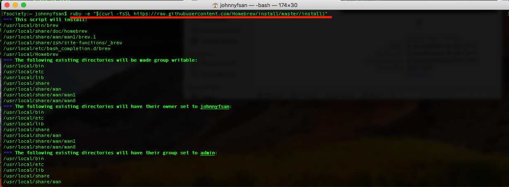
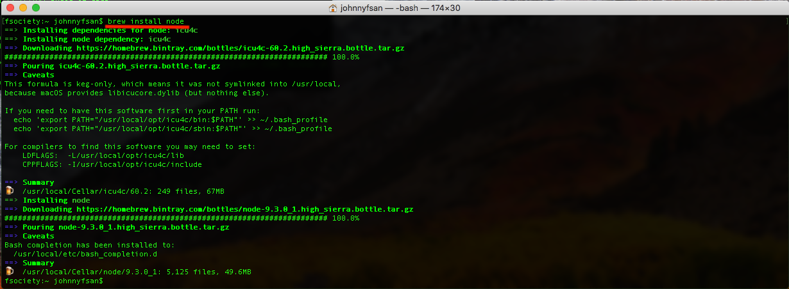
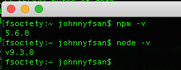

- - - - - -


Fala galera, beleza? 😎

Se você está precisando instalar uma aplicação ou app ai no seu Mac OS X, e o mesmo está dizendo que não possui o NPM instalado, seus problemas acabaram, brincadeira, não acabaram, mas vamos minimiza-lo com esse post da hora que vem pra solucionar seus problemas com o NPM.

Abra o Launchpad



Em seguida digite “terminal” e abra essa coisa linda.



No terminal, primeiro vamos baixar o *Homebrew*, veja se já possui o mesmo instalado digitando o comando “brew” no terminal, caso contrário, veja a instalação abaixo:

```
ruby -e "$(curl -fsSL https://raw.githubusercontent.com/Homebrew/install/master/install)"
```



Em seguida vamos instalar o NPM no Mac OS X.

```
brew install node
```



Verificando a versão instalada:

```
npm -v
node -v
```



Depois de instalar o “npm”, você poderá instalar sua aplicação corretamente com o “*npm”*.

Dúvidas, comentário e sugestões postem nos comentários…  
👋🏼 Até a próxima!

- - - - - -


**Johnny Ferreira**  
<johnny.ferreira.santos@gmail.com>  
<http://www.tidahora.com.br>

- - - - - -