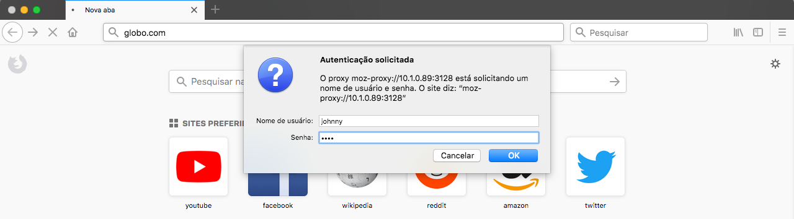
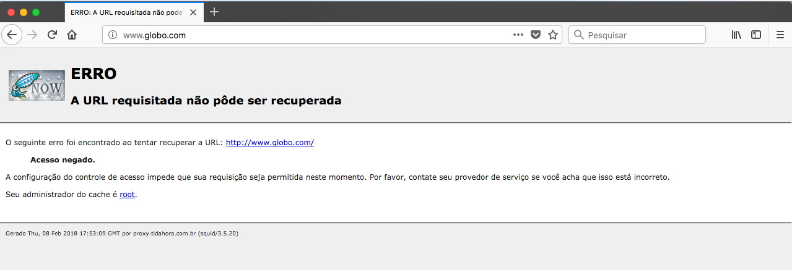
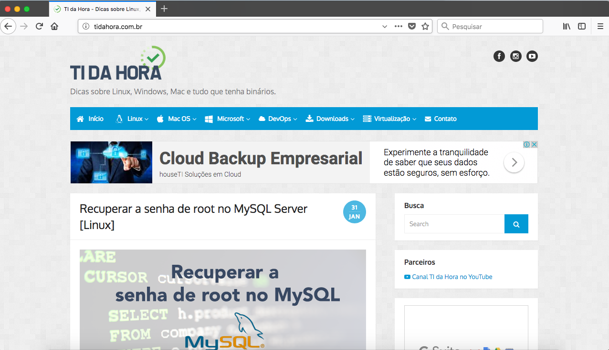

- - - - - -

Olá, como vai? 👋🏼

Em nosso post tutorial de hoje vamos abordar a instalação e configuração de um servidor Proxy com Squid no Linux CentOS 7. 🐧

#### 1. Atualizando seu sistema

É importante sempre manter o sistema atualizado, então antes de iniciarmos o processo de configuração vamos efetuar a atualização.

```bash
yum -y update
```

#### 2. Instalando o Repositório Epel

Em seguida instalamos o repositório Epel para termos uma efetividade melhor na busca de pacotes no sistema do CentOS.

```bash
yum -y install epel-release
```

#### 3. Desativando o Selinux e o FirewallD.

Para desativar o SELinux no CentOS 7, digite:

```bash
setenforce 0
```

Ajuste no arquivo de configuração do SELinux também, assim caso precise reiniciar o servidor, você não tenha que digitar novamente o comando acima.

```bash
vim /etc/selinux/config
```

e mude a linha abaixo:

```bash
SELINUX=enforcing
```

Mude para:

```bash
SELINUX=disabled
```

O próximo passo é desativar o FirewallD.

```bash
systemctl disable firewalld.service
Removed symlink /etc/systemd/system/multi-user.target.wants/firewalld.service.
Removed symlink /etc/systemd/system/dbus-org.fedoraproject.FirewallD1.service.
```

Vamos aproveitar e dar um “stop” no serviço do FirewallD que está em execução.

```bash
systemctl stop firewalld.service
```

#### 4. Instale o SQUID

Para realizar a instalação do squid é muito simples. Buscamos o pacote direto dos repositórios.

```bash
yum -y install squid
```

#### 5. Configurando o SQUID

Agora vamos efetuar as configurações do SQUID no ambiente Linux CentOS.

O primeiro passo a fazer é um backup do arquivo squid.conf.

```bash
cp -Rfa /etc/squid/squid.conf{,.bkp}
```

Agora vamos acessar o diretório de configuração do SQUID.

```bash
cd /etc/squid/
```

Vamos excluir o arquivo “squid.conf” para que possamos criar um arquivo novo e limpo.  
Só não esqueça de efetuar o backup do arquivo original conforme explicado acima.

```bash
rm -rf squid.conf
```

Na sequência criamos um novo arquivo de configuração.

Você pode optar por criar o arquivo do modo mais tradicional, utilizando o comando “touch”, ou simplesmente criar um arquivo novo diretamente com o “vi/vim”.  
Eu vou criar diretamente com o “vim”.

```bash
vim squid.conf
```

***Obs.:** Lembrando que estamos no diretório de configuração do squid “/etc/squid/”.*

Abaixo segue o conteúdo do “squid.conf” criado por [Johnny Ferreira](https://www.linkedin.com/in/johnnyferreiradossantos/) (eu mesmo 😎).


```bash
### ARQUIVO DE CONFIGURACAO DO SQUID ###

## DEFINE A PORTA DE CONEXAO DO SQUID
http_port 3128

## DEFINE O TAMANHO MAXIMO DE UM OBJETO PARA SER ARMAZENADO EM CACHE ##
maximum_object_size 4096 KB

## DEFINE O TAMANHO MINIMO DE UM OBJETO PARA SER ARMAZENADO EM CACHE ## 
minimum_object_size 0 KB

## DEFINE O TAMANHO MAXIMO DE UM OBJETO PARA SER ARMAZENADO EM CACHE DE MEMORIA ## 
maximum_object_size_in_memory 64 KB

## DEFINE A QUANTIDADE DE MEMORIA RAM A SER ALOCADA PARA CACHE ## 
cache_mem 512 MB

## AJUSTA A PERFORMANCE EM CONEXOES PIPELINE ##
pipeline_prefetch on

## CACHE DE FQDN ##
fqdncache_size 1024

## OPCOES DE REFRESH PATTERN ##
refresh_pattern ^ftp: 1440 20% 10080
refresh_pattern ^gopher: 1440 0% 1440
refresh_pattern -i (/cgi-bin/|\?) 0 0% 0
refresh_pattern . 0 20% 4320

## DEFINE A PORCENTAGEM DO USO DO CACHE ## 
cache_swap_low 90
cache_swap_high 95

## ARQUIVO DE LOGS DO SQUID ## 
access_log /var/log/squid/access.log squid
cache_log /var/log/squid/cache.log
cache_store_log /var/log/squid/store.log

## DEFINE O LOCAL DO CACHE ##
cache_dir ufs /var/spool/squid 1600 16 256

## CONTROLE DE ROTACAO DOS ARQUIVOS DE LOGS ##
logfile_rotate 10

## ARQUIVO ONDE CONTEM OS ENDERECOS LOCAIS DA REDE ##
hosts_file /etc/hosts

## ACLS - PORTAS PADROES LIBERADAS ##
acl SSL_ports port 80 #HTTP
acl SSL_ports port 443 #HTTPS
acl Safe_ports port 80 # http
acl Safe_ports port 21 # ftp
acl Safe_ports port 443 # https
acl Safe_ports port 70 # gopher
acl Safe_ports port 210 # wais
acl Safe_ports port 1025-65535 # unregistered ports
acl Safe_ports port 280 # http-mgmt
acl Safe_ports port 488 # gss-http
acl Safe_ports port 591 # filemaker
acl Safe_ports port 777 # multiling http
acl CONNECT method CONNECT

### DEFININDO MODO DE AUTENTICACAO
auth_param basic program /usr/lib64/squid/basic_ncsa_auth /etc/squid/usuarios
auth_param basic children 5
auth_param basic realm "DIGITE SEU USUARIO E SENHA PARA ACESSO A INTERNET:"
auth_param basic credentialsttl 2 hours
auth_param basic casesensitive off

### ACL PARA GARANTIR A AUTENTICACAO DO USUARIO NOS SITES ###
acl autenticados proxy_auth REQUIRED

## BLOQUEIA O ACESSO UNSAFE PORTS ##
http_access deny !Safe_ports

## Deny CONNECT to other than secure SSL port ##
http_access deny CONNECT !SSL_ports

## SITES BLOQUEADOS PARA ACESSO ##
acl sites-bloqueados url_regex -i "/etc/squid/regras/sites_bloqueados"

## SITES LIBERADOS PARA ACESSO ##
acl sites-liberados url_regex -i "/etc/squid/regras/sites_liberados"

## DEFININDO A ORDEM DAS REGRAS - ACLS ##
http_access deny sites-bloqueados
http_access allow sites-liberados
http_access allow autenticados
http_access deny all
http_reply_access allow all
icp_access allow all
miss_access allow all

## NOME QUE IRA APARECER NA TELA DE ERRO OU BLOQUEIO DO SQUID ##
visible_hostname proxy.tidahora.com.br

## DIRETORIO DAS PAGINAS DE ERROS ##
error_directory /usr/share/squid/errors/pt-br

## OUTRAS OPCOES DE CACHE ##
cache_effective_user squid
coredump_dir /var/spool/squid
```

Após salvar o arquivo (Se você utilizou o vi/vim para salvar e sair do arquivo utilize: ESC + as teclas :wq)

O próximo passo é criar um diretório para armazenar as regras, ou seja, as ACL’s do nosso squid.

```bash
mkdir /etc/squid/regras
```

Se você leu o “squid.conf” notou que temos duas ACL’s prontas na configuração.

ACL para sites bloqueados =&gt; /etc/squid/regras/sites\_bloqueados 🚫  
ACL para sites liberados =&gt; /etc/squid/regras/sites\_liberados ✅

Vamos criar esses arquivos dentro do diretório de regras.

```bash
touch /etc/squid/regras/sites_bloqueados
touch /etc/squid/regras/sites_liberados
```

Vamos colocar alguns sites na lista de bloqueados.

```bash
echo ".tidahora." >> /etc/squid/regras/sites_liberados
echo ".uol." >> /etc/squid/regras/sites_liberados
echo ".terra." >> /etc/squid/regras/sites_liberados
```

Veja o conteúdo do arquivo:

```bash
cat sites_liberados 
.tidahora.
.uol.
.terra.
```

O mesmo procedimento vamos estar efetuando para os sites\_bloqueados.

```bash
echo ".globo." >> /etc/squid/regras/sites_bloqueados
echo ".baixaki." >> /etc/squid/regras/sites_bloqueados
echo ".mercadolivre." >> /etc/squid/regras/sites_bloqueados
```

Veja o conteúdo do arquivo de sites bloqueados.

```bash
cat sites_bloqueados 
.globo.
.baixaki.
.mercadolivre.
```

Note que utilizei o formato “.site.” o ponto antes da palavra pega qualquer sub-domínio do site, e o mesmo após o domínio pega qualquer sub-página por exemplo.

Vamos ajustar a permissão na pasta “regras” para o squid.

```bash
chown -Rf squid:squid /etc/squid/regras/
```

#### 6. Configurando a Autenticação Local

No squid teremos a autenticação local, ou seja, teremos um arquivo responsável por armazenar os logins e senhas dos usuários.

Para criar esse arquivo vamos precisar instalar o Apache2 no CentOS, vamos utilizar um complemento do Apache2 chamado “htpasswd”.

```bash
yum -y install httpd
```

Não é necessário nem iniciar o serviço do Apache, vamos criar o arquivo de logins e senhas.

Criando os usuários com o comando “htpasswd”

Utilize o comando abaixo, somente pela primeira vez, para criar o arquivo:

O parâmetro “-c” na linha abaixo indica que o comando crie o arquivo e em seguida o usuário informado.

```bash
htpasswd -c /etc/squid/usuarios johnny
```

Para os demais usuários utilize:

```bash
htpasswd /etc/squid/usuarios j.ferreira
```

Analisando o arquivo criado:

```bash
cat /etc/squid/usuarios 
johnny:$apr1$bkV/Ho2E$lTFiX31f.GUPnXHbOUuqd.
j.ferreira:$apr1$wuTx5YlN$EbVodnSgzKdrFpYANo7I21
```

#### 7. Iniciando o SQUID

Agora vamos criar o diretório de cache do squid.

```bash
squid -z
```

Em seguida iniciamos o serviço do Squid.

```bash
systemctl start squid
```

Verificando o status no sistema:

```bash
systemctl status squid
● squid.service - Squid caching proxy
   Loaded: loaded (/usr/lib/systemd/system/squid.service; disabled; vendor preset: disabled)
   Active: active (running) since Wed 2018-02-07 17:55:34 -02; 34s ago
  Process: 1552 ExecStart=/usr/sbin/squid $SQUID_OPTS -f $SQUID_CONF (code=exited, status=0/SUCCESS)
  Process: 1546 ExecStartPre=/usr/libexec/squid/cache_swap.sh (code=exited, status=0/SUCCESS)
 Main PID: 1554 (squid)
   CGroup: /system.slice/squid.service
           ├─1554 /usr/sbin/squid -f /etc/squid/squid.conf
           ├─1556 (squid-1) -f /etc/squid/squid.conf
           └─1557 (unlinkd)

Feb 07 17:55:34 centos7 systemd[1]: Starting Squid caching proxy...
Feb 07 17:55:34 centos7 squid[1554]: Squid Parent: will start 1 kids
Feb 07 17:55:34 centos7 squid[1554]: Squid Parent: (squid-1) process 1556 started
Feb 07 17:55:34 centos7 systemd[1]: Started Squid caching proxy.
```

Vamos deixar o squid configurado para iniciar junto ao boot do sistema linux.

```bash
systemctl enable squid
```

#### 8. Testando o funcionamento do SQUID

Para testar o servidor Squid insira o IP e porta nas configurações de proxy do navegador, não irei abordar essa configuração nesse tutorial.

Visite um site na lista de bloqueados, globo.com por exemplo, veja o resultado abaixo:

Digite o login e senha de acesso criado nos passos 6.



Acessando o site ***globo.com*** que está na lista de bloqueados.



Acompanhe os logs de acessos.

```bash
# tail -f /var/log/squid/access.log 
1518112609.039      1 10.1.2.44 TCP_DENIED/403 5904 GET http://www.globo.com/ - HIER_NONE/- text/html
```

Veja nos logs que o acesso foi negado pelo SQUID, TCP\_DENIED/403 no domínio na lista de proibidos.

Agora podemos acessar um site que não está na lista de bloqueados, por exemplo ***[tidahora.com.br](http://www.tidahora.com.br) 😎***



Lembrando que a configuração do SQUID é basicamente toda em cima de ACL, entendendo o funcionamento e a ordem de como utilizar corretamente as ACL no SQUID é possível bloquear downloads, liberar ou bloquear usuários ou endereços IPs e muito mais.

Esse tutorial tem como objetivo auxiliar profissionais que estão a iniciar sua jornada no mundo Linux com gerenciamento de serviços de redes.

Espero ter ajudado você de alguma forma, caso tenha dúvida comenta ai que estamos sempre pronto a ajudar.

Dúvidas, comentário e sugestões postem nos comentários…  
👋🏼 Valeu! e até a próxima!

- - - - - -


**Johnny Ferreira**  
<johnny.ferreira.santos@gmail.com>  
<http://www.tidahora.com.br>

- - - - - -