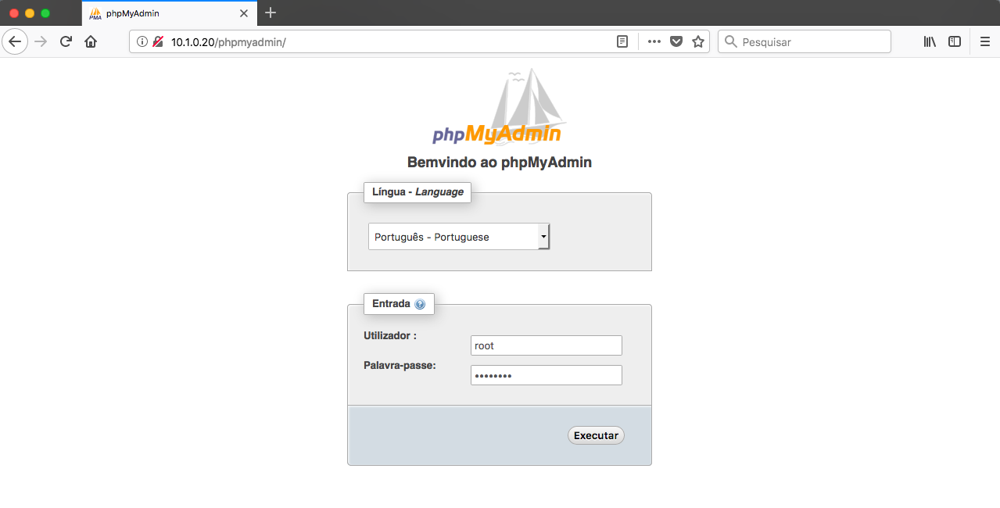
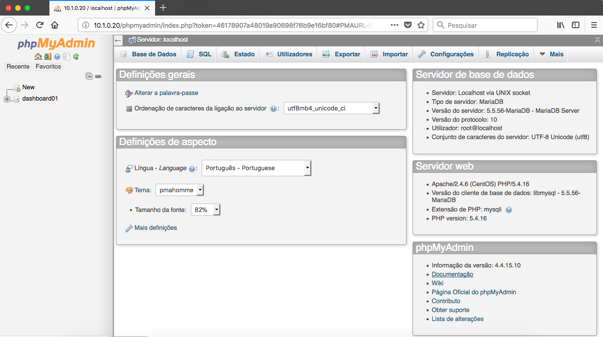

- - - - - -

Olá, como vai? 🐧  
Uma dica rápida e fácil para quem precisa instalar o phpMyAdmin no CentOS 7, porque gerenciar o MySQL Server pelo phpMyAdmin é muito mais simples e rápido de executar determinadas rotinas no banco de dados. 🐬

Então veja abaixo de maneira bem objetiva como instalar e configurar o phpMyAdmin no Linux CentOS 7.

#### 1. Instale o repositório EPEL

```
yum -y install epel-release
```

Na sequência atualize seu sistema, para validar as alterações com o novo repositório.

```
yum -y update
```

#### 2. Instale o phpMyAdmin

Para instalar o phpMyAdmin no CentOS 7, é mais simples que parece. 😎

```
yum -y install phpMyAdmin.noarch
```

#### 3. Configurando o Acesso ao phpMyAdmin

Para obter acesso ao phpMyAdmin é necessário ajustar sua rede local no arquivo de configuração do phpMyAdmin, que fica localizado no diretório do Apache.

Abra o arquivo “/etc/httpd/conf.d/phpMyAdmin.conf” com o editor de textos de sua preferência.

```
vim /etc/httpd/conf.d/phpMyAdmin.conf
```

Agora vamos ajustar as linhas abaixo:

**Require ip  
Allow from**

O arquivo padrão vem da seguinte maneira:

```
Alias /phpMyAdmin /usr/share/phpMyAdmin
Alias /phpmyadmin /usr/share/phpMyAdmin

<Directory /usr/share/phpMyAdmin/>
   AddDefaultCharset UTF-8

   <IfModule mod_authz_core.c>
     # Apache 2.4
     <RequireAny>
       Require ip 127.0.0.1 
       Require ip ::1
     </RequireAny>
   </IfModule>
   <IfModule !mod_authz_core.c>
     # Apache 2.2
     Order Deny,Allow
     Deny from All
     Allow from 127.0.0.1 
     Allow from ::1
   </IfModule>
</Directory>
```

Nós precisamos inserir o endereço da nossa rede local nesse arquivo, nas linhas mencionadas acima.

No meu caso, a minha rede local é 10.1.0.0/16, vou ajustar meu arquivo com base na minha rede, você ajusta para sua rede local ou endereço IP que irá obter o acesso.

```
Alias /phpMyAdmin /usr/share/phpMyAdmin
Alias /phpmyadmin /usr/share/phpMyAdmin

<Directory /usr/share/phpMyAdmin/>
   AddDefaultCharset UTF-8

   <IfModule mod_authz_core.c>
     # Apache 2.4
     <RequireAny>
       Require ip 127.0.0.1 10.1.0.0/16
       Require ip ::1
     </RequireAny>
   </IfModule>
   <IfModule !mod_authz_core.c>
     # Apache 2.2
     Order Deny,Allow
     Deny from All
     Allow from 127.0.0.1 10.1.0.0/16
     Allow from ::1
   </IfModule>
</Directory>
```

Após ajustar o arquivo, salve o mesmo e reinicie o Apache.

```
systemctl restart httpd
```

#### 4. Acessando o phpMyAdmin

Feito isso você poderá acessa-lo pelo navegador =&gt; http://enderecoip/phpMyAdmin

Insira o login e senha de root do MySQL.





Pronto, phpMyAdmin instalado e configurado para acesso a sua rede local! 😄

Dúvidas, comentário e sugestões postem nos comentários…  
👋🏼 Valeu! e até a próxima!

- - - - - -

**Johnny Ferreira**  
<johnny.ferreira.santos@gmail.com>  
<http://www.tidahora.com.br>

- - - - - -