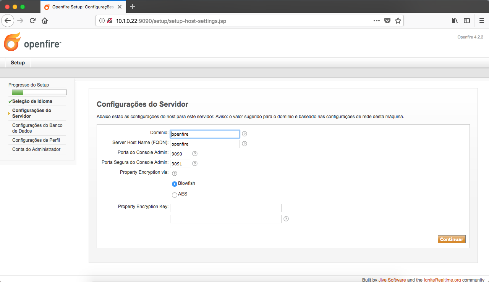
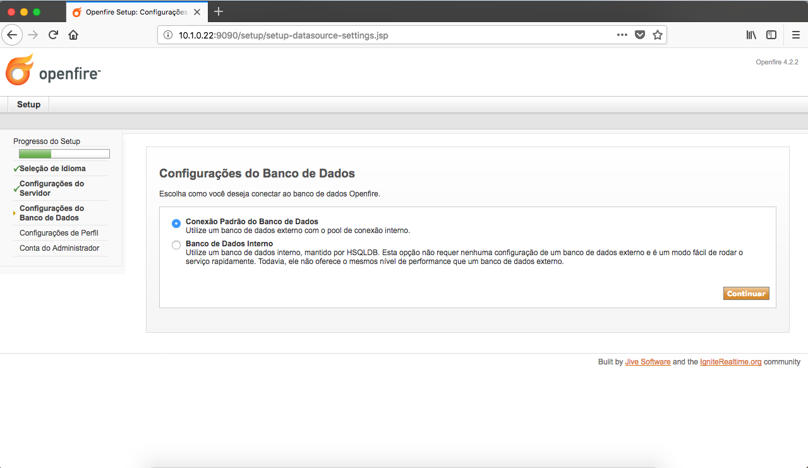
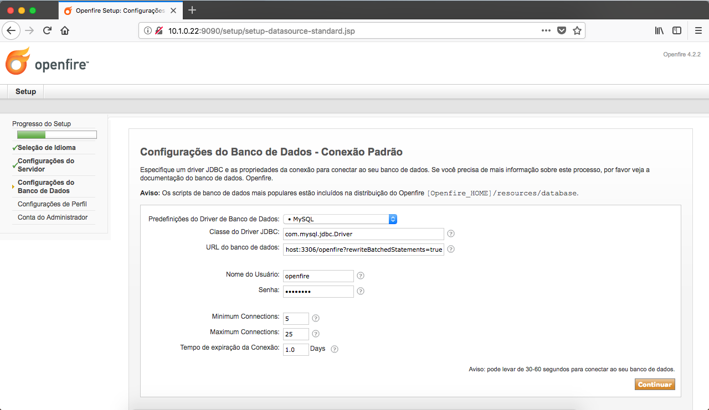
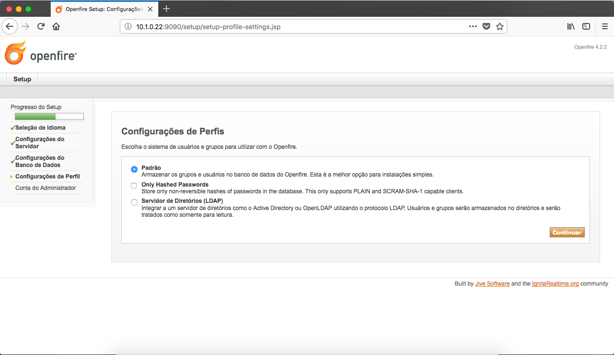
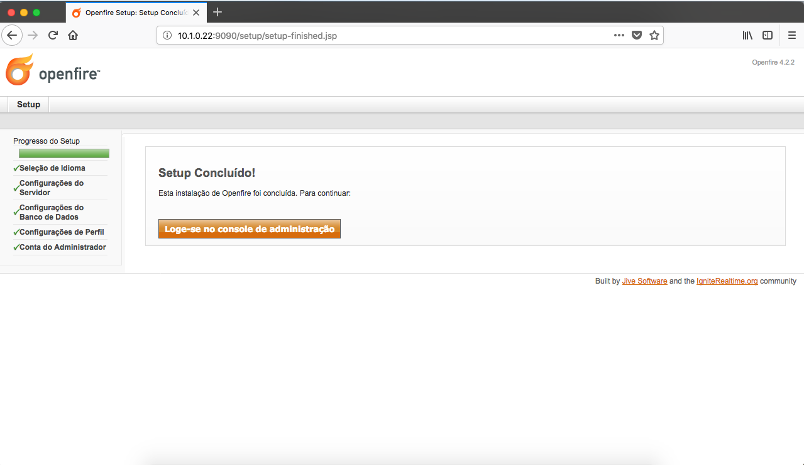
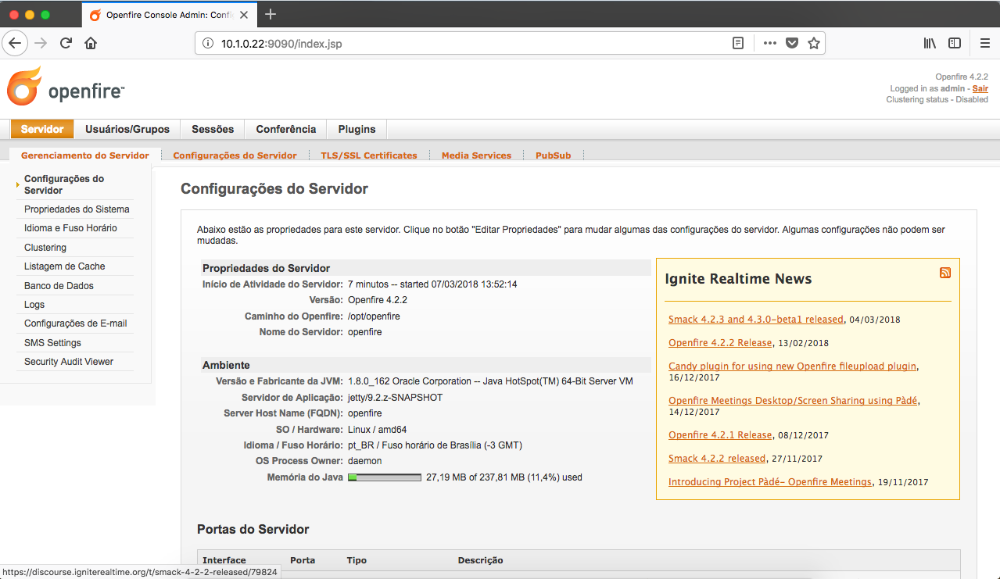

- - - - - -


Olá 🤓, como vai? Hoje estarei abordando a instalação do **Openfire 🔥** no **Linux CentOS 7**.

**Openfire** é uma ferramenta de comunicação instantânea, baseada no protocolo **XMPP**, o **Openfire** está licenciado sob a licença **Open Source** Apache.  
Uma ferramenta incrível para ser utilizados em empresas de todos os portes, sendo possível realizar integração com servidores Active Directory ou Ldap, ter auditoria de conversas por questões de compliance e muito mais.

**Site Oficial:**[ http://www.igniterealtime.org/projects/openfire/index.jsp](http://www.igniterealtime.org/projects/openfire/index.jsp)

Após instalar o CentOS 7, o primeiro passo é atualizar o seu ambiente.

```
yum -y update
```

Após a atualização do ambiente, vamos instalar dois pacotes necessários para o gerenciamento do servidor.

```
yum -y install vim wget
```

Agora vamos instalar o pacote “glibc” em nosso ambiente.

```
yum -y install glibc
```

Vamos efetuar o download do Openfire:

```
cd /root
wget https://www.igniterealtime.org/downloadServlet?filename=openfire/openfire-4.2.2-1.x86_64.rpm
```

Caso o link acima não funcione, visite o site oficial e busque pela versão atual.  
Site oficial: <https://www.igniterealtime.org/projects/openfire/>

Após o download finalizar, vamos instalar o arquivo .rpm baixado.

```
yum -y install *.rpm
```

Iniciando o serviço e ajustando sua inicialização.

```
chkconfig openfire on
systemctl start openfire.service
```

Liberando as portas 5222 e 5333 no FirewallD, essas portas são responsáveis pela comunicação do protocolo XMPP, e as portas 9090 e 9091 são de uso para o gerenciamento web do Openfire.

```
firewall-cmd --permanent --zone=public --add-port=5222/tcp
firewall-cmd --permanent --zone=public --add-port=5223/tcp
firewall-cmd --permanent --zone=public --add-port=9090/tcp
firewall-cmd --permanent --zone=public --add-port=9091/tcp
firewall-cmd --reload
```

#### Instalando o MySQL Server (MariaDB)

Vamos armazenar as informações do Openfire no MySQL Server, para isso vamos instalar e criar a database e o usuário para prosseguir com a instalação da ferramenta.

```
yum -y install mariadb-server
```

Iniciando o serviço e ajustando sua inicialização.

```
systemctl start mariadb.service
systemctl enable mariadb
```

Ajustes iniciais no MySQL, defina a senha de root, remova usuários anonimo e base de testes.

```
/usr/bin/mysql_secure_installation
```

Criando a base de dados e o usuario:

```
mysql -u root -p
CREATE DATABASE openfire;
CREATE USER 'openfire'@'localhost' IDENTIFIED BY 'password';
GRANT ALL PRIVILEGES ON openfire.* TO 'openfire'@'localhost';
FLUSH PRIVILEGES;
quit
```

#### Instalando o Openfire via Web

Após realizarmos a instalação do Openfire e do banco de dados, vamos dar andamento na instalação via web, acesse pelo navegador o endereço IP do seu servidor Openfire, seguido da porta 9090, por exemplo: http://10.1.0.22:9090

Após acessar o endereço IP, será redirecionado a página de instalação do Openfire.

Selecione o Idioma da ferramenta.

[](../assets/img/uploads/2018/03/openfire-1.png)

Insira as informações de domínio e hostname do servidor.

[](../assets/img/uploads/2018/03/openfire-2.png)

Selecione a opção “Conexão Padrão do Banco de Dados”.

[](../assets/img/uploads/2018/03/openfire-3.png)

Insira as informações de banco de dados, o banco de dados que criamos no procedimento anterior.

[](../assets/img/uploads/2018/03/openfire-4.png)

Configuração de Usuários, aqui nessa parte você já pode integrar com seu servidor AD / LDAP por exemplo, vamos utilizar a opção Padrão.

[](../assets/img/uploads/2018/03/openfire-5.png)

Um passo muito importante é sobre a conta do Administrador.  
Insira um e-mail e uma senha para o usuário administrador.

[](../assets/img/uploads/2018/03/openfire-6.png)

Agora nosso Openfire já está pronto para operar, clique em “Logue-se no console de administração”.

[](../assets/img/uploads/2018/03/openfire-7.png)

Dashboard inicial do Openfire.

[](../assets/img/uploads/2018/03/openfire-8.png)

Agora você pode configurar seus usuários e grupos, instalar plugins, e muito mais.

Abaixo segue uma lista de clientes Jabber que funcionam perfeitamente com o Openfire.

- [Spark](https://www.igniterealtime.org/downloads/index.jsp)
- [Pidgin](https://pidgin.im/)
- [Pandion](https://sourceforge.net/projects/pandion/)
- [Adium](https://adium.im/)


Dúvidas, comentário e sugestões postem nos comentários…  
👋🏼 Valeu! e até a próxima!

- - - - - -

**Johnny Ferreira**  
<johnny.ferreira.santos@gmail.com>  
<http://www.tidahora.com.br>

- - - - - -