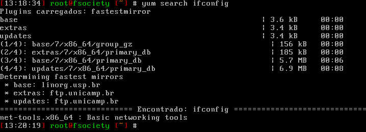
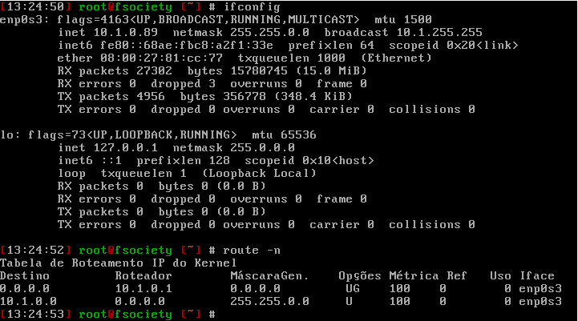

- - - - - -

Fala galera, beleza? 😎

Essa dica é para quem está iniciando no CentOS 7 e está acostumado a utilizar o comando ifconfig, presente nas versões anteriores da distribuição CentOS.

Ao realizar a instalação, notei que o comando IFCONFIG no CentOS 7 não estava disponível, encontrei uma certa dificuldade ao consultar o endereço IP atribuído para a interface de rede. Ao buscar pelo comando ifconfig e route o linux retornava com o seguinte erro:


A primeira coisa que fiz foi procurar nos repositórios oficiais do CentOS 7 o comando ifconfig, para ver o que ele me retornava.

Fazendo uma simples pesquisa com o comando yum search ifconfig obtive a informação do pacote net-tools.



```
yum -y install net-tools
```


Após a instalação já é possível fazer o uso do comando ifconfig e route.




Dúvidas, comentário e sugestões postem nos comentários…  
👋🏼 Até a próxima!

- - - - - -

**Johnny Ferreira**  
<johnny.ferreira.santos@gmail.com>  
<http://www.tidahora.com.br>

- - - - - -
