- - - - - -

Opa, tudo bem? 😎 Hoje vamos ver como estar Instalando o NxFilter no Linux CentOS 7, uma solução de filtro de conteúdo que compete diretamente com o serviço de Proxy Squid.  
O NxFilter realiza o controle e o filtro de acessos a internet baseado no serviço de DNS, possui uma interface web bem amigável e simples de gerenciar. Além de possuir um portal de documentação bem completo.

**Documentação do NxFilter:** [http://docs.nxfilter.net.br/pt\_BR/latest/index.html](http://docs.nxfilter.net.br/pt_BR/latest/index.html)

Além de possuir ótima integração com serviço de Ldap e Active Directory, o NxFilter é uma aplicação leve e que pode ser uma ótima alternativa para empresas que desejam melhorar a segurança interna, aplicando um controle e filtro de conteúdo nos computadores da rede local.

Vou abordar aqui a instalação da ferramenta no Linux CentOS 7.

Primeiro vamos atualizar o ambiente do Linux.

```
yum -y update
```

Em seguida vamos instalar o repositório Epel.

```
yum -y install epel-release
```

Atualizando novamente, agora com o epel instalando, em seguida limpamos o diretório de cache de yum.

```
yum -y update && yum clean all
```

Instalando o editor de texto “vim”, caso você utilize outro editor como nano por exemplo, fique a vontade para instalar o seu preferido.

```
yum -y install vim
```

Agora, vamos desativar o FirewallD e o SELinux do servidor que irá hospedar nossa aplicação do NxFilter.

```
systemctl disable firewalld
```

Abra o arquivo de configuração do SELinux com o editor de texto de sua preferência, aqui estamos com o “vim”.

```
vim /etc/selinux/config
```

Altere a linha abaixo:

```
SELINUX=enforcing
```

para

```
SELINUX=disabled
```

Em seguida vamos reiniciar o host.

```
reboot
```

Agora que o host já foi reiniciado com as configurações que aplicamos, vamos instalar o java e o wget para dar andamento na configuração do serviço do NxFilter.

```
yum -y install java-openjdk wget
```

Agora vamos fazer o download do NxFilter, a versão que estarei utilizando nesse tutorial é a 4.2.6.

Acesse o diretório /tmp para baixar o fonte do NxFilter.

```
cd /tmp
```

```
wget https://bitbucket.org/DeepWoods/nxfilter-rpms/raw/1ea46299bd0c237be2d99dc60b514769795292c1/nxfilter-4.2.6-0.noarch.rpm
```

Instalando o NxFilter…

```
rpm -Uvh nxfilter-4.2.6-0.noarch.rpm
```

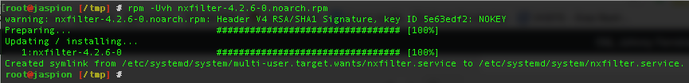

Configurando o serviço para inicializar junto ao boot do sistema.

```
systemctl enable nxfilter
```

Iniciando o NxFilter.

```
systemctl start nxfilter
```

Verifique se o serviço encontra-se ativo e rodando corretamente.

```
systemctl status nxfilter
```

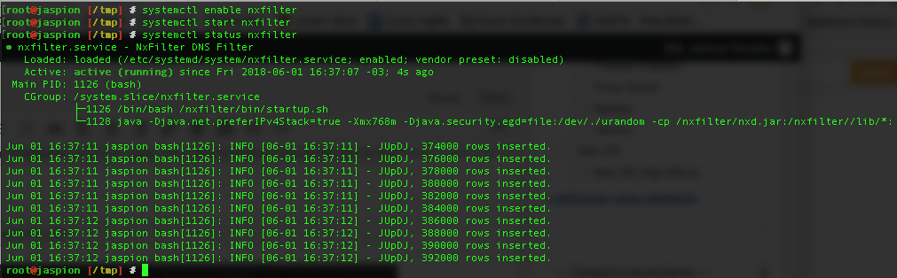

Em seguida vamos acessa-lo via web.

*http://seu\_endereco\_ip\_local/admin  
**Login:** admin  
**Senha:** admin*

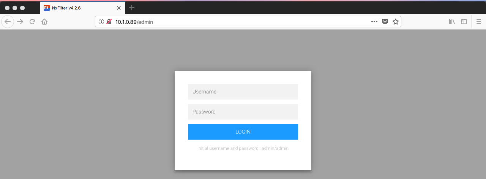

Dashboard inicial após o Login.

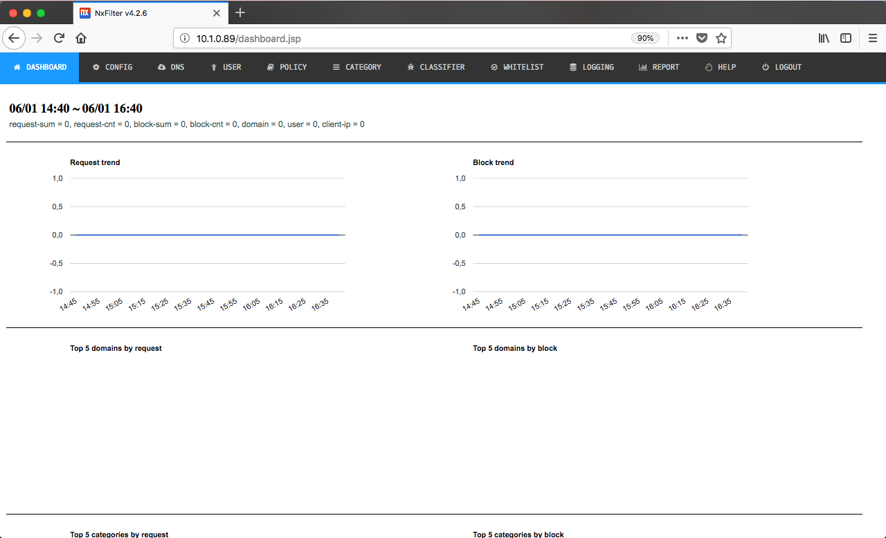

Vamos iniciar a configuração do NxFilter, acesso no menu principal superior a opção **Config** em seguida **Setup**.

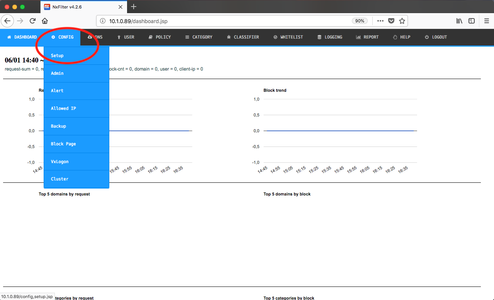

Em seguida vamos habilitar a autenticação, para podermos ter mapeados os acessos de cada usuário na rede local, após marcar a opção **Enable Authentication** clique em **Submit** para enviar as configurações.

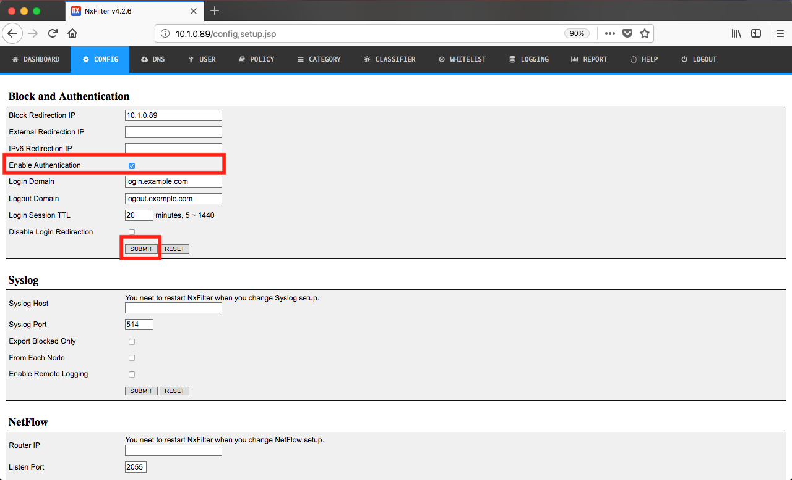

O próximo passo é a criação de usuário, acesso no menu superior, a opção **User**.

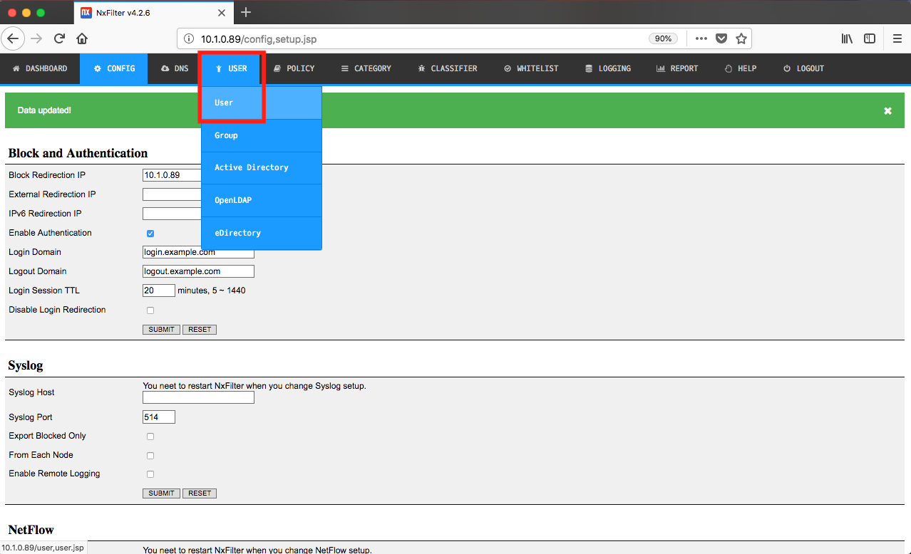

Agora vamos cadastrar um usuário para testes, preencha o nome do usuário e clique em “**Submit**“.

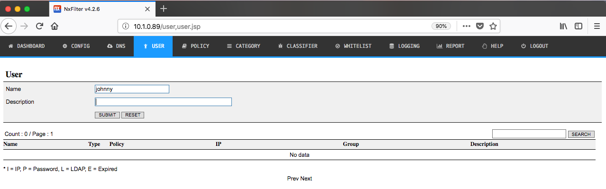

Vamos definir a senha para o usuário criado, clique em **Edit** no canto direito da tela.

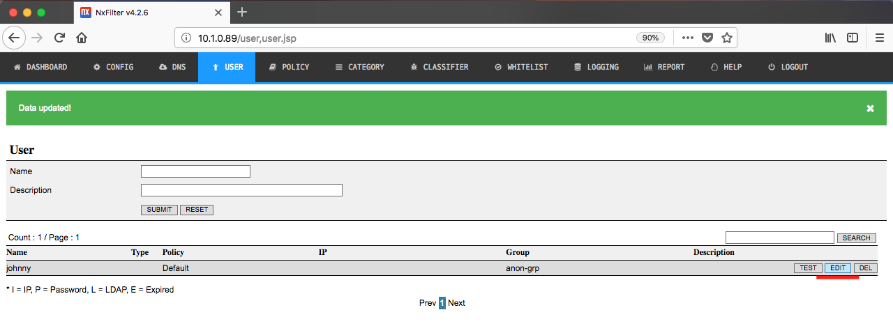

Defina uma senha para o usuário e clique em **Submit**.

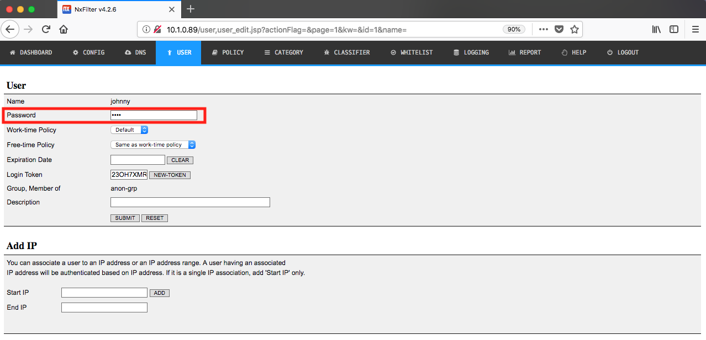

Agora que já temos o usuário cadastrado, a politica e o grupo que ele pertence estão como as padrões da ferramenta. Ainda não iremos ajustar esses pontos no momento.

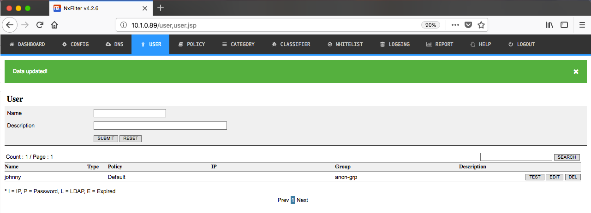

Para que o filtro funcione, ajuste o endereço IP do NxFilter nos computadores da rede local.

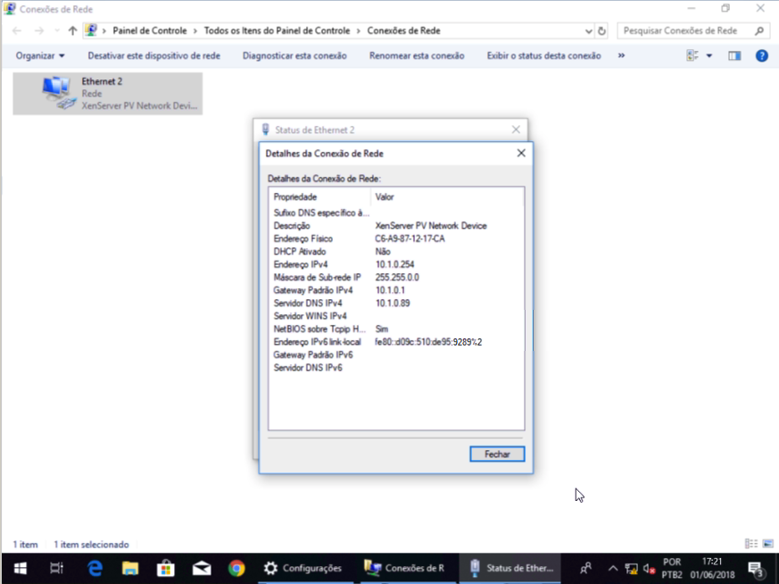

Agora abra o seu navegador, e o acesso já tera solicitado a autenticação para continuar navegando.

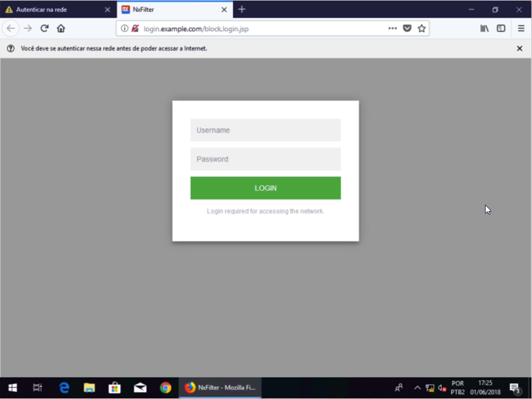

Informe o login e senha do usuário.

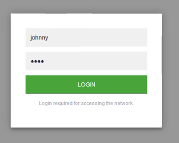

Em seguida, após digitar login e senha, seu acesso já foi registrado e liberado para acesso, basta abrir uma nova aba ou fechar e abrir novamente o navegador.

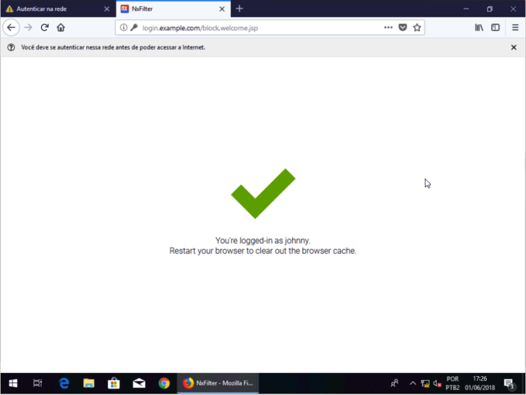

Acesso liberado 🙂

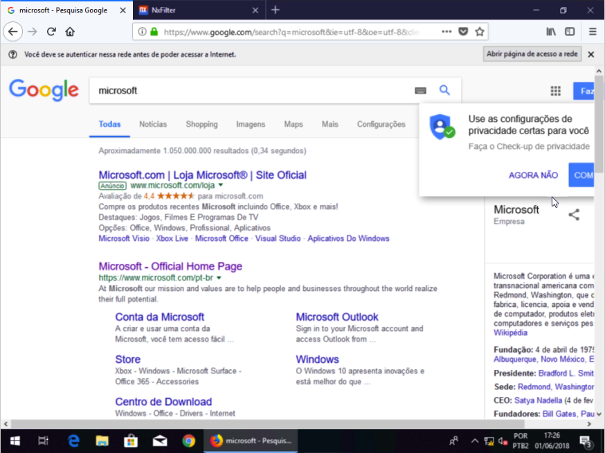

Agora bloquear algumas categorias na Política padrão do NxFilter.

Acesse o menu superior e clique em **POLICY**

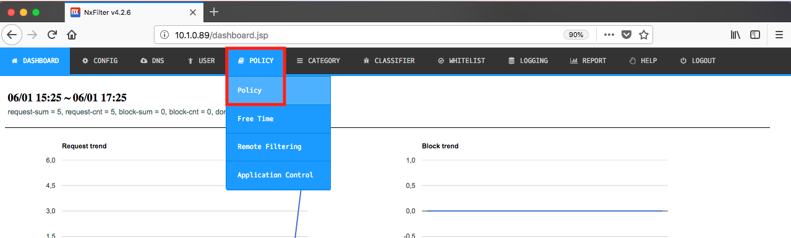

Clique em **EDIT**

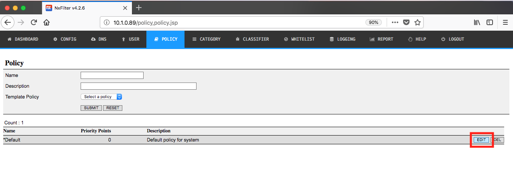

Agora vamos selecionar algumas categorias para testar o bloqueio da ferramenta NxFilter, e clique em **Submit** na sessão de bloqueio de categorias.


Agora vamos testar o bloqueio no cliente Windows que configuramos.

Acessando sites que contenham a categoria de Webmail.

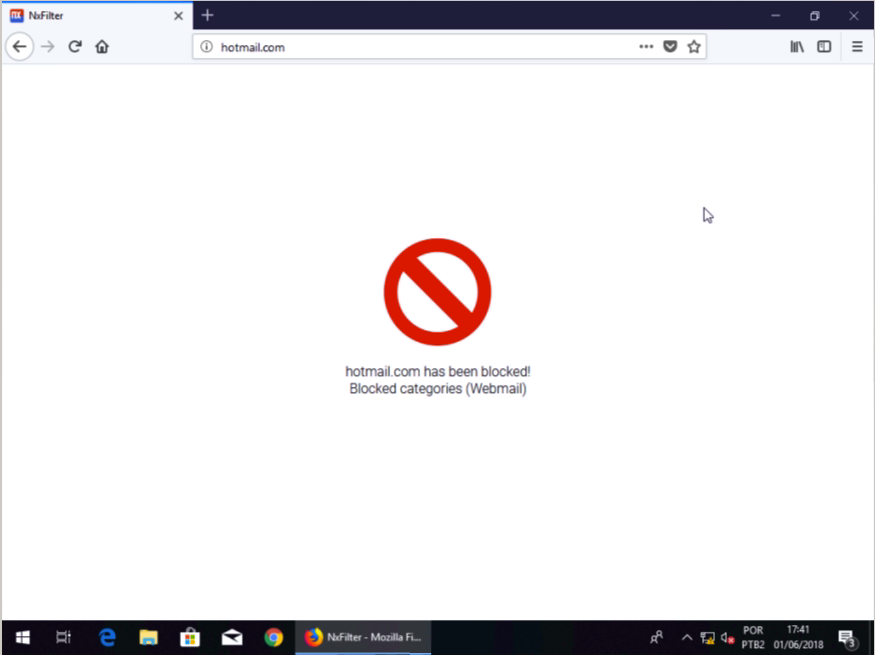

Acessando sites com conteúdo proibido. 😈

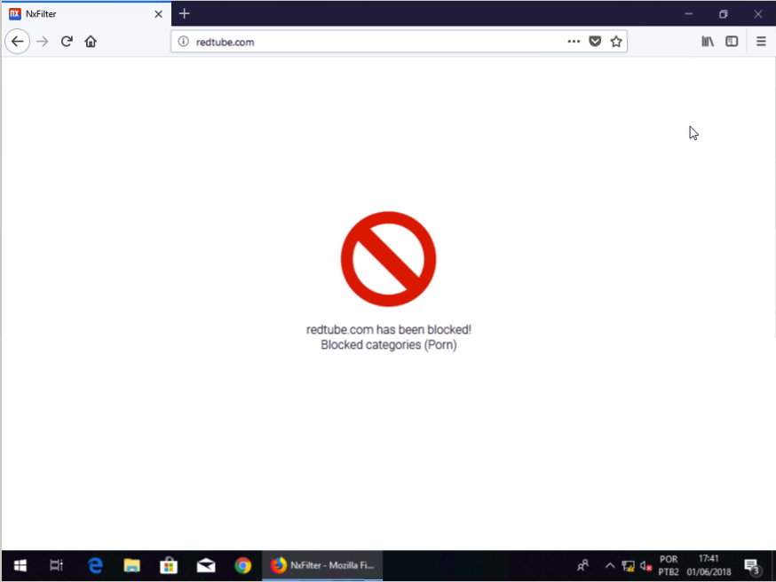

Para ver os logs de acessos, basta acessar no menu superior, a opção **Logging.**

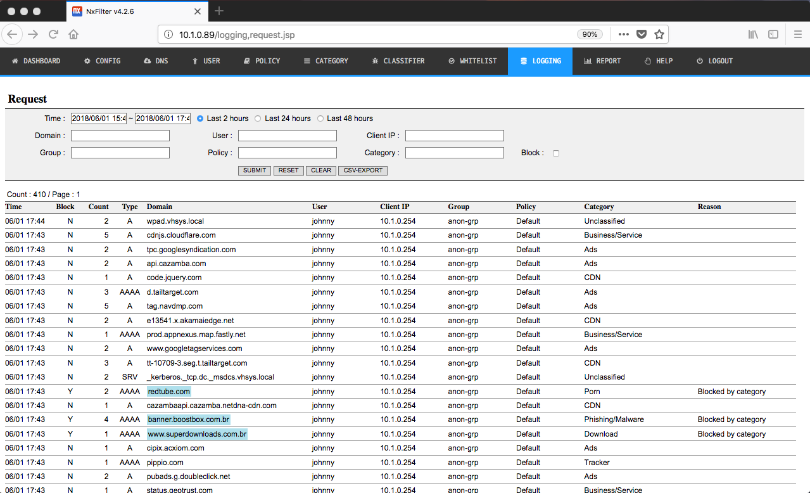

**Note que os sites bloqueados ele marca em azul claro para facilitar a localização e mostra por qual categoria ele foi bloqueado.**

Podemos notar que o NxFilter é uma ótima opção para empresas que buscam melhorar sua segurança corporativa, de uma maneira simples e fácil de gerenciar.

Dúvidas, comentário e sugestões postem nos comentários…  
👋🏼 Valeu! e até a próxima!


- - - - - -


**Johnny Ferreira**  
<johnny.ferreira.santos@gmail.com>  
<http://www.tidahora.com.br>