- - - - - -

Opa, tudo bem? 😀  
Hoje vamos implementar um Controlador de Domínio com Samba4, nosso ambiente Linux utilizado será o CentOS 7, nesse post estarei abordando a instalação do servidor PDC (Primary Domain Controller).

### Nosso ambiente de configuração será o seguinte:

**Sistema Operacional:** CentOS 7 CentOS Linux release 7.5.1804)  
**Diretório de Instalação:** /usr/local/samba

**Hostname DC 1:** DC01  
**IP DC 1 (Master):** 10.1.0.89 "Domain Name System"  
**DNS Domain:** TIDAHORA.LOCAL  
**NT4 Domain:** TIDAHORA.LOCAL  
**Função:** Controlador de Domínio e DNS.

### 1. Instalando o Controlador de Domínio PDC com Samba4

#### 1.1 Preparando o ambiente:

O primeiro passo é preparar o ambiente do sistema operacional para receber a implementação do Samba4, para isso vamos atualizar o Kernel e instalar alguns pacotes que são de extrema importância para o gerenciamento do servidor.

Atualizando o Kernel:

```
yum -y update
```

Instalando o repositório EPEL:

```
yum -y install epel-release
```

Atualizando com o novo repositório adicionado anteriormente:

```
yum -y update
```

Limpando o diretório “cache” do yum:

```
yum clean all
```

Instalando pacotes necessários para o gerenciamento do servidor:

```
yum -y install vim wget htop
```

Vamos desativar o SELinux:

```
vim /etc/selinux/config
```

Altere a linha abaixo:

```
SELINUX=enforcing
```

Para:

```
SELINUX=disabled
```

Desativando o FirewallD:

```
systemctl disable firewalld
```

Reinicie o servidor após as instalações e atualizações que efetuamos.

```
reboot
```

#### 1.2 Instalando as Dependências

Instale as dependências abaixo, para podermos compilarmos o código fonte do samba 4 no ambiente do CentOS 7.

```
yum -y install git gcc make wget  libacl-devel libblkid-devel gnutls-devel readline-devel python-devel pam-devel gdb openldap-devel bind-utils libacl-devel libblkid-devel gnutls-devel readline-devel python-devel gdb pkgconfig krb5-workstation zlib-devel setroubleshoot-server setroubleshoot-plugins policycoreutils-python libsemanage-python setools-libs-python setools-libs popt-devel libpcap-devel sqlite-devel libidn-devel libxml2-devel libacl-devel libsepol-devel libattr-devel keyutils-libs-devel cyrus-sasl-devel cups-devel
```

#### 1.3 Instalando o NTP

Ajuste muito importante para manter o horário do servidor sempre sincronizado e com a hora/data correta, isso vale para o PDC e BDC.

Caso a hora esteja errada vai ocorrer erros no ambiente de replicação.

```
yum -y install ntp ntpdate
```

Abra o arquivo de configuração do NTP:

```
vim /etc/ntp.conf
```

E adicione o conteúdo abaixo no fim do arquivo.

```
# HORARIO LOCAL NO SERVIDOR
server 127.127.1.0
fudge 127.127.1.0 stratum 10
# INTEGRACAO COM O SAMBA4
ntpsigndsocket /var/lib/samba/ntp_signd/
restrict default mssntp
```

Reiniciando o serviço do NTP para aplicar as alterações realizadas:

```
systemctl restart ntpd
```

Verificando se o serviço está em execução.

```
# systemctl status ntpd
● ntpd.service - Network Time Service
   Loaded: loaded (/usr/lib/systemd/system/ntpd.service; disabled; vendor preset: disabled)
   Active: active (running) since Fri 2018-06-15 15:37:59 -03; 5s ago
  Process: 1274 ExecStart=/usr/sbin/ntpd -u ntp:ntp $OPTIONS (code=exited, status=0/SUCCESS)
 Main PID: 1275 (ntpd)
   CGroup: /system.slice/ntpd.service
           └─1275 /usr/sbin/ntpd -u ntp:ntp -g

Jun 15 15:37:59 DC01 ntpd[1275]: Listen and drop on 1 v6wildcard :: UDP 123
Jun 15 15:37:59 DC01 ntpd[1275]: Listen normally on 2 lo 127.0.0.1 UDP 123
Jun 15 15:37:59 DC01 ntpd[1275]: Listen normally on 3 enp0s3 10.1.0.89 UDP 123
Jun 15 15:37:59 DC01 ntpd[1275]: Listen normally on 4 lo ::1 UDP 123
Jun 15 15:37:59 DC01 ntpd[1275]: Listen normally on 5 enp0s3 fe80::1e9a:cca0:e03c:9cfb UDP 123
Jun 15 15:37:59 DC01 ntpd[1275]: Listening on routing socket on fd #22 for interface updates
Jun 15 15:38:00 DC01 ntpd[1275]: 0.0.0.0 c016 06 restart
Jun 15 15:38:00 DC01 ntpd[1275]: 0.0.0.0 c012 02 freq_set kernel 0.000 PPM
Jun 15 15:38:00 DC01 ntpd[1275]: 0.0.0.0 c011 01 freq_not_set
Jun 15 15:38:04 DC01 ntpd[1275]: 0.0.0.0 c514 04 freq_mode
```

Agora iremos ajustar a sua inicialização, para que o mesmo inicie junto ao boot do sistema operacional:

```
systemctl enable ntpd
```

Verificando se tá operando corretamente:

```
 # ntpq -p
     remote           refid      st t when poll reach   delay   offset  jitter
==============================================================================
 gps.ntp.br      76.127.35.142    2 u   57   64    3    8.555   -2.083   1.523
+c.ntp.br        200.160.7.186    2 u   54   64    7   29.191    2.384   1.093
+a.st1.ntp.br    .ONBR.           1 u  119   64    6    8.724    0.078   0.997
+santuario.pads. .GPS.            1 u   53   64    7   45.259  -14.614   1.859
*LOCAL(0)        .LOCL.          10 l   58   64    7    0.000    0.000   0.000
```

#### 1.4 Ajustando a Resolução de Nomes

Adicione as linhas abaixo no arquivo “/etc/hosts”:

```
vim /etc/hosts
```

Adicione o conteúdo abaixo no final do arquivo:

```
10.1.0.89       DC01.TIDAHORA.LOCAL DC01
```

#### 1.5 Baixando e Compilando o Samba 4

Faça o Download da versão 4.8 do Samba, essa versão pode ser localizada no diretório oficial do samba4, abaixo temos a versão hospedada em nosso servidor:  
**Link oficial:** <https://download.samba.org/pub/samba/stable/samba-4.8.2.tar.gz>  
**Link tidahora:** <http://tidahora.com.br/arquivos/samba-4.8.2.tar.gz>

```
cd /root
wget https://download.samba.org/pub/samba/stable/samba-4.8.2.tar.gz
```

Descompactando…

```
tar -zxvf samba-4.8.2.tar.gz
```

**Atenção:** Apenas na hora que ele solicitar o mecanismo de “DNS”, utilize o “samba internal”.

```
cd /root/samba-4.8.2
```

Compilando…

```
./configure --enable-debug --enable-selftest
```

Ao concluir o comando, você deve receber o seguinte:

```
[...]
'configure' finished successfully (1m46.475s)
```

Concluindo a compilação do Samba 4.  
(Esse processo pode demorar um pouco, normal 😴 rs)

```
make
make install
```

Após compilarmos o Samba 4, precisamos provisionar o domínio:  
Antes disso, precisamos ajustar o Kerberos:

```
rm -rf /etc/krb5.conf
ln -sf /usr/local/samba/private/krb5.conf /etc/krb5.conf
```

Agora vamos provisionar o domínio com o comando abaixo:

```
/usr/local/samba/bin/samba-tool domain provision --use-rfc2307 --interactive
```

Abaixo a saída do comando acima, note que apenas pressionamos enter para ir confirmando as configurações de Realm, Domain, etc.

```
Realm [TIDAHORA.LOCAL]: 
 Domain [TIDAHORA]: 
 Server Role (dc, member, standalone) [dc]: 
 DNS backend (SAMBA_INTERNAL, BIND9_FLATFILE, BIND9_DLZ, NONE) [SAMBA_INTERNAL]: 
 DNS forwarder IP address (write 'none' to disable forwarding) [8.8.8.8]: 
Administrator password: 
Retype password: 
Looking up IPv4 addresses
Looking up IPv6 addresses
No IPv6 address will be assigned
Setting up secrets.ldb
Setting up the registry
Setting up the privileges database
Setting up idmap db
Setting up SAM db
Setting up sam.ldb partitions and settings
Setting up sam.ldb rootDSE
Pre-loading the Samba 4 and AD schema
Unable to determine the DomainSID, can not enforce uniqueness constraint on local domainSIDs

Adding DomainDN: DC=tidahora,DC=local
Adding configuration container
Setting up sam.ldb schema
Setting up sam.ldb configuration data
Setting up display specifiers
Modifying display specifiers and extended rights
Adding users container
Modifying users container
Adding computers container
Modifying computers container
Setting up sam.ldb data
Setting up well known security principals
Setting up sam.ldb users and groups
Setting up self join
Adding DNS accounts
Creating CN=MicrosoftDNS,CN=System,DC=tidahora,DC=local
Creating DomainDnsZones and ForestDnsZones partitions
Populating DomainDnsZones and ForestDnsZones partitions
Setting up sam.ldb rootDSE marking as synchronized
Fixing provision GUIDs
A Kerberos configuration suitable for Samba AD has been generated at /usr/local/samba/private/krb5.conf
Merge the contents of this file with your system krb5.conf or replace it with this one. Do not create a symlink!
Setting up fake yp server settings
Once the above files are installed, your Samba AD server will be ready to use
Server Role:           active directory domain controller
Hostname:              DC01
NetBIOS Domain:        TIDAHORA
DNS Domain:            tidahora.local
DOMAIN SID:            S-1-5-21-4246262892-3072409771-728129917
```

Agora vamos reiniciar o servidor.

```
reboot
```

#### 1.6 Iniciando o Samba 4 no CentOS 7

Para iniciar o serviço digite o comando abaixo.

```
/usr/local/samba/sbin/samba
```

Feito isso, verifique o status do serviço.

```
ps aux |grep samba
```

```
root      1006 14.5  7.2 574544 36424 ?        Ss   16:59   0:00 /usr/local/samba/sbin/samba
root      1007  0.0  4.6 574544 23044 ?        S    16:59   0:00 /usr/local/samba/sbin/samba
root      1008  0.0  4.7 574544 23544 ?        S    16:59   0:00 /usr/local/samba/sbin/samba
root      1009  0.0  4.5 574548 22628 ?        S    16:59   0:00 /usr/local/samba/sbin/samba
root      1010  0.0  4.8 574544 24256 ?        S    16:59   0:00 /usr/local/samba/sbin/samba
root      1011  0.0  4.5 574544 22908 ?        S    16:59   0:00 /usr/local/samba/sbin/samba
root      1012 80.0  4.7 574544 23916 ?        R    16:59   0:00 /usr/local/samba/sbin/samba
root      1013  0.0  4.6 574544 23196 ?        S    16:59   0:00 /usr/local/samba/sbin/samba
root      1014  0.0  5.0 574544 25292 ?        S    16:59   0:00 /usr/local/samba/sbin/samba
root      1015 24.0  7.8 646456 39000 ?        Rs   16:59   0:00 /usr/local/samba/sbin/smbd -D --option=server role check:inhibit=yes --foreground
root      1016  0.0  4.8 574544 24180 ?        S    16:59   0:00 /usr/local/samba/sbin/samba
root      1017  0.0  4.6 574544 23012 ?        S    16:59   0:00 /usr/local/samba/sbin/samba
root      1018  0.0  4.5 574544 22904 ?        S    16:59   0:00 /usr/local/samba/sbin/samba
root      1019  0.0  4.8 574544 24060 ?        S    16:59   0:00 /usr/local/samba/sbin/samba
root      1020  1.0  4.7 574544 23956 ?        S    16:59   0:00 /usr/local/samba/sbin/samba
root      1021  0.0  5.0 574964 25296 ?        S    16:59   0:00 /usr/local/samba/sbin/samba
root      1022  0.0  4.5 574548 22628 ?        S    16:59   0:00 /usr/local/samba/sbin/samba
root      1025  0.0  4.5 574548 22628 ?        S    16:59   0:00 /usr/local/samba/sbin/samba
root      1026 22.0  7.4 595160 37004 ?        Ss   16:59   0:00 /usr/local/samba/sbin/winbindd -D --option=server role check:inhibit=yes --foreground
root      1027 18.0  4.3 473416 21884 ?        D    16:59   0:00 python /usr/local/samba/sbin/samba_dnsupdate
root      1028  0.0  4.5 574548 22628 ?        S    16:59   0:00 /usr/local/samba/sbin/samba
root      1029 37.0  9.7 652324 48604 ?        R    16:59   0:00 python /usr/local/samba/sbin/samba_spnupdate
root      1032  0.0  4.5 646044 22764 ?        S    16:59   0:00 /usr/local/samba/sbin/smbd -D --option=server role check:inhibit=yes --foreground
root      1033  0.0  4.5 646044 22564 ?        S    16:59   0:00 /usr/local/samba/sbin/smbd -D --option=server role check:inhibit=yes --foreground
root      1035  0.0  0.1 112676   728 pts/0    R+   16:59   0:00 grep --color=auto samba
```

Vamos criar o script de gerenciamento de serviço para o samba4 no CentOS 7.

Crie o seguinte arquivo abaixo:

```
vim /etc/systemd/system/samba.service
```

Conteúdo do arquivo:

```
[Unit]
Description=Samba AD Daemon
After=syslog.target network.target
 
[Service]
Type=forking
NotifyAccess=all
PIDFile=/usr/local/samba/var/run/samba.pid
LimitNOFILE=16384
EnvironmentFile=-/etc/sysconfig/samba
ExecStart=/usr/local/samba/sbin/samba -D
ExecReload=/usr/bin/kill -HUP $MAINPID
ExecStop=/usr/bin/killall samba
Restart=on-failure
 
[Install]
WantedBy=multi-user.target
```

Agora precisamos reiniciar o daemon do SystemD e validar o unit criado.

Reiniciando o daemon do SystemD:

```
systemctl daemon-reload
```

Habilitando o Samba4 para inicializar junto ao boot do sistema.

```
systemctl enable samba
```

Vamos receber a seguinte mensagem no console:

```
Created symlink from /etc/systemd/system/multi-user.target.wants/samba.service to /etc/systemd/system/samba.service.
```

Parando o serviço:

```
systemctl stop samba.service
```

Verificando o status do serviço se parou corretamente:

```
systemctl status samba.service
```

Veja a saída do comando abaixo que o status do serviço encontra-se com a mensagem de “failed”

```
● samba.service - Samba AD Daemon
   Loaded: loaded (/etc/systemd/system/samba.service; enabled; vendor preset: disabled)
   <strong><span style="color: #ff0000;">Active: failed</strong>(Result: exit-code) since Sat 2018-06-16 15:58:47 -03; 1s ago
  Process: 1651 ExecStop=/usr/bin/killall samba (code=exited, status=203/EXEC)
  Process: 1608 ExecStart=/usr/local/samba/sbin/samba -D (code=exited, status=0/SUCCESS)
 Main PID: 1609 (code=exited, status=127)

Jun 16 15:58:34 DC01 samba[1623]: [2018/06/16 15:58:34.679977,  0] ../lib/util/util_runcmd.c:327(samba_runcmd_io_handler)
Jun 16 15:58:34 DC01 samba[1623]:   /usr/local/samba/sbin/samba_dnsupdate:     raise e
Jun 16 15:58:34 DC01 samba[1623]: [2018/06/16 15:58:34.699606,  0] ../source4/dsdb/dns/dns_update.c:330(dnsupdate_nameupdate_done)
Jun 16 15:58:34 DC01 samba[1623]:   ../source4/dsdb/dns/dns_update.c:330: Failed DNS update - with error code 24
Jun 16 15:58:47 DC01 systemd[1]: Stopping Samba AD Daemon...
Jun 16 15:58:47 DC01 systemd[1]: samba.service: control process exited, code=exited status=203
Jun 16 15:58:47 DC01 systemd[1]: samba.service: main process exited, code=exited, status=127/n/a
Jun 16 15:58:47 DC01 systemd[1]: Stopped Samba AD Daemon.
Jun 16 15:58:47 DC01 systemd[1]: Unit samba.service entered failed state.
Jun 16 15:58:47 DC01 systemd[1]: samba.service failed.
```

Agora vamos iniciar o Samba 4 com o parâmetro “start”.

```
systemctl start samba.service
```

Verificando o “status” do serviço novamente.

```
systemctl status samba.service
```

```
● samba.service - Samba AD Daemon
   Loaded: loaded (/etc/systemd/system/samba.service; enabled; vendor preset: disabled)
  <strong><span style="color: #339966;"> Active: active (running)</strong> since Sat 2018-06-16 16:02:36 -03; 1s ago
  Process: 1651 ExecStop=/usr/bin/killall samba (code=exited, status=203/EXEC)
  Process: 1674 ExecStart=/usr/local/samba/sbin/samba -D (code=exited, status=0/SUCCESS)
 Main PID: 1675 (samba)
   CGroup: /system.slice/samba.service
           ├─1675 /usr/local/samba/sbin/samba -D
           ├─1676 /usr/local/samba/sbin/samba -D
           ├─1677 /usr/local/samba/sbin/samba -D
           ├─1678 /usr/local/samba/sbin/samba -D
           ├─1679 /usr/local/samba/sbin/smbd -D --option=server role check:inhibit=yes --foreground
           ├─1680 /usr/local/samba/sbin/samba -D
           ├─1681 /usr/local/samba/sbin/samba -D
           ├─1682 /usr/local/samba/sbin/samba -D
           ├─1683 /usr/local/samba/sbin/samba -D
           ├─1684 /usr/local/samba/sbin/samba -D
           ├─1685 /usr/local/samba/sbin/samba -D
           ├─1686 /usr/local/samba/sbin/samba -D
           ├─1687 /usr/local/samba/sbin/samba -D
           ├─1688 /usr/local/samba/sbin/samba -D
           ├─1689 /usr/local/samba/sbin/samba -D
           ├─1690 /usr/local/samba/sbin/samba -D
           ├─1691 /usr/local/samba/sbin/samba -D
           ├─1692 /usr/local/samba/sbin/samba -D
           ├─1693 python /usr/local/samba/sbin/samba_dnsupdate
           ├─1696 /usr/local/samba/sbin/winbindd -D --option=server role check:inhibit=yes --foreground
           ├─1699 /usr/local/samba/sbin/smbd -D --option=server role check:inhibit=yes --foreground
           ├─1700 /usr/local/samba/sbin/smbd -D --option=server role check:inhibit=yes --foreground
           └─1701 /usr/local/samba/sbin/smbd -D --option=server role check:inhibit=yes --foreground

Jun 16 16:02:36 DC01 samba[1675]: [2018/06/16 16:02:36.732687,  0] ../source4/smbd/server.c:638(binary_smbd_main)
Jun 16 16:02:36 DC01 samba[1675]:   binary_smbd_main: samba: using 'standard' process model
Jun 16 16:02:36 DC01 samba[1675]: [2018/06/16 16:02:36.802774,  0] ../lib/util/become_daemon.c:138(daemon_ready)
Jun 16 16:02:36 DC01 samba[1675]:   daemon_ready: STATUS=daemon 'samba' finished starting up and ready to serve connections
Jun 16 16:02:36 DC01 winbindd[1696]: [2018/06/16 16:02:36.987541,  0] ../source3/winbindd/winbindd_cache.c:3160(initialize_winbindd_cache)
Jun 16 16:02:36 DC01 winbindd[1696]:   initialize_winbindd_cache: clearing cache and re-creating with version number 2
Jun 16 16:02:37 DC01 winbindd[1696]: [2018/06/16 16:02:37.332481,  0] ../lib/util/become_daemon.c:138(daemon_ready)
Jun 16 16:02:37 DC01 winbindd[1696]:   daemon_ready: STATUS=daemon 'winbindd' finished starting up and ready to serve connections
Jun 16 16:02:37 DC01 smbd[1679]: [2018/06/16 16:02:37.541658,  0] ../lib/util/become_daemon.c:138(daemon_ready)
Jun 16 16:02:37 DC01 smbd[1679]:   daemon_ready: STATUS=daemon 'smbd' finished starting up and ready to serve connections
```

#### 1.7 Ajustando a resolução de nomes no servidor

Para que o domínio funcione corretamente com todos os serviços necessários para a implementação do Controlador de Domínio, é necessário realizar um ajuste no arquivo /etc/resolv.conf do servidor Samba.

```
vim /etc/resolv.conf
```

Deixe seu arquivo conforme abaixo:

```
search tidahora.local
domain tidahora.local
nameserver 127.0.0.1
```

Para que não tenhamos problemas com esse arquivo, de algum softwares ou algum membro da equipe de TI alterar as configurações dele, vamos aplicar uma restrição de escrita no arquivo com o comando “chattr”:

```
chattr +i /etc/resolv.conf
```

Caso você precise alterar o arquivo, use o comando acima com o parâmetro “-i” para liberar permissão de escrita.

#### 1.8 Configurando o Kerberos

Kerberos é o nome de um Protocolo de rede, que permite comunicações individuais seguras e identificadas, em uma rede insegura. Para isso o Massachusetts Institute of Technology (MIT) disponibiliza um pacote de aplicativos que implementam esse protocolo. O protocolo Kerberos previne Eavesdropping e Replay attack, e ainda garante a integridade dos dados. Seus projetistas inicialmente o modelaram na arquitetura cliente-servidor, e é possível a autenticação mutua entre o cliente e o servidor, permitindo assim que ambos se autentiquem. Kerberos utiliza Criptografia simétrica e necessita de um sistema de confiança tripla.  
Continue lendo em: <http://pt.wikipedia.org/wiki/Kerberos>

Instalando pacotes do Kerberos no CentOS 7.

```
yum -y install krb5-server-ldap krb5-server
```

Fazendo backup do arquivo original.

```
cp -Rfa /etc/krb5.conf{,.bkp}
```

Editar o arquivo do Kerberos.

```
rm -rf /etc/krb5.conf
vim /etc/krb5.conf
```

```
[libdefaults]
default_realm = TIDAHORA.LOCAL
dns_lookup_realm = false
dns_lookup_kdc = true
```

Agora precisamos reiniciar o Samba:

```
systemctl restart samba.service
```

Autenticando o domínio no Kerberos:

```
kinit administrator
Password for administrator@TIDAHORA.LOCAL: <==SENHA-DE-ADMIN-DOMINIO
Warning: Your password will expire in 41 days on Fri Jul 27 16:48:00 2018
```

Listando o ticket do kerberos.

```
klist
```

```
Ticket cache: FILE:/tmp/krb5cc_0
Default principal: administrator@TIDAHORA.LOCAL

Valid starting     Expires            Service principal
06/16/18 16:18:25  06/17/18 02:18:25  krbtgt/TIDAHORA.LOCAL@TIDAHORA.LOCAL
	renew until 06/17/18 16:18:21
```

#### 1.9 Ingressando Host Windows no Domínio

O primeiro host que iremos ingressar em nosso domínio, será o host onde iremos instalar o RSAT da Microsoft para gerenciar os recursos do controlador de domínio.  
Nesse tutorial estarei utilizando um Windows 7, mas funciona com Windows 8 e Windows 10 normalmente.

O primeiro passo para ingressar o host no domínio, é ajustar o DNS do mesmo, para isso abra as configurações de rede do Windows e adicione o IP do seu servidor Samba 4 nos ajustes de DNS do Windows.

[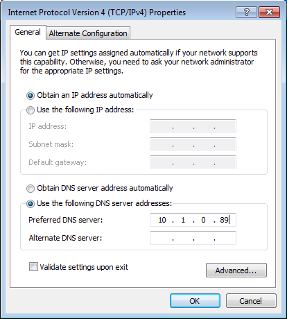](../assets/img/uploads/2018/06/samba4-centos-7-ad-1.png)

Clique com o botão direito do mouse sobre o ícone **“Meu Computador”** e vá em **“Propriedades”.**

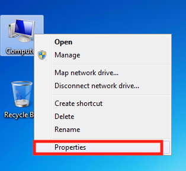

Ao abrir **“Propriedades”** clique em **“Alterar Configurações”**.  
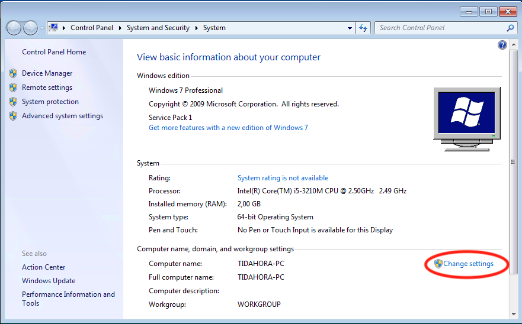

Depois na aba de “**Nome do Computador”** clique em **“Alterar”**.

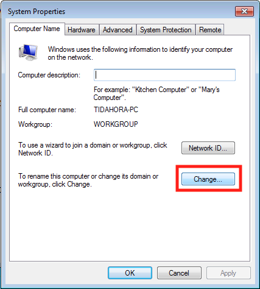

Coloque o nome do seu domínio conforme a imagem abaixo:

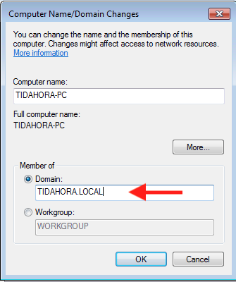

Informe o Login de Administrator e a Senha, aquela que criamos na hora de provisionar o domínio.

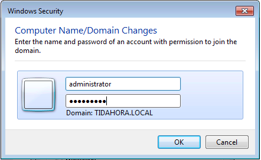

Após a confirmação do login e senha a maquina receberá uma mensagem de boas-vindas ao domínio.

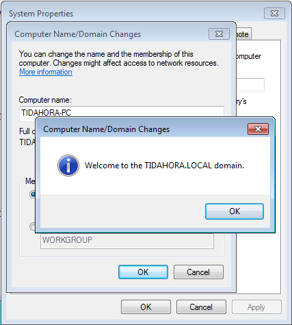

Será solicitado para reiniciar o host Windows, para aplicar as configurações do novo domínio.

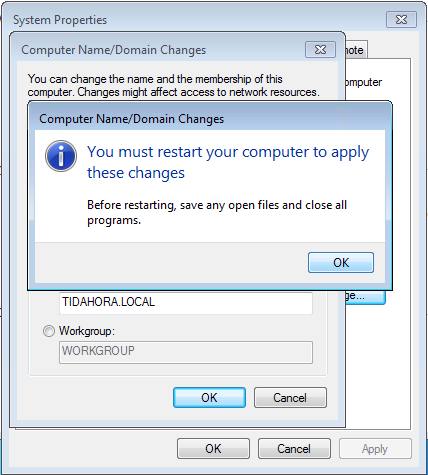

Clique em **“Fechar”** a janela de **“Propriedades”**.

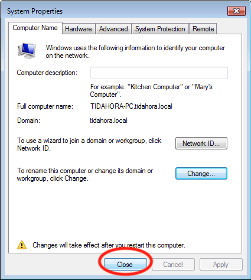

E reinicie o host clicando no botão **“Reiniciar Agora”.**

[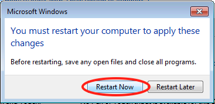](../assets/img/uploads/2018/06/samba4-centos-7-ad10.png)

#### 1.10 Gerenciamento do Domínio com RSAT Microsoft

Para que possamos gerenciar o domínio de uma maneira mais eficaz e precisa, vamos utilizar o host Windows que acabamos de ingressar, e também vamos precisar instalar a Ferramenta de Administração de Servidor Remoto da Microsoft.

Faça login com o usuário “Administrator” do seu domínio na estação para gerenciamento do RSAT.

[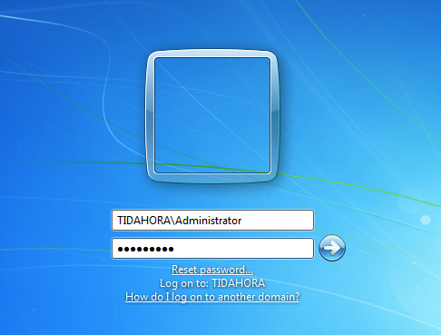](../assets/img/uploads/2018/06/samba4-centos-7-ad18.png)

Acesse o link <https://www.microsoft.com/pt-br/download/details.aspx?id=7887> pelo seu navegador e faça o Download o RSAT.

Abaixo o link oficial da Microsoft para cada tipo de S.O.

Windows 10: [Link Microsoft](http://www.microsoft.com/en-us/download/details.aspx?id=44280 "http://www.microsoft.com/en-us/download/details.aspx?id=44280")  
Windows 8.1: [Link Microsoft](http://www.microsoft.com/en-us/download/details.aspx?id=39296 "http://www.microsoft.com/en-us/download/details.aspx?id=39296")  
Windows 8: [Link Microsoft](http://www.microsoft.com/download/details.aspx?id=28972 "http://www.microsoft.com/download/details.aspx?id=28972")  
Windows 7: [Link Microsoft](http://www.microsoft.com/downloads/details.aspx?FamilyID=7D2F6AD7-656B-4313-A005-4E344E43997D&displaylang=en "http://www.microsoft.com/downloads/details.aspx?FamilyID=7D2F6AD7-656B-4313-A005-4E344E43997D&displaylang=en")[  
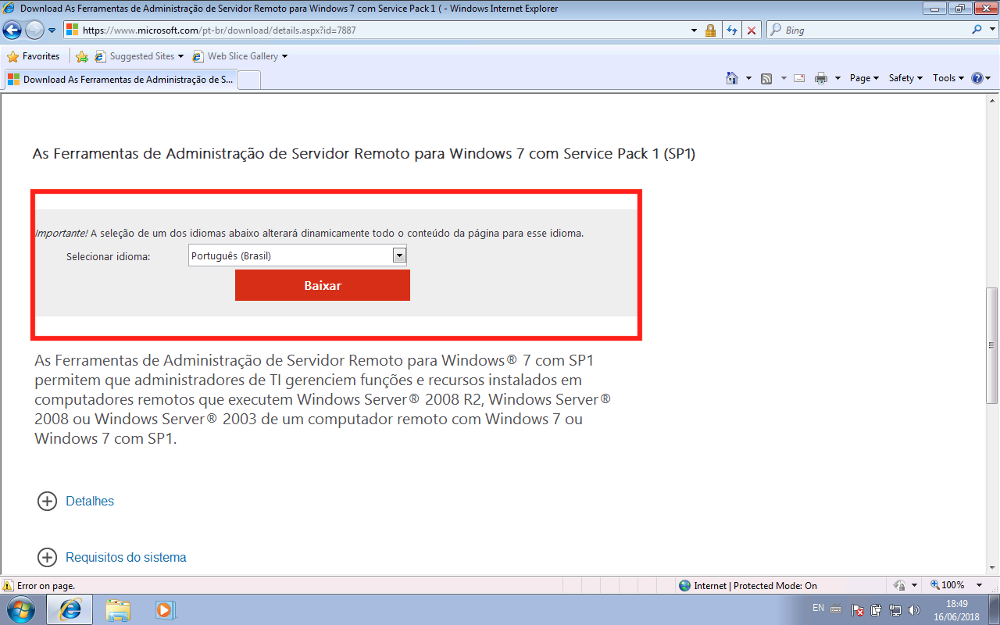](../assets/img/uploads/2018/06/samba4-centos-7-ad11.png)

Escolha a versão do sistema operacional que você está utilizando, no meu caso estou utilizando 64 bits.

[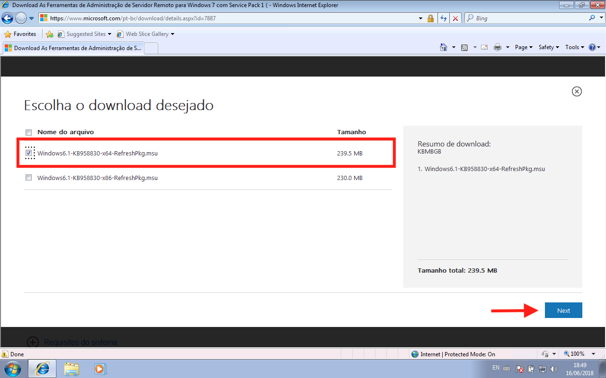](../assets/img/uploads/2018/06/samba4-centos-7-ad12.png)

Após finalizar o Download vamos executar e instalar o complemento da Microsoft.

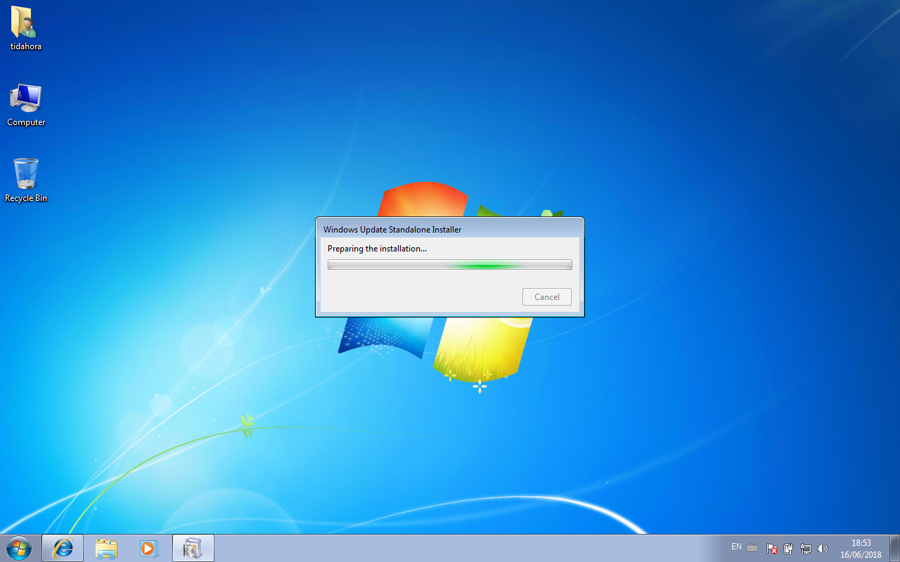

Confirme a instalação da atualização de complemento.

[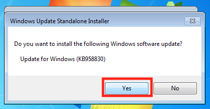](../assets/img/uploads/2018/06/samba4-centos-7-ad14.png) 

Aguarde a cópia do pacote.

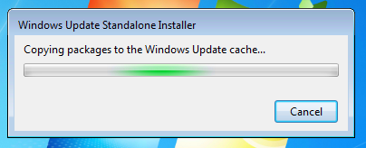

Confirme os termos.

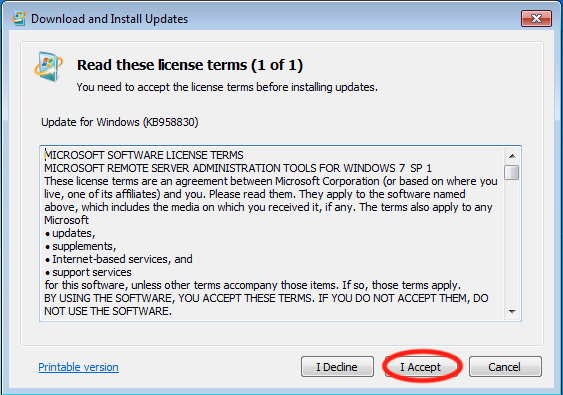

Aguarde a instalação.

[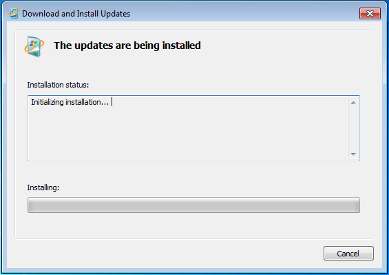](../assets/img/uploads/2018/06/samba4-centos-7-ad17.png)

Após finalizar a instalação, vá em **Painel de Controle**

[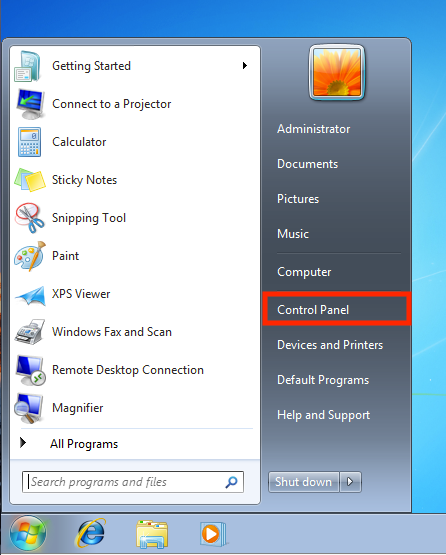](../assets/img/uploads/2018/06/samba4-centos-7-ad-19.png)

Procure por **Programas e Recursos**

[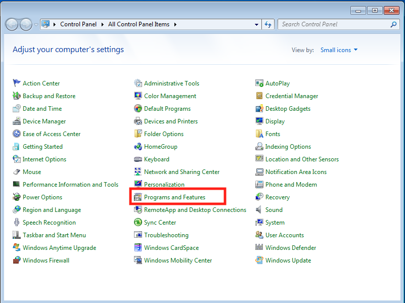](../assets/img/uploads/2018/06/samba4-centos-7-ad-19.1.png)

Clique na opção **Habilitar e Desabilitar Recursos**

[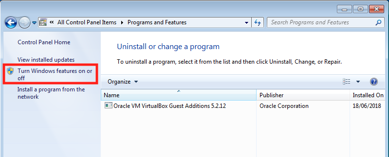](../assets/img/uploads/2018/06/samba4-centos-7-ad-19.2.png)

Vai abrir uma tela de Recursos Adicionais do Windows, vamos buscar pelo RSAT, que acabamos de instalar e em seguida vamos habilitar em nosso ambiente.

[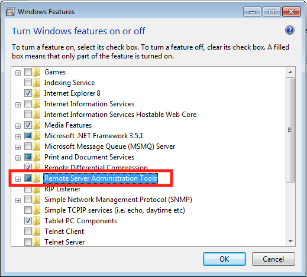](../assets/img/uploads/2018/06/samba4-centos-7-ad-19.3.png)

Marque todos os ítens e sub-ítens na pasta RSAT.

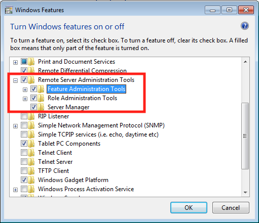

Clique em **OK** e aguarde a ativação do RSAT no Windows.

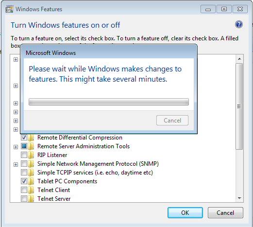

Agora volte ao **Painel de Controle** do Windows.

E procure por **Ferramentas Administrativas.**

[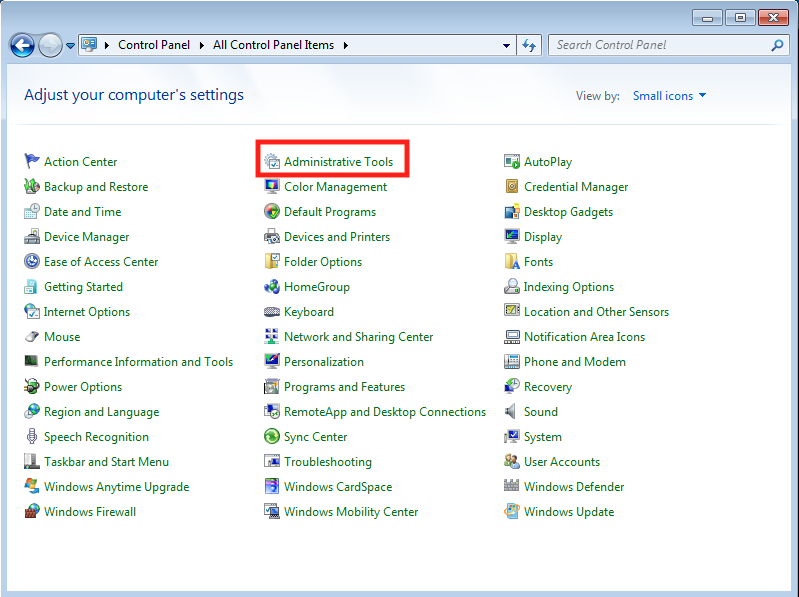](../assets/img/uploads/2018/06/samba4-centos-7-ad20.png)

Veja que agora temos os ítens necessários para gerenciamento do domínio Active Directory, clique em **Usuários e Computadores do Active Directory**

[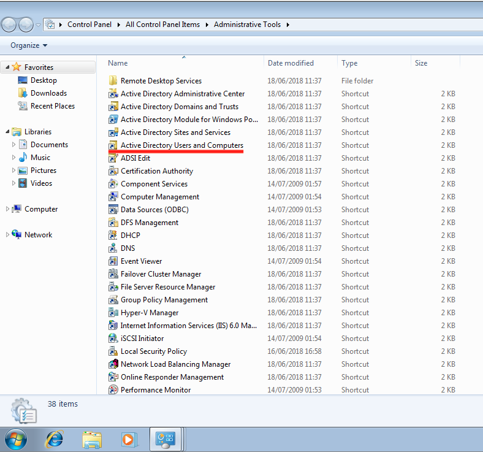](../assets/img/uploads/2018/06/samba4-centos-7-ad21.png)

Pronto, seu domínio Active Directory em Samba4 está pronto para uso.

[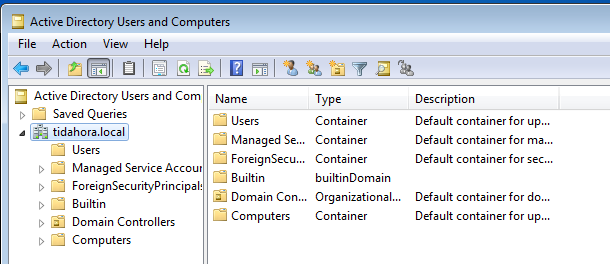](../assets/img/uploads/2018/06/samba4-centos-7-ad22.png)

Agora você pode criar **OU’s, GPO’s, Usuários** e **Grupos** conforme sua necessidade.

Dúvidas, comentário e sugestões postem nos comentários…  
👋🏼 Valeu! e até a próxima!

- - - - - -

**Johnny Ferreira**  
<johnny.ferreira.santos@gmail.com>  
<http://www.tidahora.com.br>

- - - - - -