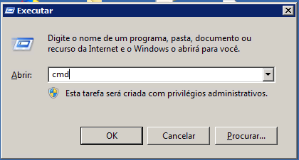
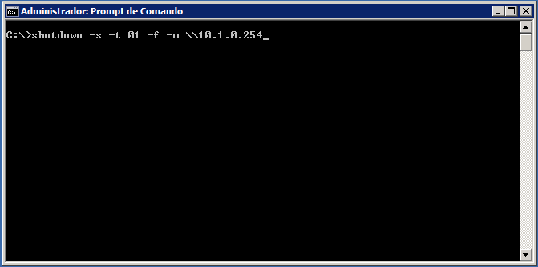
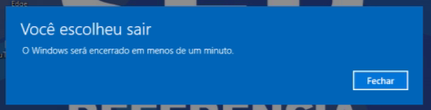
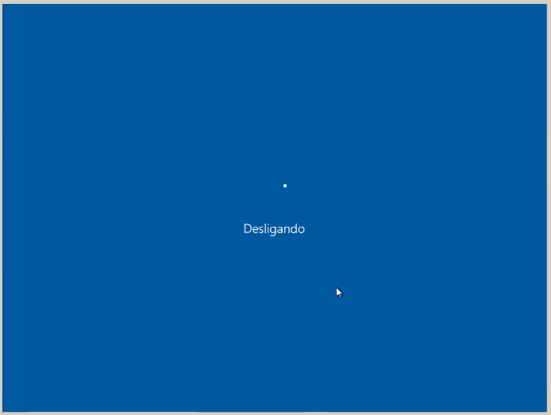

- - - - - -

Olá, tudo bem? 😄  
É comum um administrador de redes se deparar com situações onde ele precisa forçar o desligamento ou reiniciar um micro remotamente. Independente se tem alguém utilizando essa máquina ou não. Os motivos podem ser diversos, desde a uma atualização que necessita de um reboot, ou um desligamento de um colaborador, onde o mesmo após sua demissão não pode mais ter acesso ao computador em rede local.

Neste tutorial irei descrever de uma forma simples como desligar ou reiniciar um computador remotamente com sistema operacional Windows.

**Observação: Lembrando que o procedimento deve ser realizado por um usuário com previlégio de Administrador nos computadores. (Exemplo: Administradores, Administradores de Domínio)**

Abaixo vou explicar os parâmetros que podemos utilizar para desligar um computador remotamente.

- - - - - -

Parâmetros para o comando “shutdown”:

**DESLIGAR O COMPUTADOR:** -s  
**REINICIAR O COMPUTADOR:** -r  
**TEMPO DE ESPERA:** -t xx ( xx = se refere ao tempo em segundos)  
**FORÇAR A FINALIZAÇÃO DE PROGRAMAS:** -f  
**COMPUTADOR REMOTO:** -m \\\\endereco\_ip ou \\\\nome\_computador

Agora que já sabemos os parâmetros que podemos utilizar para essa tarefa, vamos testar na prática.

Em um computador com um usuário administrador ou com permissões de super usuário abra o **Prompt de Comandos**:

Utilizando as teclas **W****inkey + R** digite **CMD** e clique em **OK**:



Com o Prompt de Comandos aberto, digite o seguinte:

```
shutdown -s -t 01 -f -m \\ip_do_cliente
```

Vou desligar o computador com Endereço IP 10.1.0.254 por exemplo:  
Digite o comando acima, e pressione **Enter** para confirmar o desligamento.



Na tela do computador cliente, vai aparecer uma mensagem de aviso que o computador será desligado.



Em seguida é realizado a ação de shutdown remoto.




Dúvidas, comentário e sugestões postem nos comentários…  
👋🏼 Até a próxima!

- - - - - -

**Johnny Ferreira**  
<johnny.ferreira.santos@gmail.com>  
<http://www.tidahora.com.br>

- - - - - -