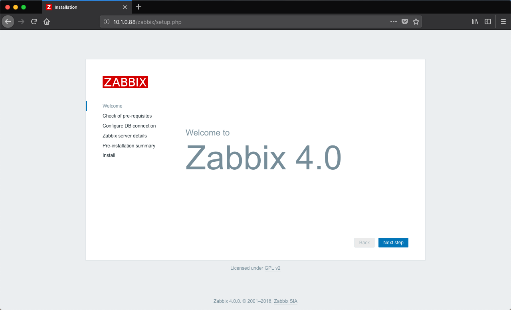
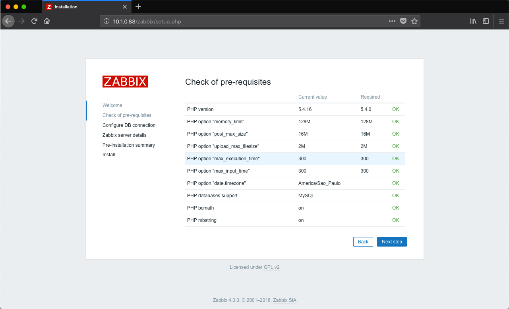
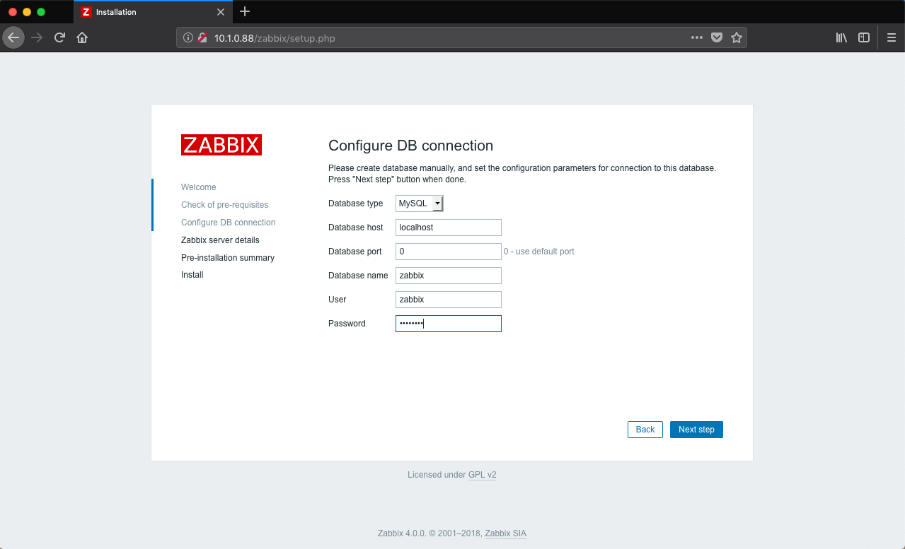
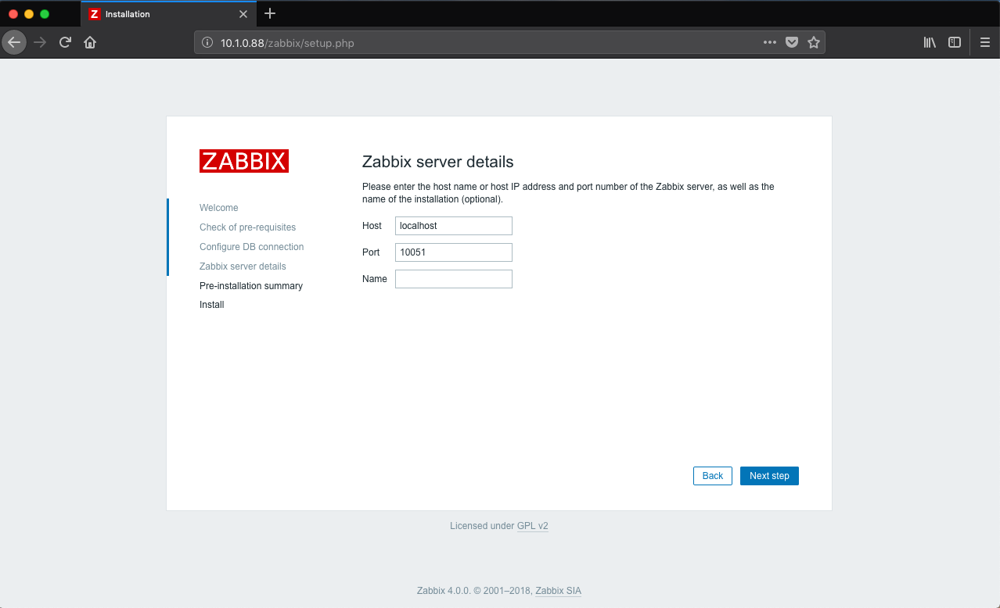
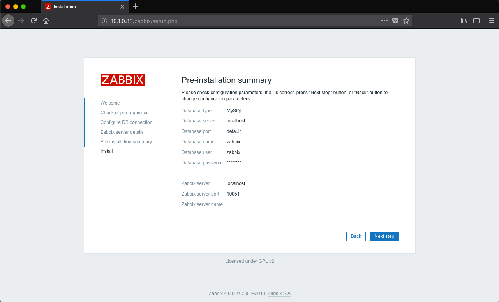
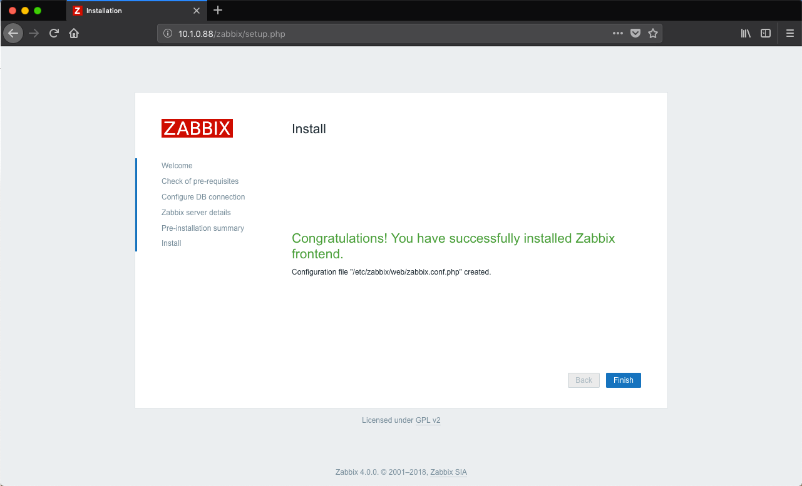
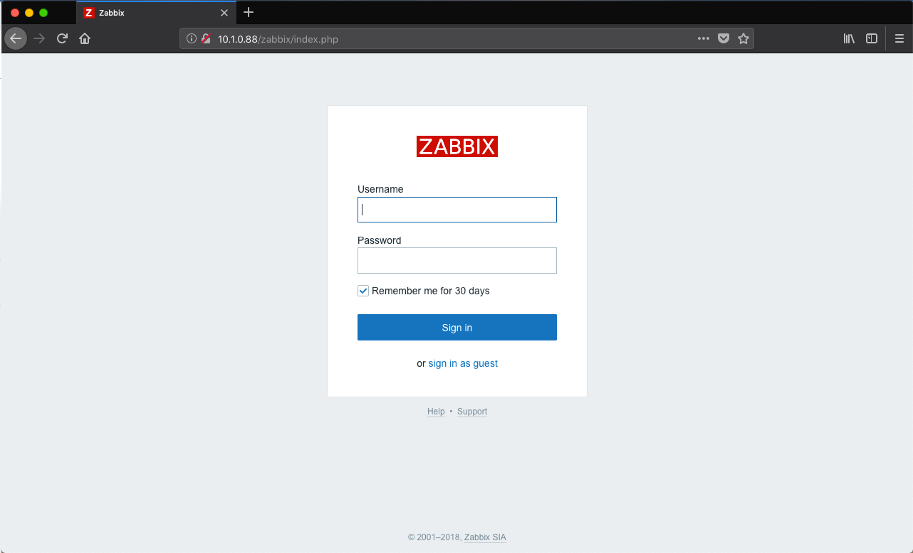
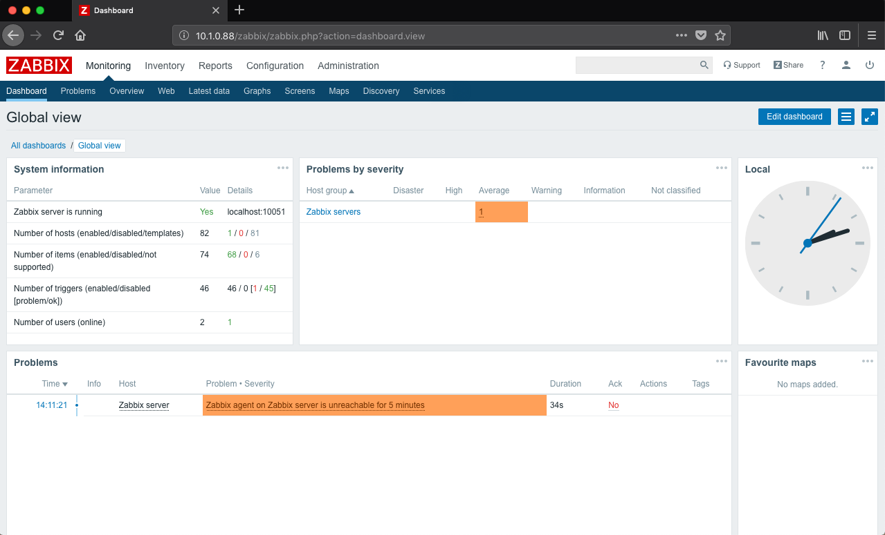

- - - - - -


Olá, 🐧  
Podemos dizer que o Zabbix é um dos grandes nomes quando o assunto é monitoramento de redes. Se você precisa de um software para monitoramento de servidores, ativos de rede, serviços, ou alguma aplicação em especial, saiba que o Zabbix pode lhe ajudar muito.

Agora vem a parte boa, é Open Source, totalmente livre para implementação e uso sem a necessidade de licenças pagas.

Se deseja conhecer mais sobre o Zabbix, visite o **Site do Zabbix 🚀:** <https://www.zabbix.com/>

Nesse post estarei abordando a instalação do Zabbix Server na versão 4 no Linux CentOS 7.

O primeiro passo depois de realizar a instalação do CentOS 7, é preparar o ambiente do sistema operacional para receber a aplicação do Zabbix, cada profissional que trabalha com servidor Linux tem a sua própria maneira e seus costumes de ajustes do servidor, eu estarei aplicando nesse post a maneira com a qual eu gosto de trabalhar nos testes que realizo com os servidores CentOS.

### Atualizando os repositórios do CentOS

Vamos atualizar o ambiente do CentOS antes de tudo.

```
yum -y update
```

Em seguida vamos instalar o repositório adicional Epel.

```
yum -y install epel-release
```

Limpando o cache do “yum”:

```
yum clean all
```

### Instalando pacotes necessários para a administração do servidor

Como de costume eu sempre instalo alguns pacotes para facilitar a vida de gerenciamento no servidor, e já deixar os pacotes que possam vir a ser usados já instalados.

Caso você não ache necessário instalar todos os pacotes abaixo, basta você remover o pacote da linha abaixo.

```
yum -y install vim htop tcpdump telnet
```

#### Desativando o FirewallD e o SELinux

Este é um assunto muito polêmico na comunidade Linux, desativar ou não o FirewallD e o SELinux? 🤔

Tem profissionais que preferem deixar ativo, já outros para não terem problemas na implementação e nos testes preferem desativar, eu prefiro desativar, como estamos implementando para executar testes, e conhecer a nova plataforma do Zabbix, não vejo necessidade de deixar o FirewallD e o SELinux ativos. Fique a vontade se você quer trabalhar com eles ativos ou não ;-).

```
systemctl disable firewalld
```

```
vim /etc/selinux/config
```

Mude a linha abaixo:

```
SELINUX=enforcing
```

para:

```
SELINUX=disabled
```

Em seguida reinicie o servidor.

```
reboot
```

### Instalando o Apache, PHP e o MariaDB

Para que não tenhamos problemas em dependências na instalação do Zabbix, vamos instalar alguns pacotes que por padrão já fazem parte dos pré-requisitos da aplicação de monitoramento do Zabbix.

```
yum -y install httpd php php-pdo php-mysql mariadb-server
```

Em seguida já vamos deixar o serviço do Apache rodando e habilitado para iniciar junto ao boot do S.O.:

```
systemctl start httpd.service
systemctl enable httpd.service
```

### Ajustando o MariaDB

Configuramos o MariaDB para iniciar junto ao sistema operacional, isso é muito importante, caso o servidor seja reiniciado, não é necessário que você ou alguém inicie os serviços.

```
systemctl enable mariadb.service
```

Iniciando o MariaDB:

```
systemctl start mariadb.service
```

Primeiras configurações de segurança do banco de dados:

```
mysql_secure_installation
```

Nessa etapa você vai definir, a senha de root, remover usuários e base de testes, etc.

### Criando Usuário e Base de Dados para o Zabbix

Agora que o MariaDB já está apto a operar, vamos criar a base de dados e o usuário de banco que irá gerenciar a aplicação do Zabbix junto ao banco de dados:

Logue-se no console do banco, com a senha que você definiu no passo anterior.

```
mysql -u root -p
```

Criando a base de dados:

```
CREATE DATABASE zabbix;
```

Criando o Usuário que iremos ajustar na plataforma do Zabbix depois:

```
CREATE USER 'zabbix'@'localhost' IDENTIFIED BY 'password';
```

Ajustando a permissão do usuário “zabbix” para o banco de dados “zabbix:

```
GRANT ALL PRIVILEGES ON zabbix.* TO 'zabbix'@'localhost';
FLUSH PRIVILEGES;
EXIT
```

### Instalando o Repositório do Zabbix 4

Vamos instalar o repositório do zabbix no CentOS 7, dessa forma podemos ter todos os pacotes disponíveis pelo gerenciador de pacotes yum.

```
rpm -ivh https://repo.zabbix.com/zabbix/4.0/rhel/7/x86_64/zabbix-release-4.0-1.el7.noarch.rpm
```

### Instalando os pacotes do Zabbix Server

Abaixo vamos instalar todos os pacotes que vamos precisar para implementar o Zabbix Server 4 com suporte ao MariaDB.

```
yum install -y zabbix-server-mysql zabbix-web-mysql zabbix-proxy-mysql zabbix-agent
```

### Importando Dados do Zabbix ao Banco

Essa etapa é muito importante, pois iremos importar os schemas de banco, e todos os dados necessário para o funcionamento da plataforma.

```
zcat /usr/share/doc/zabbix-server-mysql*/create.sql.gz | mysql -uzabbix -ppassword zabbix
```

*Não esqueça de alterar a senha no comando acima.* 😉

#### Ajustando Zabbix para Conexão ao Banco de Dados

Precisamos informar no arquivo de configuração do Zabbix Server, os dados de acesso ao banco de dados que criamos.

```
vim /etc/zabbix/zabbix_server.conf
```

Procure as linhas abaixo, e altere no arquivo de configuração.

```
DBHost=localhost
DBName=zabbix
DBUser=zabbix
DBPassword=password
```

Agora que fizemos os ajustes, precisamos ajustar o serviço do Zabbix para iniciar junto ao S.O. e dar o “start” no serviço.

```
systemctl enable zabbix-server
systemctl start zabbix-server
```

Em seguida, vamos fazer um ajuste no arquivo de configuração de VirtualHost do Zabbix, vamos alterar a linha de “timezone” nas configurações do PHP.

```
vim /etc/httpd/conf.d/zabbix.conf
```

Na linha 20, do arquivo acima, onde contém “php\_value date.timezone…” altere conforme abaixo:

```
php_value date.timezone America/Sao_Paulo
```

Salve o arquivo e reinicie o Apache.

```
systemctl restart httpd.service
```

### Concluindo a instalação via Web 🚀

No seu navegador acesse o endereço IP/zabbix, conforme a imagem abaixo, já iremos receber a tela de instalação do Zabbix 4.0

[](../assets/img/uploads/2018/10/1-1.png)

Lista de dependências, como já fizemos anteriormente, base clicar em “Next”

[](../assets/img/uploads/2018/10/2-1.png)

Configurações do Bando de dados, insira os dados como nome do banco, usuário e senha, e clique em continuar.

[](../assets/img/uploads/2018/10/3-1.png)

Na tela abaixo, não é necessário ajustarmos nada, somente “next”

[](../assets/img/uploads/2018/10/4-1.png)

Um breve resumo das configurações anteriores ajustadas:

[](../assets/img/uploads/2018/10/5-1.png)

Confirmar e finalizar a instalação…

[](../assets/img/uploads/2018/10/6.png)

Em seguida já temos a tela de Login, o login padrão é **admin** e a senha default é **zabbix.**

**Login:** admin  
**Senha:** zabbix

[](../assets/img/uploads/2018/10/7.png)

Dashboard do Zabbix 4 após o login.

[](../assets/img/uploads/2018/10/8.png)

Note que na imagem acima, o nosso agente do servidor Zabbix está “off”, vamos fazer a instalação e configuração do mesmo.

Caso você não tenha instalado ele nos procedimentos acima, o comando para instalar é:

```
yum -y install zabbix-agent
```

Seu arquivo de configuração está localizado no diretório “/etc/zabbix/”

Abra o arquivo de configuração do Zabbix Agent:

```
vim /etc/zabbix/zabbix_agentd.conf
```

E verifique se a linha de número 98 do arquivo de configuração, está conforme abaixo:

```
Server=127.0.0.1
```

Salve seu arquivo e reinicie o serviço do Zabbix Agent.

```
systemctl restart zabbix-agent
```

Ajuste o serviço para iniciar ao boot do S.O. também:

```
systemctl enable zabbix-agent
```

Ajustando isso o mesmo já irá responder corretamente ao Zabbix e gerar os gráficos e alertas.

Estarei abordando em outros tópicos o ajuste de clientes, criação de mapas, etc.

Dúvidas, comentário e sugestões postem nos comentários…  
👋🏼 Valeu! e até a próxima!

- - - - - -

**Johnny Ferreira**  
<johnny.ferreira.santos@gmail.com>  
<http://www.tidahora.com.br>

- - - - - -