- - - - - -


Opa, tudo bem por aí? 😄  
Espero que sim, esse post tem por objetivo abordar a instalação e a configuração do agente do Zabbix em host com sistema operacional Windows. 🖥

Antes de mais nada, verifique a versão do seu servidor Zabbix, e em seguida visite a página de downloads oficial do Zabbix, para que você não tenha problemas com vírus, etc, afinal, estaremos instalando no windows né, rsrsrs.

[https://www.zabbix.com/download\_agents](https://www.zabbix.com/download_agents)

[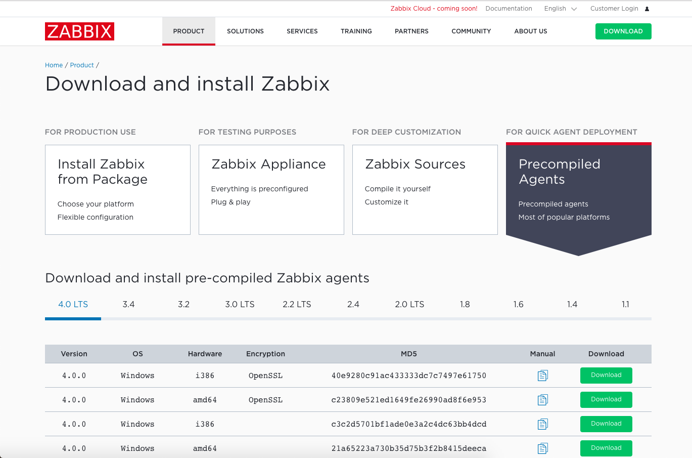](../assets/img/uploads/2018/10/agente-windows-1.png)

Agora que já temos o download do arquivo do agente no host Windows, descompacte os arquivos, que por padrão e por motivos de segurança, vem no formato .zip.

Dentro da pasta Arquivos e Programas, crie uma pasta chamada Zabbix.

[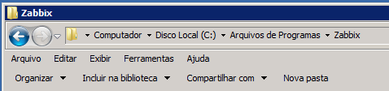](../assets/img/uploads/2018/10/agente-windows-2.png)

Em seguida, copie os arquivos para a pasta criada, ficando da maneira abaixo:

[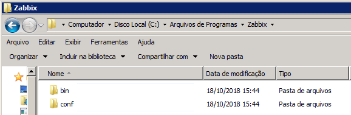](../assets/img/uploads/2018/10/agente-windows-3.png)

Agora é necessário ajustarmos o arquivo de configuração do Agente, dentro da pasta **C:\\Arquivos de Programas\\Zabbix\\conf\\**.  
O arquivo de configuração do agente é “**zabbix\_agentd.win.conf**”  
Abra o arquivo com o editor de texto, pode ser com o bloco de notas mesmo.  
Altere as linhas abaixo, conforme o seu ambiente:

```
Server=10.1.0.14
ServerActive=10.1.0.14
Hostname=Hostname-do-Computador
```

Onde 10.1.0.14, é o IP do meu Servidor Zabbix, você vai ajustar para o IP do seu servidor.  
Salve seu arquivo com as configurações realizadas.

Em seguida, abra o prompt de comandos do Windows como usuário administrador.  
E digite o seguinte comando abaixo:

```
C:\Users\administrator>"C:\Program Files\Zabbix\bin\zabbix_agentd.exe" -i -c "C:
\Program Files\Zabbix\conf\zabbix_agentd.win.conf"
```

[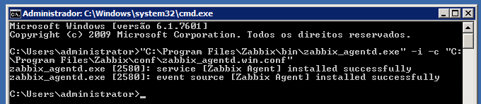](../assets/img/uploads/2018/10/agente-windows-4.png)

Após executar o comando acima, e receber a mensagem de que o agente encontra-se instalado com sucesso, abra o Gerenciador de Serviços do Windows (services.msc) e inicie o serviço do Zabbix Agent.

[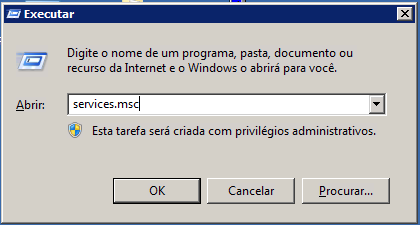](../assets/img/uploads/2018/10/agente-windows-5.png)

Clique com o botão direito do mouse para iniciar o serviço, como mostra a imagem abaixo:

[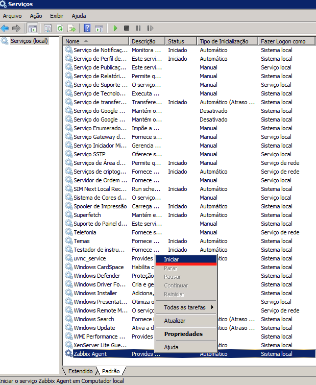](../assets/img/uploads/2018/10/agente-windows-6.png)

Em seguida, se tudo ocorreu bem, temos o serviço rodando.

[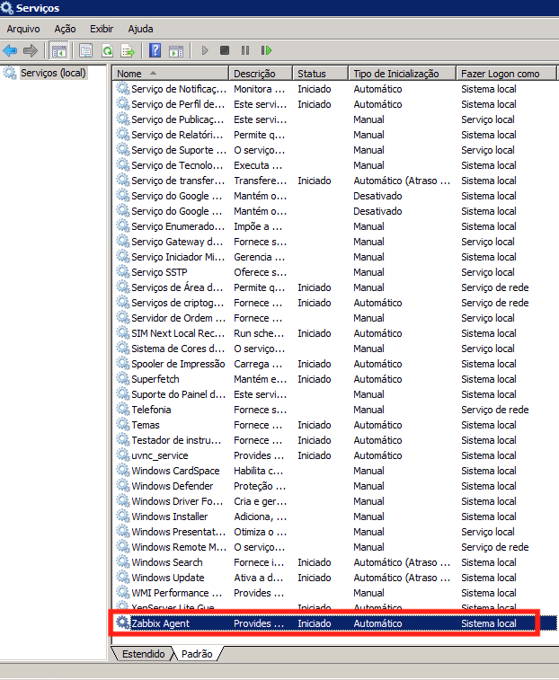](../assets/img/uploads/2018/10/agente-windows-7.png)

### ADICIONANDO O CLIENTE NO SERVIDOR ZABBIX

Para que o host Windows possa ser monitorado pelo servidor, além da instalação do agente, é necessário adicionarmos no servidor Zabbix o novo cliente a ser monitorado.

Acesse a Dashboard do seu servidor Zabbix, e no menu de **“Configurações”** &gt; **“Hosts”**:

[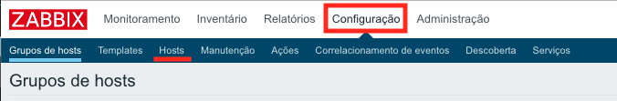](../assets/img/uploads/2018/10/agente-windows-8.png)

No canto direito superior, clique em **“Criar Host”**.

[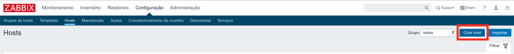](../assets/img/uploads/2018/10/agente-windows-9.png)

Agora iremos adicionar informações do host que iremos monitorar, informações como hostname, endereço IP e o template do sistema operacional.

[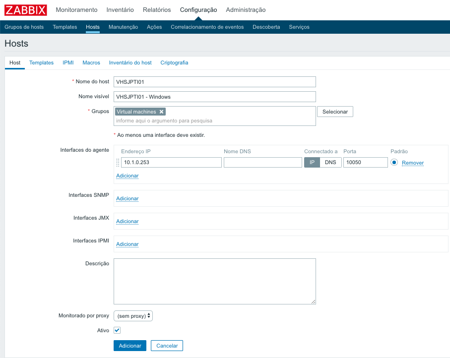](../assets/img/uploads/2018/10/agente-windows-10.png)

Na aba templates, pesquise e selecione o template OS Windows e clique em “Adicionar” e no “Adicionar” logo abaixo:

[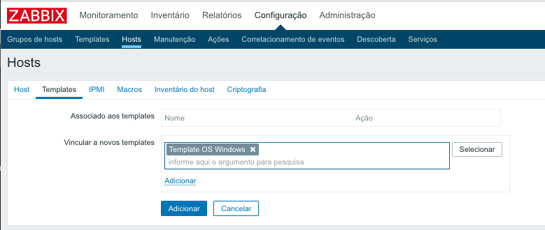](../assets/img/uploads/2018/10/agente-windows-11.png)

Em seguida já temos o host aguardando o monitoramento do servidor Zabbix.

[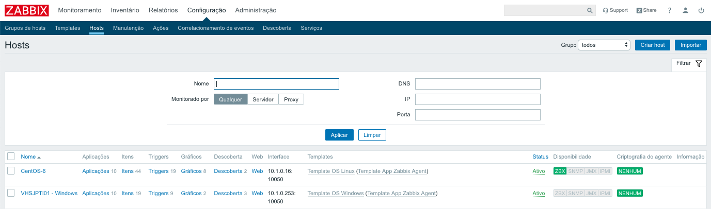](../assets/img/uploads/2018/10/agente-windows-12.png)

Depois de alguns minutos o host já está sendo monitorado pelo Zabbix.🚀

[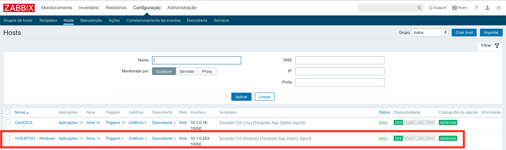](../assets/img/uploads/2018/10/agente-windows-13.png)

Caso ocorra erros na comunicação do seu servidor Zabbix e o host Windows, verifique no Firewall do Windows se o agente está com permissão para operar. 🔥

Dúvidas, comentário e sugestões postem nos comentários…  
👋🏼 Valeu! e até a próxima!

- - - - - -

**Johnny Ferreira**  
<johnny.ferreira.santos@gmail.com>  
<http://www.tidahora.com.br>

- - - - - -