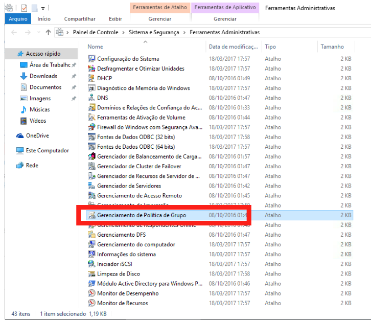
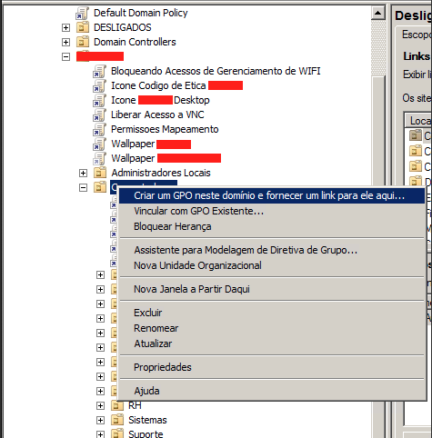
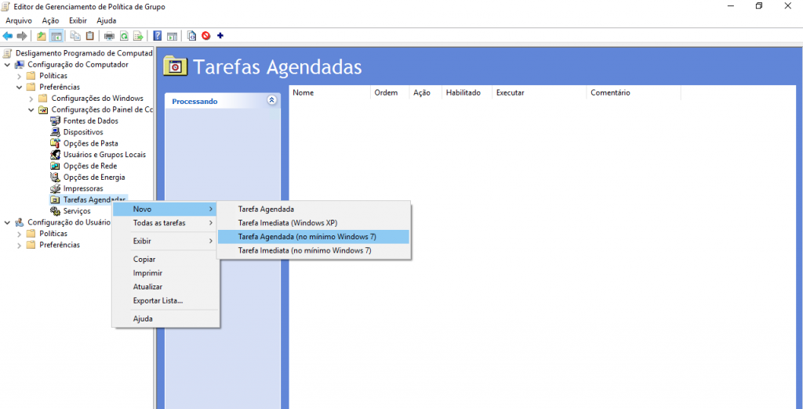
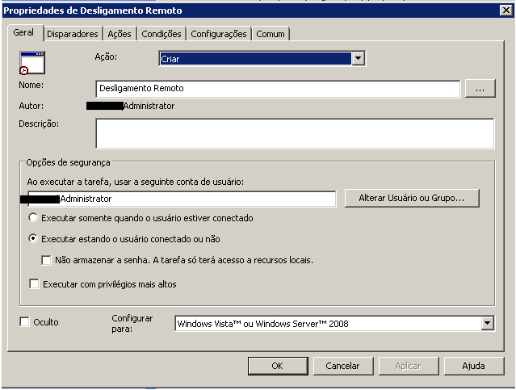
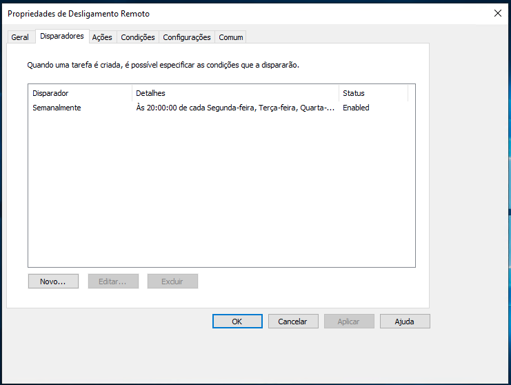
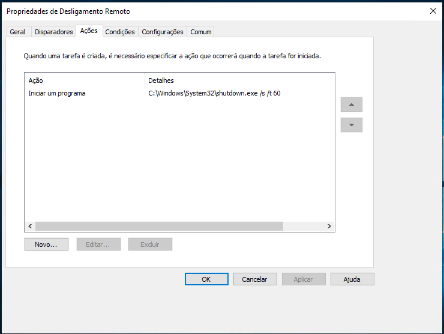
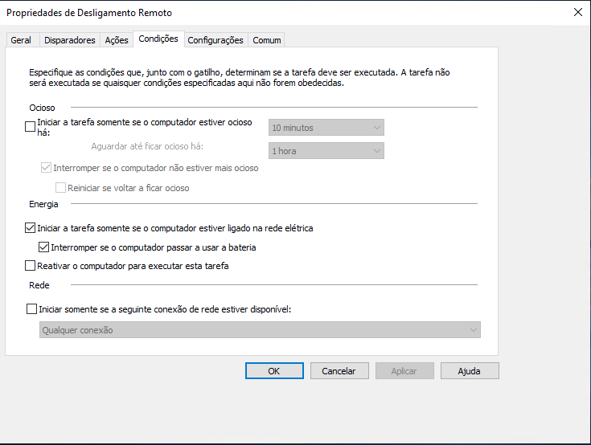
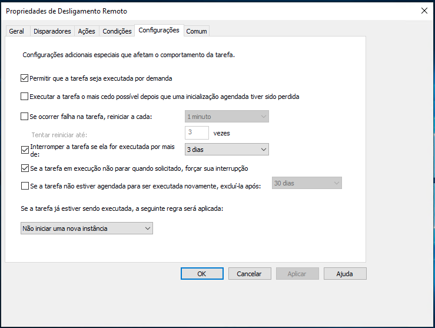
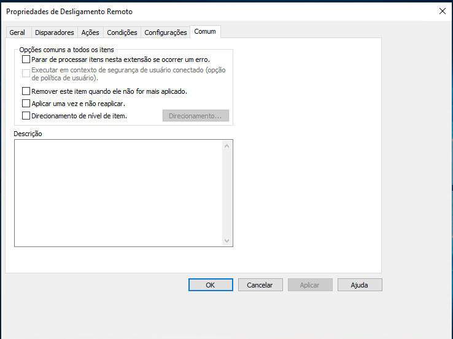
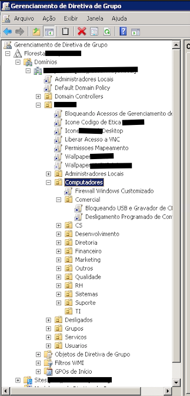

- - - - - -

*GPO para realizar o desligamento automatizado e agendado das estações/computadores em rede local.*

Fala galera, beleza?

Objetivo desse post é documentar aqui uma GPO que precisei criar na rede que administro. Visando em economizar energia e reduzir custos, notei que bastante colaboradores “esqueciam” seus computadores/notebooks ligados depois do expediente.

Foi então que comecei a buscar soluções para tratar esse pequeno problema, e uma das formas que consegui fazer com facilidade e de rápida implementação, foi através de GPO em meu domínio.

Siga os passos abaixo, caso precise criar essa regra em seu controlador de domínio também.

Primeiro passo é abrir o **Gerenciador de Política de Grupo.**

  

  

Clique com o botão direito do Mouse na **OU** que deseja criar a GPO, e clique em **Criar um GPO neste domínio e fornecer um link para ele aqui…**

Eu selecionei a “**OU**” de **Computadores** dentro da “**OU**” do meu **domínio**:

Informe o nome desejado para a **GPO**:

**Nome Inserido:** Desligamento Programado de Computadores.

Após criarmos a GPO, vamos edita-la, clique com o botão direito na GPO criada. Teremos a tela abaixo:

Configurações do Computador » Preferências » Configurações do Painel de Controle » Tarefas Agendadas

Clique com o botão direito em Tarefa Agendada e selecione a opção Tarefa Agendada (no mínimo Windows 7)

Preencha os campos conforme as imagens abaixo:  
Aba **Geral**:

Aba **Disparadores**, clique em Nova… e faça o cadastro das informações abaixo:

Aba **Ações**:

Aba **Condições**:

Aba **Configurações**:

Aba **Comum**:

Para aplicar a GPO nos computadores, vincule a GPO criada na **OU** de **Computadores** e nos **setores** correspondentes:

Após isso você pode esperar replicar as GPOs para as estações, ou executar o comando **gpupdate /force** para forçar a atualizar.

Dúvidas, comentário e sugestões postem nos comentários…  
👋🏼 Até a próxima!

- - - - - -

  

**Johnny Ferreira**  
<johnny.ferreira.santos@gmail.com>  
<http://www.tidahora.com.br>