- - - - - -

Olá 🤓, como vai? Veja aqui como **Criar Pendrive de Instalação do Mac OS High Sierra**.

Se você precisa formatar o seu Macbook, iMac ou Mac Mini, esse post ensina como baixar o sistema original diretamente da App Store e em seguida criar um pendrive para formatar e instalar novamente o sistema operacional. Deixando seu Mac muito mais rápido. Assim como outros sistemas operacionais, é importante reinstalar o sistema do Mac para obter sempre um desempenho melhor do produto.


#### Passo 1. Obtendo o Mac OS High Sierra

O primeiro passo para criar o **pendrive inicializável,** é obter o sistema operacional que desejamos instalar, nesse caso o **Mac OS High Sierra**.  
Para isso, abra sua **App Store**, localizada no seu Dock de atalhos.  

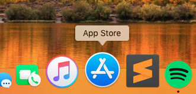

Em seguida no campo de busca digite “**Mac OS High Sierra**” e clique “Enter” para pesquisar o conteúdo desejado. Assim que o Mac OS High Sierra aparecer na lista de resultados, clique em “**Obter**” para fazer o Download.

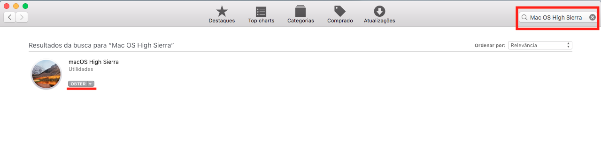


Após realizar o Download do Mac OS High Sierra, ele ficará disponível na lista de programas do Launchpad.  
Abra o **Launchpad**, conforme imagem abaixo:

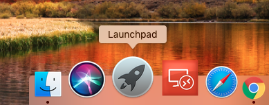


E na sequência já podemos ver o nosso sistema pronto para ser instalado no Mac.

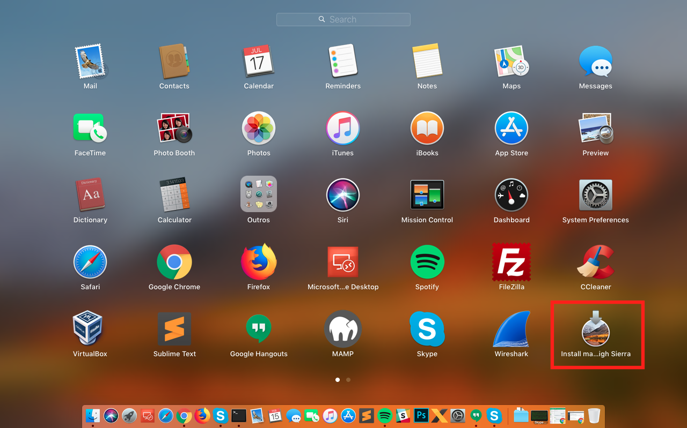

Mas o nosso objetivo não é instalar por cima, e sim, formatar o disco, e reinstalar o sistema operacional, para isso vamos ao segundo passo desse tutorial.


#### Passo 2. Formatando o Pendrive

Agora que já temos o sistema baixado em nosso Mac, precisamos criar um Pendrive para transferir a imagem ao mesmo. Plugue o Pendrive no Mac.

***Observação:** Tenha um pendrive de no mínimo 8GB.*

Para isso abra novamente o “**Launchpad**“. 

 

E digite a palavra “**Disk**” para buscarmos o “**Utilitário de Disco**“.

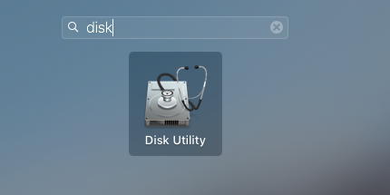 

Com o “**Utilitário de disco**” aberto, e com o pendrive plugado ao Mac, conforme imagem abaixo.

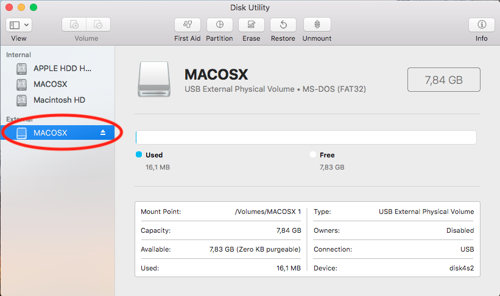 

Vamos clicar na Opção “**Apagar/Erase**“, conforme abaixo:

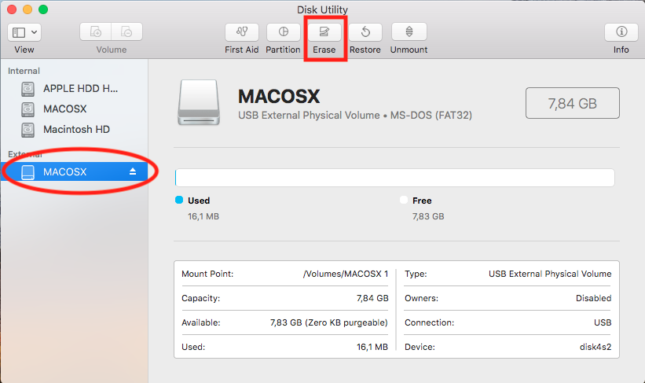 

Informe um nome para formatamos o pendrive, e selecione o formato “**Mac OS Extendido (Journaled)**” e clique em “**Formatar/Apagar/Erase**“.

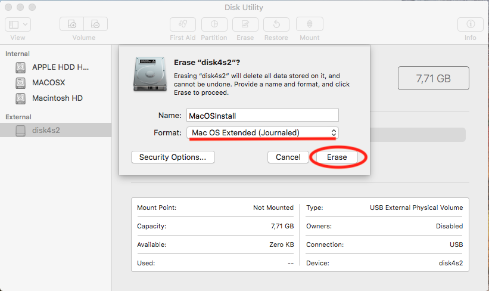

Pronto, pendrive formatado e pronto para receber o Mac OS High Sierra.

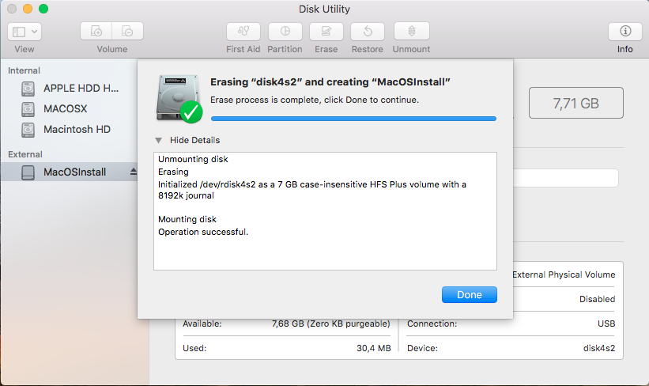


#### Passo 3. Criar Pendrive de Instalação do Mac OS High Sierra

Abra o **Launchpad** novamente, e digite “**Terminal**“.


Abra o **terminal**

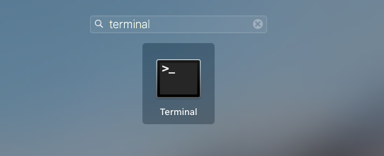

Digite no terminal o comando abaixo:

```
sudo /Applications/Install\ macOS\ High\ Sierra.app/Contents/Resources/createinstallmedia --volume /Volumes/MacOSInstall
```

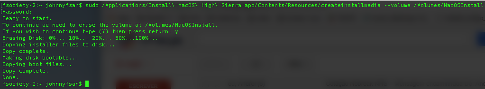

O processo de copia para o pendrive pode demorar de 20 a 40 minutos, dependendo do seu hardware.

#### Passo 4. Iniciando o Mac pelo pendrive.

Após realizarmos os procedimentos acima, vamos reiniciar o Mac OS X, e na na tela de boot do sistema pressione a tecla “option” do teclado do Mac, para abrir as opções de boot.

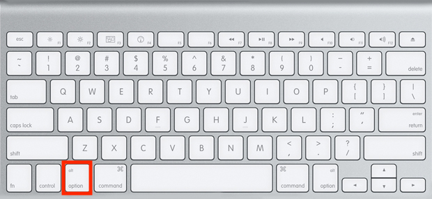

Após o procedimento acima, irá aparecer a tela de boot do sistema, use as setas do teclado para selecionar o disco de inicialização, ou seja, o pendrive, normalmente representado pela cor **Laranja**.

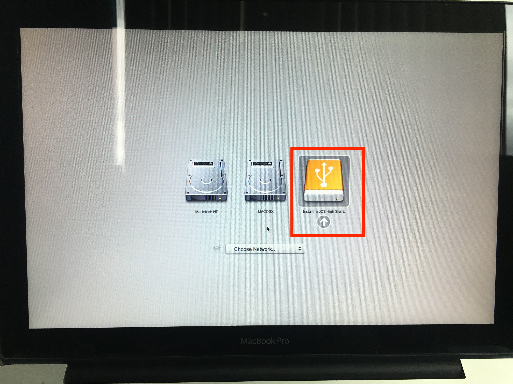

Após a seleção do pendrive, a instalação do Mac OS será iniciada, não irei abordar aqui como instalar o Mac OS.

Dúvidas, comentário e sugestões postem nos comentários…  
👋🏼 Valeu! e até a próxima!

- - - - - -


**Johnny Ferreira**  
<johnny.ferreira.santos@gmail.com>  
<http://www.tidahora.com.br>

- - - - - -