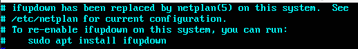
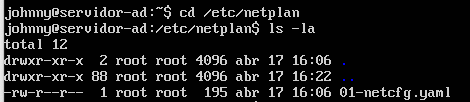
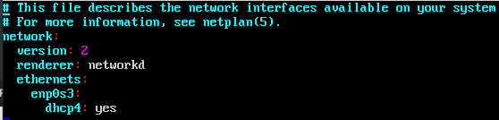
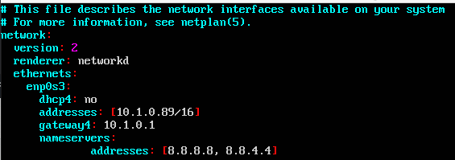
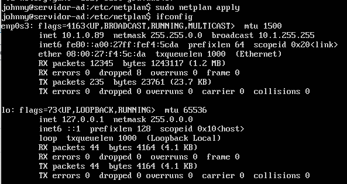

- - - - - -


Opa, beleza?

Confesso que eu não uso muito o Ubuntu Server nas aplicações e serviços que realizo, mas esses tempos me surgiu uma necessidade, e precisei realizar o ajuste da interface de rede.  
Como de costume, fui direto ao arquivo **/etc/network/interfaces** e cadê? Fui surpreendido com a mensagem abaixo:



Porém lendo a mensagem acima, o sistema nos informa que o gerenciamento de rede agora é realizado por um carinha chamado netplan.

Então vamos lá conhecer esse tal de netplan e ajusta-lo para que a interface de rede do Ubuntu funcione com o endereço IP que eu preciso definir nele.

Pelo que verifiquei no manual do mesmo, o seu gerenciamento é bem simples, não tem segredo.

Acesse o diretório abaixo:

```
cd /etc/netplan
```

Agora vamos verificar o conteúdo do diretório:

```
ls -l
```



Com o editor de texto de suas preferência, vamos abrir o arquivo 01-netcfg.yaml. Eu estarei utilizando o vim.


```
sudo vim 01-netcfg.yaml
```




Agora vamos ajustar o arquivo conforme a nossa necessidade.

O primeiro passo é alterar a opção referente ao dhcp4 para no, em seguida utilizar os parâmetros de addressses e gateway4 para informar qual será o IP/Mask e gateway que estaremos utilizando.



Agora saia do arquivo, não esqueça de salva-lo, rs!

Vamos aplicar as mudanças no arquivo que alteramos. Para aplicar as alterações use o comando abaixo:

```
sudo netplan apply
```

Em seguida utilize o famoso ifconfig para visualizar o endereço ip do Linux.

```
ifconfig
```



Feito, endereço IP alterado com sucesso, até que o Netplan não complicou tanto assim, rs!

É isso ai, espero poder ter lhe auxiliado de alguma forma com esse curto e singelo post.

Dúvidas, comentário e sugestões postem nos comentários… 

👋🏼 Até a próxima!

- - - - - -

**Johnny Ferreira**  
<johnny.ferreira.santos@gmail.com>  
<http://www.tidahora.com.br>

- - - - - -