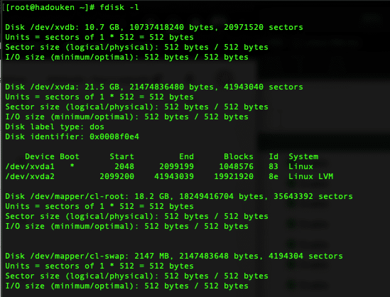
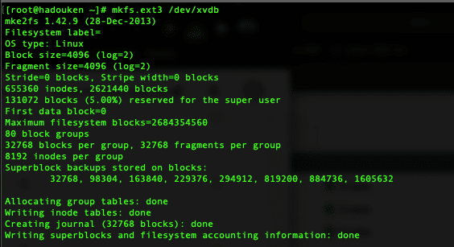
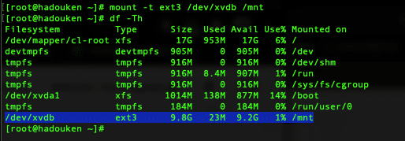
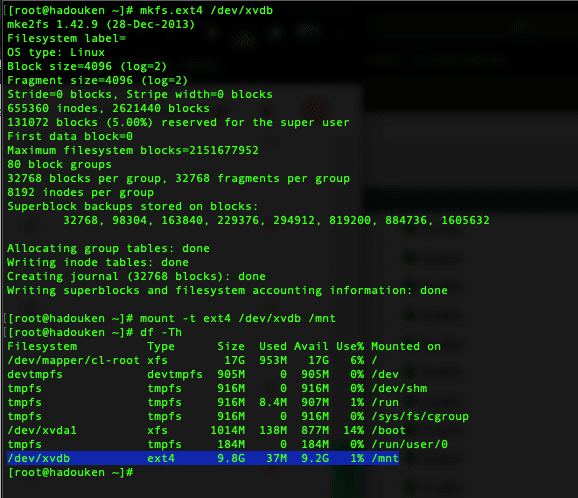
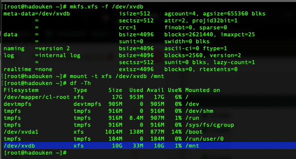

- - - - - -


Fala povo, bão?

Tutorial de hoje mostra como formatar e montar partições no poderoso sistema Linux.

Se você ta precisando formatar um HD em Ext3, Ext4 ou em XFS se liga nesse humilde artigo que podemos te ajudar a entender como tudo isso funciona.

Nosso cenário aqui neste tutorial:  
CentOS 7 com dois HD’s, um de 20GB para o / e outro adicional de 10GB que estaremos formatando e usando como exemplo.

O primeiro passo é localizar o dispositivo dentro do sistema Linux, para isso utilizamos o comando fdisk com o parâmetro -l.

```
fdisk -l
```



Note na imagem acima, que temos dois dispositivos nesse servidor linux:

- /dev/xvda
- /dev/xvdb

O dispositivo /dev/xvda contém duas partições, note na imagem o device /dev/mapper/cl-root de 18.2GB e o /dev/mapper/cl-swap de 2147mb, isso porque o disco foi criado com LVM.

Estaremos formatando e montando o HD /dev/xvdb:

*Observação: Talvez no seu servidor a nomenclatura esteja diferente, essa maquina está virtualizada em XenServer, por isso ele mostra como xvd\*.*

### Formatando e Montando Disco com EXT3

Agora que já identificamos o disco a ser formatado, vamos executar o comando para formatar no sistema de arquivos EXT3:

Utilize o comando abaixo para formatar o disco:

```
mkfs.ext3 /dev/xvdb
```



Agora em seguida iremos montar o disco, irei utilizar o diretório /mnt como exemplo:

```
mount -t ext3 /dev/xvdb /mnt
```

Em seguida vamos listar os devices montados com o comando df:

```
df -Th
```



Note na imagem acima que o disco foi montado em EXT3 no diretório /mnt

### Formatando e Montando Disco com EXT4

Para a formatação em EXT4 segue o mesmo padrão do EXT3, confira abaixo:

*Observação: se você for utilizar o mesmo disco que usou no exemplo de ext3, é preciso desmontar o disco para poder formatar, utilize o comando abaixo para isso:*

```
umount /mnt
```

Formatando o disco em EXT4:

```
mkfs.ext4 /dev/xvdb
```

Montando o disco no diretório /mnt como exemplo:

```
mount -t ext4 /dev/xvdb /mnt
```

Abaixo a imagem com os comandos executados:




### Formatando e Montando Disco com XFS

Seguindo a mesma linha de procurar o dispositivo no sistema Linux com o fdisk, para formatar um disco em XFS e monta-lo não tem nenhum segrego, confira abaixo:

Formatando…

```
mkfs.xfs -f /dev/xvdb
```

Montando o disco:

```
mount -t xfs /dev/xvdb /mnt
```

Confira a imagem abaixo com os comandos executados:



É isso, além disso você pode configurar o seu fstab para que a partição seja montada automaticamente.

Dúvidas, comentário e sugestões postem nos comentários…  
👋🏼 Até a próxima!

- - - - - -

**Johnny Ferreira**  
<johnny.ferreira.santos@gmail.com>  
<http://www.tidahora.com.br>

- - - - - -