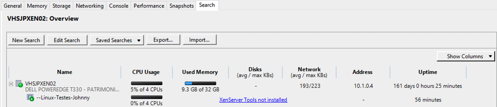
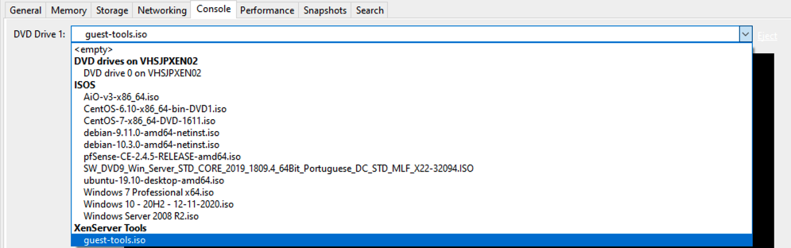
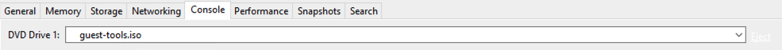
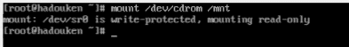
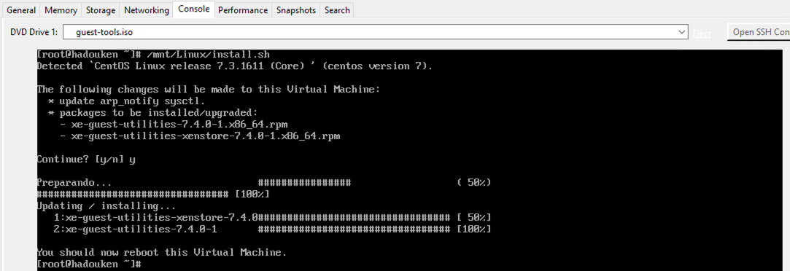
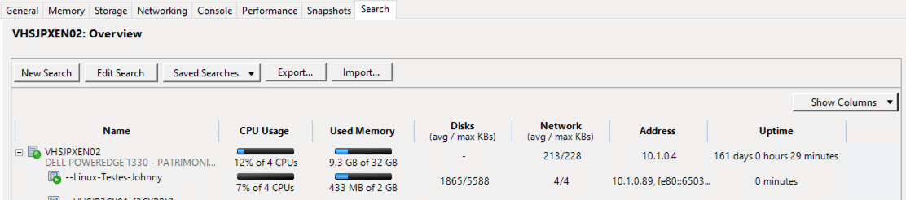

- - - - - -


Fala povo, bão?

Seguinte, para quem usa ambiente de virtualização com Citrix XenServer, sabe que para o correto funcionamento das máquinas virtuais é necessário a instalação do pacote XenTools, esse pacote deve ser instalado na máquina virtual para o provisionamento adequado dos recursos de hardware entre o hypervisor e o sistema operacional da máquina cliente.

Note que na aba **Search** do XenCenter, a máquina que não possui o pacote XenTools instalado não tem seu hardware monitorado corretamente pelo XenCenter, é informado que o XenSeerver Tools não está instalado.

[](../assets/img/uploads/2020/11/Screen-Shot-2020-11-17-at-11.02.42.png)

Após instalar o sistema operacional no **XenServer**, na aba **Console** da máquina virtual, você terá a opção de **DVD Drive**, selecione o pacote X**enServer Tools,** sua ISO terá o nome de **guest-tools.iso**:

[](../assets/img/uploads/2020/11/Screen-Shot-2020-11-17-at-10.57.02.png)

Após selecionado a ISO do XenTools, irá aparecer no drive de DVD a iso que iremos montar dentro do Linux CentOS.

[](../assets/img/uploads/2020/11/Screen-Shot-2020-11-17-at-10.58.20.png)

Com o disco pronto no Drive, vamos fazer a montagem dentro do sistema operacional, execute o comando abaixo:

```
mount /dev/cdrom /mnt
```

Após executar o comando acima, irá aparecer a mensagem abaixo, informando que o dispositivo encontra-se montado somente em modo somente de leitura.

[](../assets/img/uploads/2020/11/Screen-Shot-2020-11-17-at-11.00.01.png)

Para instalar o XenTools no Linux CentOS execute o comando abaixo:

```
/mnt/Linux/install.sh
```

Confirme com “y” a instalação do pacote:

[](../assets/img/uploads/2020/11/Screen-Shot-2020-11-17-at-11.04.37.png)

Em seguida precisamos desmontar o drive e reiniciar a máquina virtual, execute:

```
umount /mnt <br></br>reboot
```

Agora consulte novamente na aba Search do XenCenter, a máquina agora é monitorada pelo XenCenter.

[](../assets/img/uploads/2020/11/Screen-Shot-2020-11-17-at-11.06.56.png)

É isso, sempre instale o plugin, irá facilitar sua administração e poderá conter com alguns recursos que o XenCenter disponibiliza.


Dúvidas, comentário e sugestões postem nos comentários…  
👋🏼 Valeu! e até a próxima!

- - - - - -

**Johnny Ferreira**  
<johnny.ferreira.santos@gmail.com>  
<http://www.tidahora.com.br>

- - - - - -