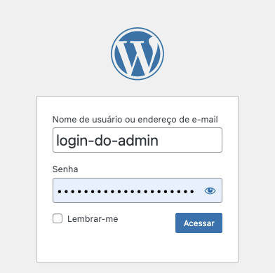
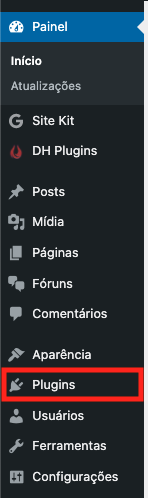
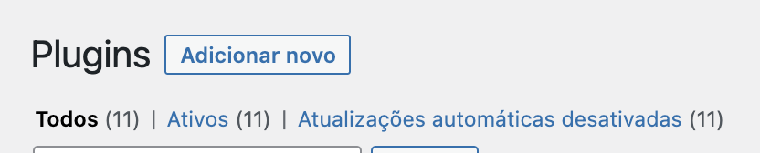
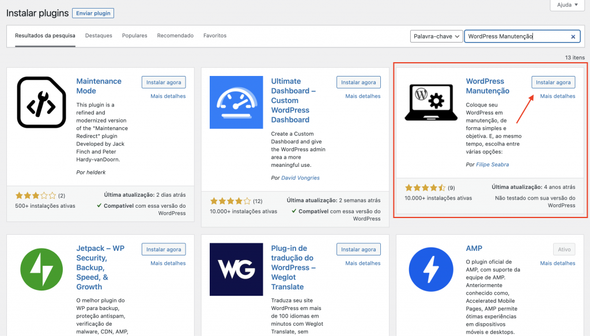
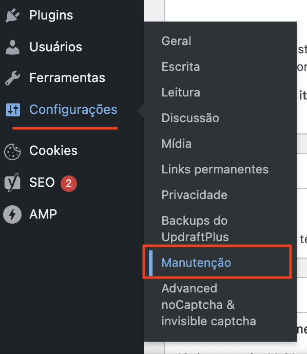
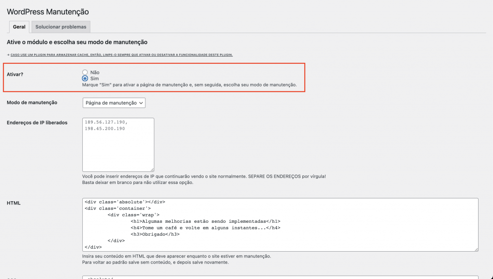
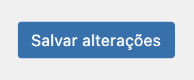
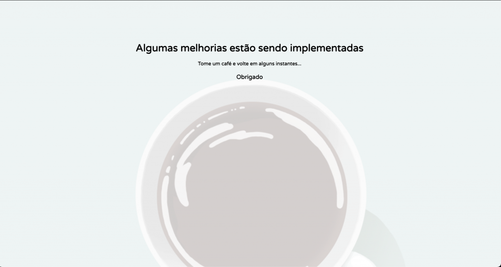

- - - - - -

Opa, blza? 😎 

No post de hoje irei mostrar uma das maneiras de colocar um site ou um blog WordPress em modo de manutenção. Muito útil quando você ainda está desenvolvendo, customizando templates, ou simplesmente deseja tirar o site/blog do ar por algum motivo.

O primeiro passo é acessar o painel WordPress como um login Admin.

Para isso, acesse a URL do seu Site/Blog e no final coloque /wp-admin que você será redirecionado para a URL de login, conforme imagem abaixo, em seguida insira os dados de acesso.

Tela de Login de Administração do WordPress

Após efetuar o login no WordPress, no menu lateral esquerdo, selecione a opção **Plugin**s:

Menu lateral esquerdo WordPress

Em seguida clique no botão **Adicionar novo:**

No canto direito da tela, no campo **“Pesquisar plugins…”** digite **“WordPress Manutenção”**.

Vai aparecer algumas opções de plugins que fazem o WordPress operar em modo de manutenção, selecione o plugins marcado conforme imagem abaixo, chamado **“WordPress Manutenção”** em seguida clique em **“Instalar agora”**.  

Tela de pesquisa de plugins do WordPress.

Depois do plugins ser instalado, clique em **“Ativar”**:

Feito isso o seu plugin encontra-se ativo e funcionando, mas para poder colocar o site ou blog em manutenção é preciso seguir os passos abaixo.

### ATIVANDO O MODO DE MANUTENÇÃO

Para ativar o modo de manutenção no WordPress é preciso clicar em **“Configurações”** e procure pela opção de Menu **“Manutenção”,** conforme mostra a imagem abaixo:

Opção de manutenção em Configurações do WordPress.

No menu **“WordPress Manutenção”**  basta marcar a opção **“Sim”** no campo **Ativar**, conforme mostra a imagem abaixo:

Tela WordPress Manutenção.

Não esqueça de **“Salvar alterações”** no botão no final da página:

Salvar alterações no WordPress Manutenção.

Após isso seu site ou blog já estará em modo de manutenção para os visitantes:

Tela de manutenção padrao.

Lembrando que é possível customizar essa tela de bloqueio de acordo com sua necessidade, você pode mudar o background, inserir dados de contato, etc.

- - - - - -

Dúvidas? Postem nos comentários!  
👋🏼 Até a próxima!

- - - - - -

**Johnny Ferreira**  
<johnny.ferreira.santos@gmail.com>  
<http://www.tidahora.com.br>

- - - - - -