- - - - - -

*Aprenda a instalar o servidor de chat interno para comunicação interna em empresas, neste artigo você irá ver a instalação do OpenFire em cima do Linux Ubuntu.*

OpenFire é um serviço de mensagens instantâneas muito utilizado em empresas em todo o mundo, o seu objetivo é facilitar a comunicação interna e manter uma segurança dos dados. O OpenFire trabalha em cima do protocolo XMPP.

Empresas que não necessitam ou não podem utilizar serviços de chat como Skype ou Hangouts, normalmente optam por utilizar o OpenFire para centralizar o serviço de comunicação corporativa.

- - - - - -

**Ambiente  
Servidor:** Linux Ubuntu 20.04 LTS

- - - - - -

**Passo 1: Atualizando o ambiente do sistema operacional**
----------------------------------------------------------

Para que tenhamos um sucesso maior na continuação da instalação, vamos rodar o update antes de iniciarmos de fato a instalação e configuração do serviço do OpenFire.

Execute no terminal do seu Ubuntu, o comando abaixo:


```
sudo apt update
```


**Passo 2: Instalando o JAVA JDK 8**
------------------------------------

O serviço do OpenFire roda em cima de JAVA, o primeiro passo para a instalação do OpenFire é instalar o JAVA e deixar o sistema preparado para receber o pacote de instalação do OpenFire.

No terminal, execute:


```
sudo apt-get install openjdk-8-jdk
```


Vai solicitar permissão para prosseguir com a instalação, clique **Y** e pressione **Enter** para autorizar a instalação:

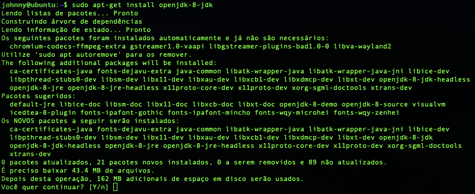

Testando se o JAVA foi instalado com sucesso, no terminal execute:


```
java -version
```


Irá receber o seguinte retorno na tela do terminal:

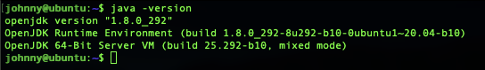

**Passo 3: Instalando o OpenFire**
----------------------------------

Para fazer o download o OpenFire na versão mais atualizada, visite: <https://www.igniterealtime.org/projects/openfire/>

No terminal do Linux Ubuntu, execute:

```
wget https://www.igniterealtime.org/downloadServlet?filename=openfire/openfire_4.6.3_all.deb -O openfire.deb
```

Após o download, vamos instalar o pacote com o comando abaixo:


```
sudo dpkg -i openfire.deb
```

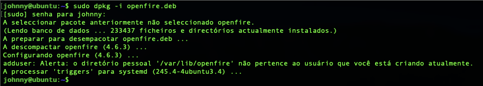

Em seguida, vamos iniciar o serviço do OpenFire no Linux Ubuntu:

```
sudo systemctl start openfire
```

E verificando se o mesmo foi iniciando com sucesso!


```
sudo systemctl status openfire
```


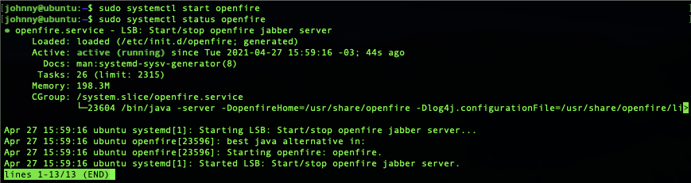


**Passo 4: Continuando a instalação via Web**
---------------------------------------------

A instalação do OpenFire é de fato muito simples de se realizar, o próximo passo agora é continuar a instalação via browser.

Para isso, acesse em seu navegador o endereço IP do servidor seguido da porta 9090, por exemplo: http://10.1.0.200:9090

Após acessar o endereço no navegador, a primeira tela abordada será a do idioma desejado, seleciona o idioma e continue:

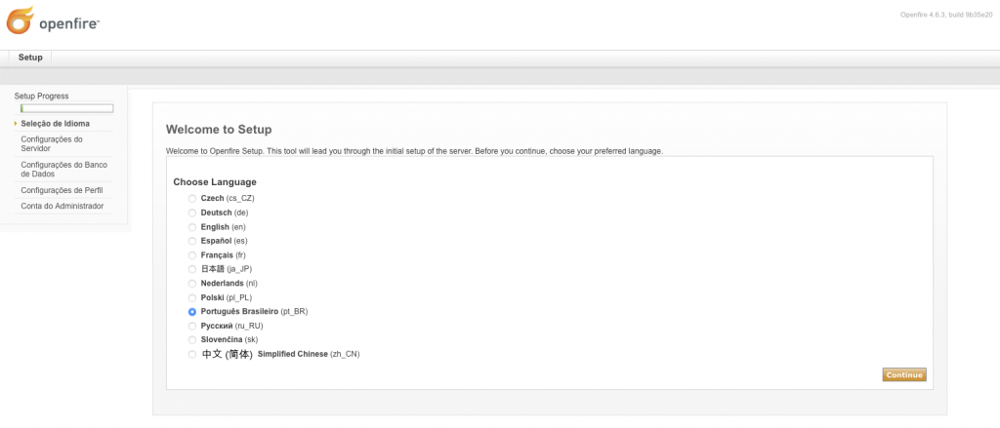

Na segunda tela é referente ao domínio utilizado no serviço, neste exemplo vou deixar default, mas caso você queira configurar um domínio, é nesta tela que precisa ser feito o ajuste:

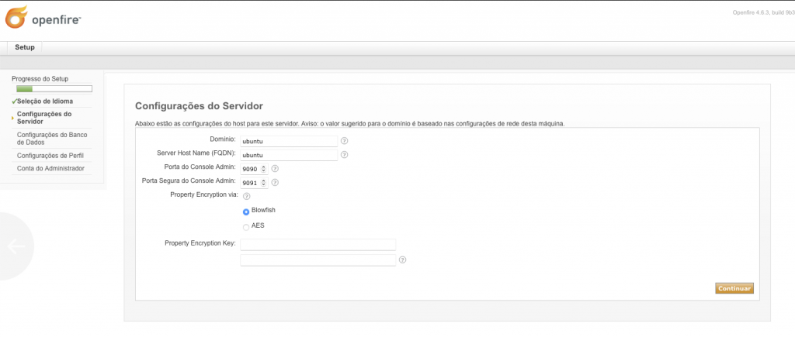

Na próxima tela, é referente ao Banco de Dados utilizado você pode utilizar diversos tipos de banco de dados, neste exemplo vamos usar o banco de dados próprio do OpenFire.

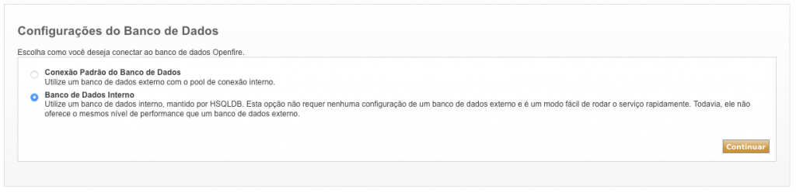

Configurações do Perfil de acesso ao OpenFire, você pode criar logins locais, mas pode também autenticar um Active Directory ou LDAP por exemplo, isso dependendo do tamanho da sua rede pode facilitar seu trabalho com a criação de grupos e usuários de acesso.

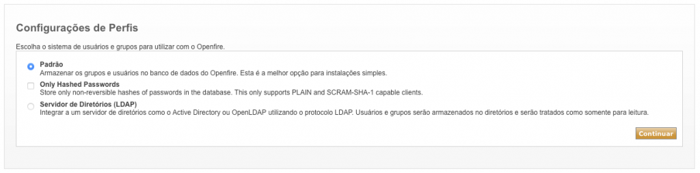

Na próxima tela iremos definir o Administrador da plataforma do Openfire.

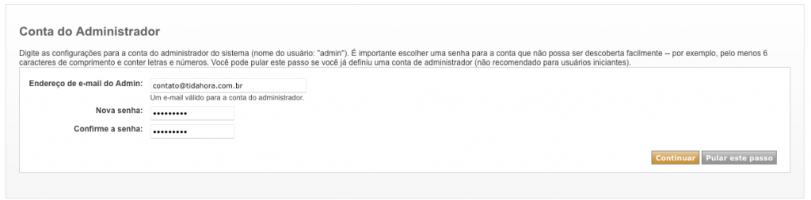

Após preencher as etapas acima, uma tela de conclusão será apresentada.

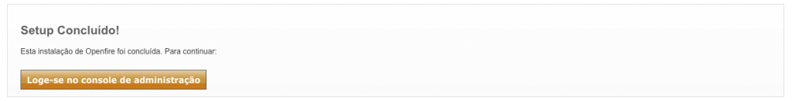

Clique no botão para logar-se no console de Administração.

O login é: admin e a senha é a que foi definida na última tela de configuração.

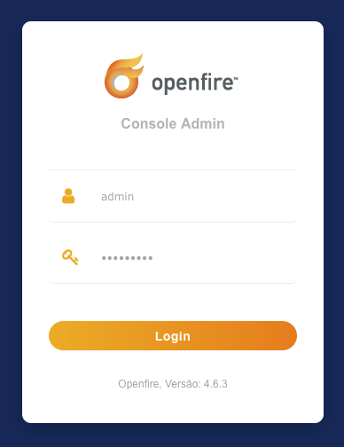

Feito isso o console de administração estará pronto para você criar os grupos, usuários, instalação de plugins entre outras funcionalidades.

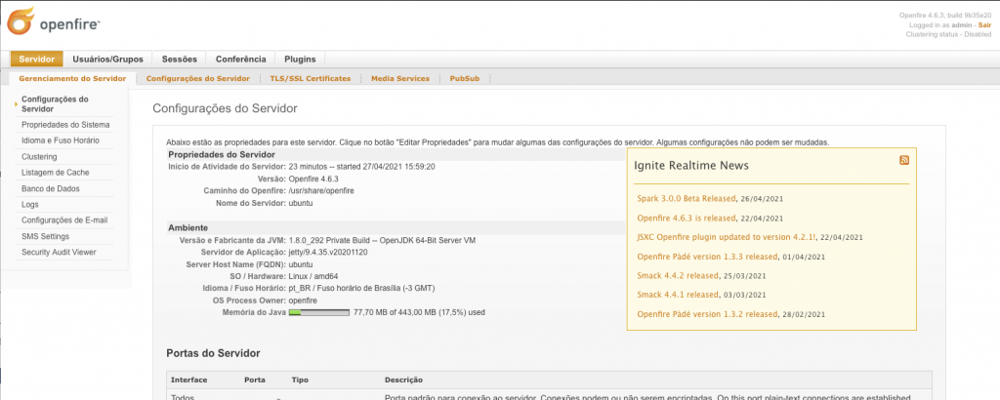

Se você precisar de clientes para o seu chat, uma dica é o Spark, porém existem outros, pesquise sobre.

Espero que de alguma forma este post lhe auxilie.

👋🏼 Até a próxima!

- - - - - -

**Johnny Ferreira**  
<johnny.ferreira.santos@gmail.com>  
<http://www.tidahora.com.br>

- - - - - -