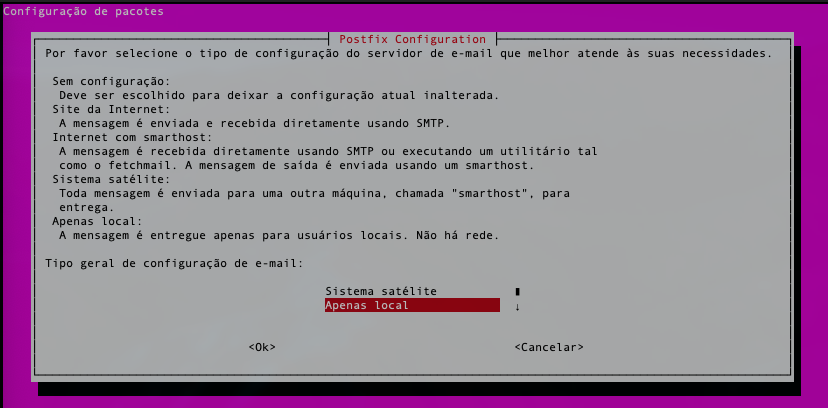
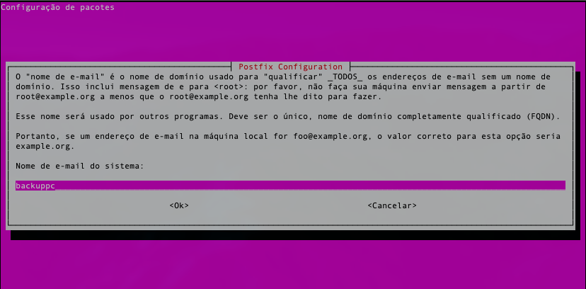
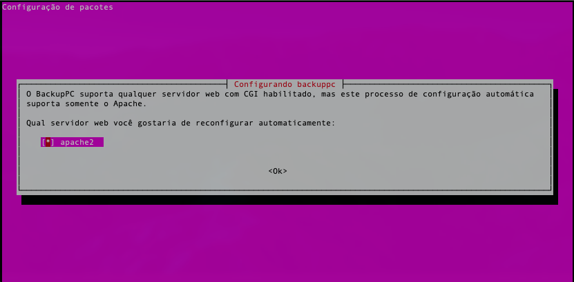
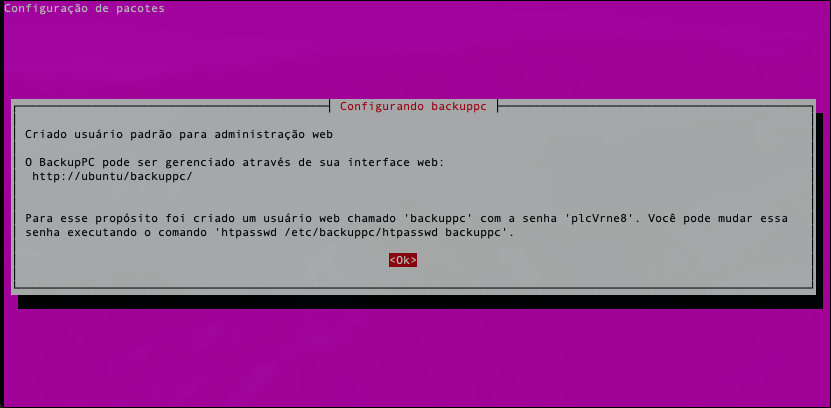
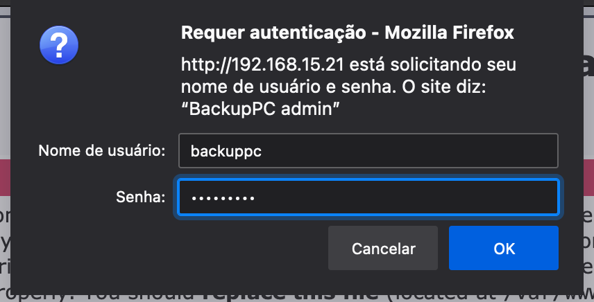
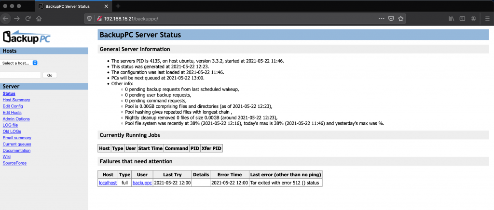

- - - - - -

*Servidor de Backup no Linux Ubuntu com o BackupPC*
---------------------------------------------------

O **BackupPC** é uma ferramenta para backup de dados, muito utilizado no ambiente corporativo, essa ferramenta vem se tornando necessária para o Administrador manter a segurança e integridade dos dados.  
É uma ferramenta de simples instalação e configuração, sua parte de restaurar os backups também é bem amigável.  
Para quem procura uma ferramenta de Backup, sem necessidade de pagar uma licença de software, sem a preocupação de que a ferramenta irá funcionar corretamente, e de fácil gerenciamento, o BackupPC pode lhe ajudar e muito.

[](../assets/img/uploads/2021/05/backup_animation.gif)

Visitem o site oficial e o site de documentação para maiores informações.

Site oficial [http://backuppc.sourceforge.net/](http://backuppc.sourceforge.net/ "http://backuppc.sourceforge.net/")  
Documentação [http://backuppc.sourceforge.net/faq/BackupPC.html](http://backuppc.sourceforge.net/faq/BackupPC.html "http://backuppc.sourceforge.net/faq/BackupPC.html")

- - - - - -

Informações sobre nosso cenário:
--------------------------------

**Servidor de Backup:**

- **Linux Ubuntu 20.04 LTS**
- **Endereço IP:** 192.168.15.21/24
- **Hostname:** ubuntu

- - - - - -

### 1. Atualizando o Sistema Operacional do Servidor

Vamos começar nosso processo de instalação do BackupPC com a atualização do sistema operacional do servidor.

Execute no terminal:

```
sudo apt update
sudo apt dist-upgrade
```

Aguarde o processo de update finalizar e então reinicie o server:

```
sudo reboot
```

### 2. Instalando o BackupPC

A instalação do BackupPC é tão simples, que é preciso de apenas um comando.

```
sudo apt install backuppc
```

Ao executar o comando acima, será levantando todas as dependências necessárias para o correto funcionamento do BackupPC no Ubuntu, apenas clique em Continuar.

Após confirmarmos a instalação do BackupPC e suas dependências, vamos iniciar a configuração do BackupPC.

Abaixo a primeira tela, referente a configuração do serviço de e-mail do BackupPC, utilizado para alertar os administradores sobre os Jobs de Backups, em nosso tutorial vou selecionar a opção “Apenas local”.



Informe o nome da conta de e-mail a ser utilizado pelo BackupPC:



Vamos selecionar o servidor web Apache2:



Informação sobre o acesso ao serviço do BackupPC, clique em OK:




### 3. Alterando a senha padrão de acesso ao BackupPC
-------------------------------------------------

Vamos alterar a senha default/padrão que vem com as configurações do BackupPC.

O login padrão é: backuppc

Execute o comando abaixo:


```
sudo htpasswd /etc/backuppc/htpasswd backuppc
```


*Saída do comando acima:*


```
New password: *************
Re-type new password: *************
Updating password for user backuppc
```


- - - - - -

### 4. Ajustando o serviço do BackupPC no Linux
-------------------------------------------

Vamos ajustar o serviço do BackupPC no Ubuntu para o mesmo iniciar junto ao boot do sistema operacional, assim não teremos problemas no futuro caso o servidor seja reiniciado por qualquer motivo.


```
sudo systemctl enable backuppc
```

*Saída do comando acima:*

```
backuppc.service is not a native service, redirecting to systemd-sysv-install.
Executing: /lib/systemd/systemd-sysv-install enable backuppc
```

Iniciando o serviço do BackupPC:

```
sudo systemctl start backuppc
```

Verificando o status do serviço:

```
sudo systemctl status backuppc
```

*Saída do comando acima:*

```
● backuppc.service - LSB: Launch backuppc server
     Loaded: loaded (/etc/init.d/backuppc; generated)
     Active: active (running) since Sat 2021-05-22 11:46:51 -03; 8min ago
       Docs: man:systemd-sysv-generator(8)
      Tasks: 2 (limit: 2315)
     Memory: 21.4M
     CGroup: /system.slice/backuppc.service
             ├─4135 /usr/bin/perl /usr/share/backuppc/bin/BackupPC -d
             └─4136 /usr/bin/perl /usr/share/backuppc/bin/BackupPC_trashClean

May 22 11:46:51 ubuntu systemd[1]: Starting LSB: Launch backuppc server...
May 22 11:46:51 ubuntu backuppc[4125]:  * Starting backuppc...
May 22 11:46:51 ubuntu backuppc[4125]:    ...done.
May 22 11:46:51 ubuntu systemd[1]: Started LSB: Launch backuppc server.
```

- - - - - -

### 5. Configurando o acesso SSH para os clientes de Backup
-------------------------------------------------------

Vamos ajustar o ssh do servidor de backup para poder se comunicar com os clientes de Backups via SSH / Rsync sem a necessidade de utilizar senhas.

Onde uma vez configurado um cliente de backup, sua autenticação para o servidor de backup será através de chaves do serviço de SSH.

Vamos começar redefinindo a senha de acesso ao bash do usuário backuppc.


```
sudo passwd backuppc
```


Após a alteração da senha de acesso ao bash com o login backuppc, execute o comando abaixo para irmos ao console:


```
su - backuppc
```


Em seguida no terminal, digite:


```
ssh-keygen
```


*Saída dos comandos acima:*


```
johnny@ubuntu:~$ sudo passwd backuppc
Nova senha: 
Redigite a nova senha: 
passwd: senha atualizada com sucesso
johnny@ubuntu:~$ su - backuppc
Senha: 
$ ssh-keygen    
Generating public/private rsa key pair.
Enter file in which to save the key (/var/lib/backuppc/.ssh/id_rsa): 
Created directory '/var/lib/backuppc/.ssh'.
Enter passphrase (empty for no passphrase): 
Enter same passphrase again: 
Your identification has been saved in /var/lib/backuppc/.ssh/id_rsa
Your public key has been saved in /var/lib/backuppc/.ssh/id_rsa.pub
The key fingerprint is:
SHA256:X5I0Bheg9a3+McybUkWS9tsPRzYVnkVrGMB/kvrCrhI backuppc@ubuntu
The key's randomart image is:
+---[RSA 3072]----+
|        +.+o.o o+|
|       o + o+ = =|
|      .   =.o=.=.|
|         o + ++oo|
|        S + o.o=.|
|       E o *. o o|
|        . +.*  o.|
|       .  .+ *  .|
|        ..oo=    |
+----[SHA256]-----+
```


O próximo passo é copiar a chave que geramos acima para os clientes de backups, utilize o comando abaixo para isso:


```
ssh-copy-id root@ip-do-servidor-cliente-backup
```


O comando acima, irá retornar algo semelhante:


```
/usr/bin/ssh-copy-id: INFO: Source of key(s) to be installed: "/var/lib/backuppc/.ssh/id_rsa.pub"
The authenticity of host 'ip-do-servidor-cliente-backup (ip-do-servidor-cliente-backup)' can't be established.
ECDSA key fingerprint is SHA256:UrmtPA/mOokAKSAOjPSPIKKSkksu.
Are you sure you want to continue connecting (yes/no/[fingerprint])? yes
/usr/bin/ssh-copy-id: INFO: attempting to log in with the new key(s), to filter out any that are already installed
/usr/bin/ssh-copy-id: INFO: 1 key(s) remain to be installed -- if you are prompted now it is to install the new keys
root@192.168.15.78's password: 

Number of key(s) added: 1

Now try logging into the machine, with:   "ssh 'root@ip-do-servidor-cliente-backup'"
and check to make sure that only the key(s) you wanted were added.
```


### 6. Ajustando o SSH do Cliente de Backup
---------------------------------------

Precisamos fazer mais um ajuste no serviço de SSH, só que dessa é do lado do cliente.

Vamos editar o arquivo de configuração de chaves autorizadas do serviço de ssh, vou utilizar o VIM, execute o comando abaixo com seu editor de texto favorito.


```
vim .ssh/authorized_keys
```

Adicione a seguinte linha abaixo antes da palavra **ssh-rsa**:

```
from="IP-Servidor-de-BackupPC",no-agent-forwarding,no-port-forwarding,no-pty
```

Exemplo:

```
from="192.168.15.21",no-agent-forwarding,no-port-forwarding,no-pty
```

Salve e feche seu arquivo após o ajuste acima.


### 7. Configurando o Apache para o BackupPC
----------------------------------------

O BackupPC por padrão vem configurado para acesso somente para o localhost, vamos precisar ajustar isso para que nossa rede local possa acessar o serviço do BackupPC via web.

Execute o comando abaixo no seu servidor BackupPC:

```
sudo vim /etc/apache2/conf-available/backuppc.conf
```

Procure pela linha abaixo: (Linha 22)

```
Require local
```

Vamos altera-lá para:

```
Require all granted
```

Salve e saia do arquivo, em seguida vamos reiniciar o serviço do Apache para validar a alteração.

```
sudo systemctl restart apache2
```


### 8. Acessando o BackupPC pela Interface Web
------------------------------------------

Abra seu navegador de preferência e digite o endereço abaixo:

<http://endereco-ip-servidor/backuppc>


Informe o login e a senha que criamos no passo 3.



Tela principal do BackupPC:



Para incluir um cliente no BackupPC é bem simples, basta configura-lo no menu Hosts, caso tenha dúvidas, consulte a documentação oficial do BackupPC.

<http://backuppc.sourceforge.net/faq/BackupPC.html>

- - - - - -

**Johnny Ferreira**  
<johnny.ferreira.santos@gmail.com>  
<http://www.tidahora.com.br>