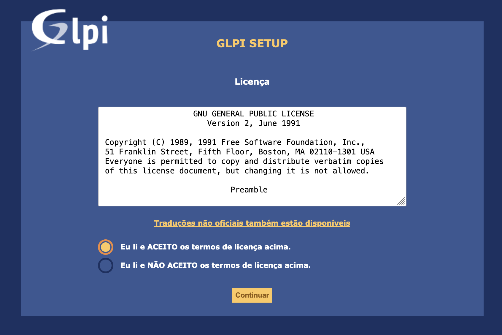
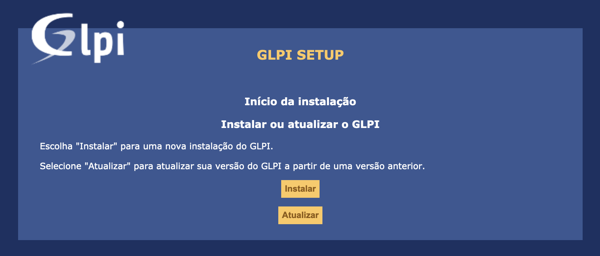
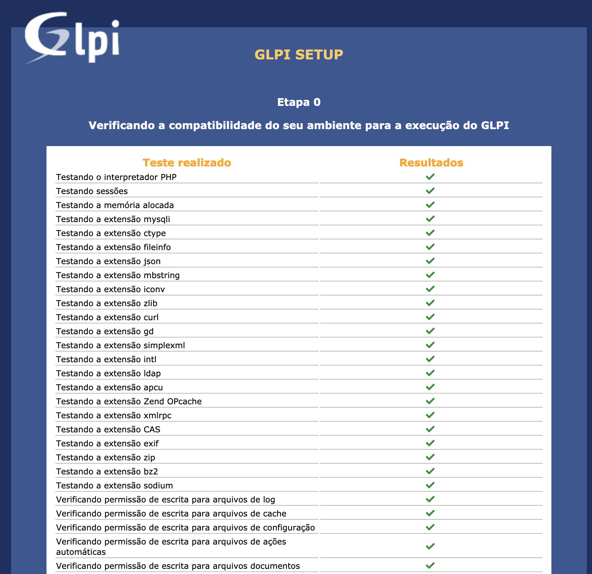
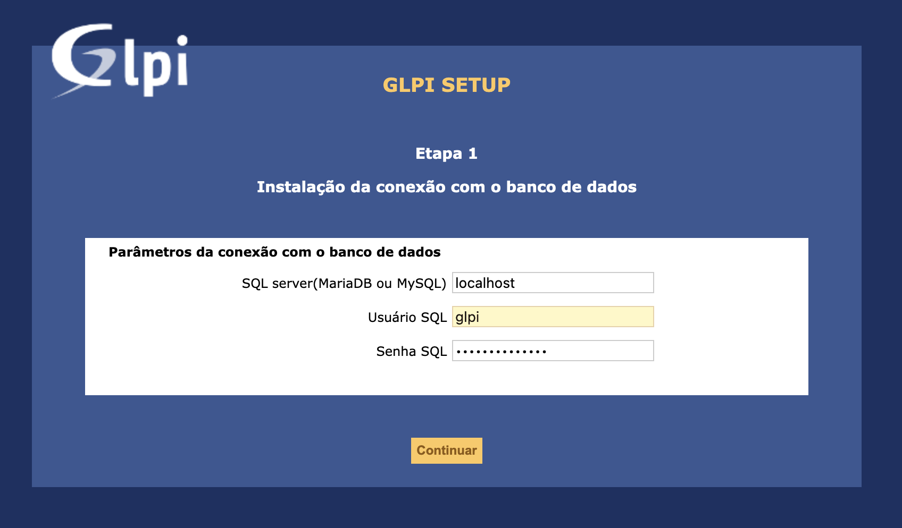
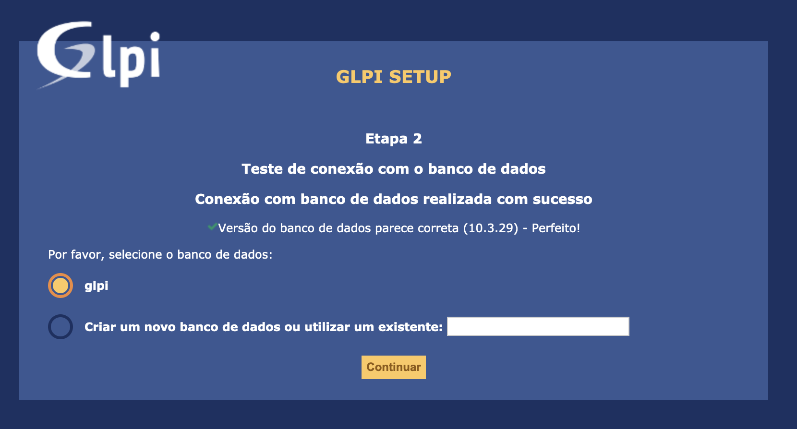
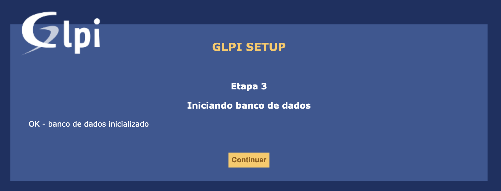
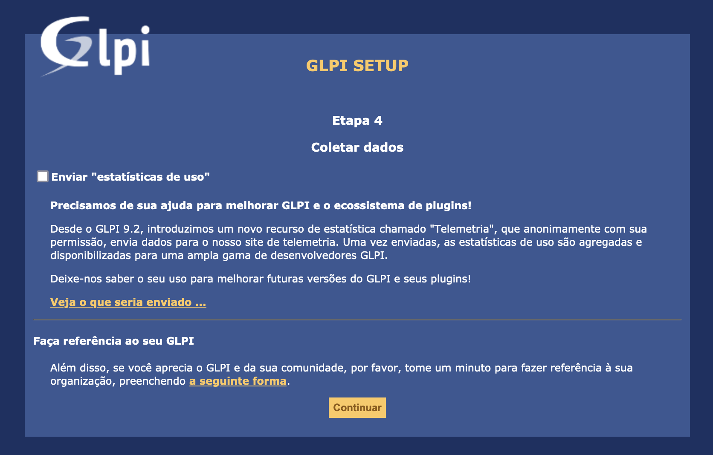
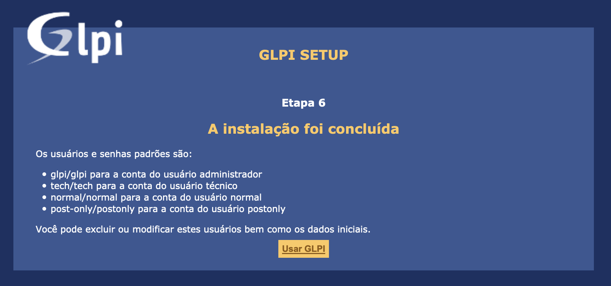
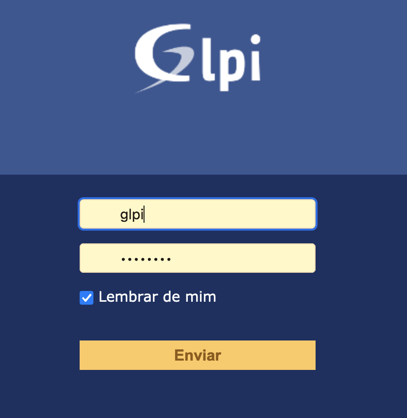
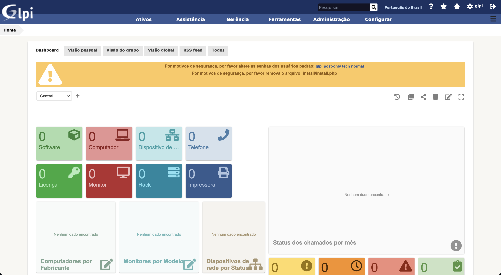

- - - - - -


Opa, blza? 😎 

No tutorial de hoje vou abordar a instalação do software GLPI, um software Open Source de gestão de Service Desk e gerenciamento de TI.

Se você não conhece o projeto GLPI, visite o site oficial, em <https://glpi-project.org/pt-br/>.

- - - - - -

##### Ambiente de Instalação

- Linux Debian 10 Buster
- Apache
- MariaDB Server
- PHP 7.3

##### Atenção!

Neste post não iremos configurar Hostname, Endereço IP e DNS do Servidor Linux Debian.

Faça estas etapas antes de iniciarmos a instalação do GLPI.

- - - - - -

##### Passo 1: Preparando o Ambiente do Sistema Operacional Linux

Para que tudo ocorra bem, e não tenhamos problemas com dependências ou com erros em nosso ambiente, é importante manter o sistema operacional Linux sempre atualizado, para isso iremos configurar os repositórios no Debian 10 e atualizar o sistema.

Antes de iniciarmos o procedimento de atualização, vamos fazer uma cópia do arquivo **sources.list** do Debian, execute:

```
cp -Rfa /etc/apt/sources.list{,.bkp}
```

Temos duas possibilidades de realizar a alteração do arquivo de repositórios, a primeira é editando o arquivo com um editor de texto de sua preferência, seja ele VI, VIM ou NANO e copiando e colando o conteúdo abaixo no arquivo “**/etc/apt/sources.list**“:

```
vi /etc/apt/sources.list
```

Conteúdo do arquivo:

```
## -- REPOSITORIOS DEBIAN 10 BUSTER -- ##

deb http://deb.debian.org/debian/ buster main non-free contrib
deb-src http://deb.debian.org/debian/ buster main non-free contrib

deb http://security.debian.org/debian-security buster/updates main contrib non-free
deb-src http://security.debian.org/debian-security buster/updates main contrib non-free

deb http://deb.debian.org/debian/ buster-updates main contrib non-free
deb-src http://deb.debian.org/debian/ buster-updates main contrib non-free

deb http://deb.debian.org/debian/ buster-backports main contrib non-free
deb-src http://deb.debian.org/debian/ buster-backports main contrib non-free
```

A segunda forma de atualizar o arquivo de repositórios é executando o comando abaixo:

```
cat << EOF |tee -a /etc/apt/sources.list
## -- REPOSITORIOS DEBIAN 10 BUSTER -- ##
deb http://deb.debian.org/debian/ buster main non-free contrib
deb-src http://deb.debian.org/debian/ buster main non-free contrib

deb http://security.debian.org/debian-security buster/updates main contrib non-free
deb-src http://security.debian.org/debian-security buster/updates main contrib non-free

deb http://deb.debian.org/debian/ buster-updates main contrib non-free
deb-src http://deb.debian.org/debian/ buster-updates main contrib non-free

deb http://deb.debian.org/debian/ buster-backports main contrib non-free
deb-src http://deb.debian.org/debian/ buster-backports main contrib non-free
EOF
```

Em seguida, execute o comando abaixo para atualizar os repositórios:

```
apt update -y && apt upgrade -y
```

- - - - - -

##### Passo 2: Instalação do Servidor Web Apache e PHP no Debian

A seguir o procedimento para a instalação do Servidor Web Apache no Linux Debian 10.

```
>apt install -y apache2
```

Em seguida vamos instalar o PHP 7.3 e suas dependências:

```
apt install -y php7.3 php7.3-curl php7.3-gd php7.3-json php7.3-mbstring php7.3-mysql php7.3-xml php7.3-intl php7.3-ldap php-apcu php7.3-xmlrpc php-cas php7.3-zip php7.3-bz2 php-gd php-apcu
```

- - - - - -

##### Passo 3: Instalação do Servidor de Banco de Dados – MariaDB no Debian

Execute o comando abaixo para iniciar a instalação do MariaDB Server no Debian:

```
>apt install -y mariadb-server
```

Em seguida executamos o procedimento de instalação segura do banco de dados MariaDB / MySQL:

Neste procedimento é executado a definição de senha do Root para acesso ao Banco, remove usuário anônimo, base de dados de teste e recarrega as opções que foram alteradas:

```
>mysql_secure_installation
```

Exemplo da saída do comando acima:

```
>NOTE: RUNNING ALL PARTS OF THIS SCRIPT IS RECOMMENDED FOR ALL MariaDB
      SERVERS IN PRODUCTION USE!  PLEASE READ EACH STEP CAREFULLY!

In order to log into MariaDB to secure it, we'll need the current
password for the root user.  If you've just installed MariaDB, and
you haven't set the root password yet, the password will be blank,
so you should just press enter here.

Enter current password for root (enter for none): 
OK, successfully used password, moving on...

Setting the root password ensures that nobody can log into the MariaDB
root user without the proper authorisation.

Set root password? [Y/n] Y
New password: ********
Re-enter new password: ********
Password updated successfully!
Reloading privilege tables..
 ... Success!


By default, a MariaDB installation has an anonymous user, allowing anyone
to log into MariaDB without having to have a user account created for
them.  This is intended only for testing, and to make the installation
go a bit smoother.  You should remove them before moving into a
production environment.

Remove anonymous users? [Y/n] Y
 ... Success!

Normally, root should only be allowed to connect from 'localhost'.  This
ensures that someone cannot guess at the root password from the network.

Disallow root login remotely? [Y/n] Y
 ... Success!

By default, MariaDB comes with a database named 'test' that anyone can
access.  This is also intended only for testing, and should be removed
before moving into a production environment.

Remove test database and access to it? [Y/n] Y
 - Dropping test database...
 ... Success!
 - Removing privileges on test database...
 ... Success!

Reloading the privilege tables will ensure that all changes made so far
will take effect immediately.

Reload privilege tables now? [Y/n] Y
 ... Success!

Cleaning up...

All done!  If you've completed all of the above steps, your MariaDB
installation should now be secure.

Thanks for using MariaDB!
```

Agora iremos iniciar o serviço do MariaDB no Linux:

```
>systemctl start mariadb
```

Vamos também ajustar o serviço para iniciar junto ao boot do sistema operacional, assim quando o servidor reiniciar, o MariaDB será iniciado junto no processo de inicialização do Debian.

```
systemctl enable mariadb
```

- - - - - -

##### Passo 4: Criando o Banco de Dados e Usuário de acesso ao Bando para o GLPI

Aqui iremos criar o banco de dados que iremos hospedar os dados da aplicação do GLPI:

Rode o comando abaixo para acessar o Console do MariaDB:

```
>mysql -u root -p
```

O primeiro passo é criar o banco de dados:

```
CREATE DATABASE glpi;
```

Agora iremos criar o usuário do banco de dados que iremos configurar na aplicação do GLPI:

```
CREATE USER 'glpi'@'localhost' IDENTIFIED BY 'password@glpi';
```

Em seguida, vamos configurar a permissão para o usuário “glpi” acessar e ter domínio sob o banco de dados “glpi”:

```
GRANT ALL PRIVILEGES ON glpi.* TO 'glpi'@'localhost';
FLUSH PRIVILEGES;
```

- - - - - -

##### Passo 5: Instalando o GLPI no Linux Debian 10

Estarei atualizando a última versão disponível da aplicação GLPI, porém, dependendo da data que você estiver vendo este tutorial, possa ser que tenha outras versões a frente mais atualizadas, então sempre verifique o site oficial do GLPI.

Versão utilizada: GLPI 9.5

No servidor Linux, vamos efetuar o download dos arquivos do GLPI, instale o **wget** caso não tenha em seu server.

```
>apt install -y wget
```

Fazendo o download dos arquivos.

```
wget https://github.com/glpi-project/glpi/releases/download/9.5.5/glpi-9.5.5.tgz
```

Descompactando os arquivos no diretório web desejado:

```
tar -xvf glpi-9.5.5.tgz -C /var/www/html/
```

Ajustando as permissões para o diretório web:

```
>chown -Rf www-data:www-data /var/www/html/glpi/
```

- - - - - -

##### Passo 6: Finalizando a instalação via Web

Agora que já configuramos tudo, o próximo passo é realizar a instalação da aplicação do GLPI pelo navegador, então acesse o endereço IP do seu servidor e siga as etapas de finalização de instalação:

Acesse no navegador: http://endereco\_ip/glpi

A primeira tela é para selecionar o idioma de instalação e uso da aplicação:


Aceite das licenças e termos de uso da aplicação:



Em seguida é questionado se a instalação é uma nova instância ou atualização, clique em **Instalar:**



A próxima tela irá apresentar se os requisitos foram atingidos, caso não tenha algum pacote php será apresentado nesta tela para resolver antes de continuar a instalação.



No final da tela acima, terá os botões abaixo:


Clique em **Continuar** se estiver tudo ok com seu ambiente Web.

Insira os dados do banco de dados que criamos nos passos anteriores:



Selecione o banco de dados que criamos anteriormente:



Confirmação do Banco de dados inicializado com sucesso!



Na tela seguinte, clique em **Continuar:**



Na tela 5, é apresentado uma tela de doação, siga em frente, ou doe caso ache necessário.

Na próxima tela é apresentado os logins de acesso ao GLPI, anote e salve para o primeiro acesso:



Tela de login:



Após efetuar o Login, a tela inicial do GLPI:



Instalação finalizada.

Agora precisamos remover o diretório de instalação da aplicação do diretório Web:

```
>rm -rf /var/www/html/glpi/install/
```

Feito isso é só começar a customizar a aplicação as suas necessidades.

- - - - - -

Dúvidas? Postem nos comentários!  
👋🏼 Até a próxima!

- - - - - -

**Johnny Ferreira**  
<johnny.ferreira.santos@gmail.com>  
<http://www.tidahora.com.br>

- - - - - -

Johnny Ferreira