- - - - - -


Opa, tudo bem?

No tutorial de hoje vou abordar a configuração da autenticação de grupos e usuários de uma base LDAP / Active Directory no GLPI.

Dessa forma é possível mapear todos os grupos e usuários presentes na estrutura da árvore de um serviço de controlador de domínio Active Directory.

- - - - - -

Com uma login Admin no **GLPI** acesse os menus **Configurar &gt; Autenticação:**

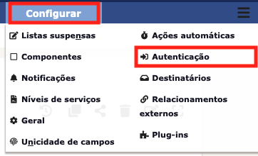

Em seguida selecione a opção **Diretórios LDAP**

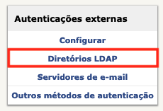

Clique no ícone de adicionar um novo diretório LDAP:

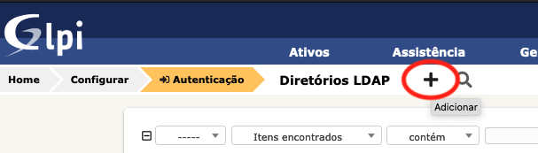

Será apresentado a tela abaixo para iniciarmos a configuração do servidor de autenticação LDAP / AD:

**Atenção! Para essas etapas você irá precisar das informações abaixo:**

Domínio;
Endereço IP do Servidor LDAP/AD;
Login com permissão de Domain Admin;

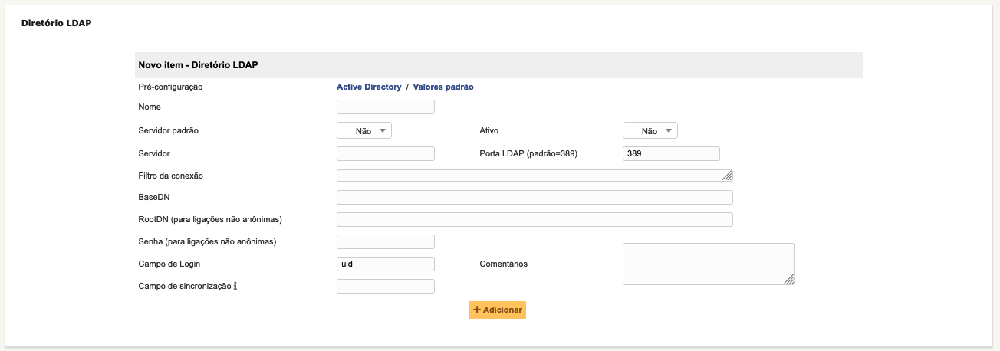

**Preencha os dados conforme abaixo:**

```
Nome: meu-domínio

Servidor Padrão: Sim
Ativo: Sim

Servidor: Endereço IP do Servidor AD/LDAP
Porta LDAP (padrão=389): 389

Filtro de conexão: (&(objectClass=user)(objectCategory=person))

BaseDN: dc=DOMINIO,dc=LOCAL

RootDN (para ligações não anônimas): usuario_domain_admin@dominio.local

Senha (para ligações não anônimas): **********

Campo de Login: SaMAccountName
```

Imagem abaixo mostrando como ficou configurado neste exemplo, não se esqueça de clicar em **Salvar:**

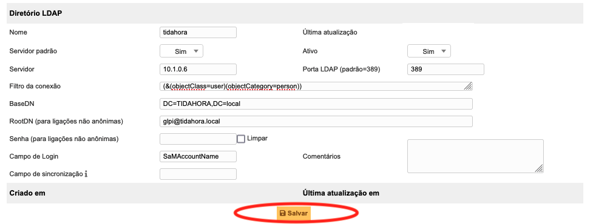

Após salvar as configurações realizadas anteriormente, clique no **Menu lateral – Testar** e clique em **Testar** para verificar se as configurações estão corretas:

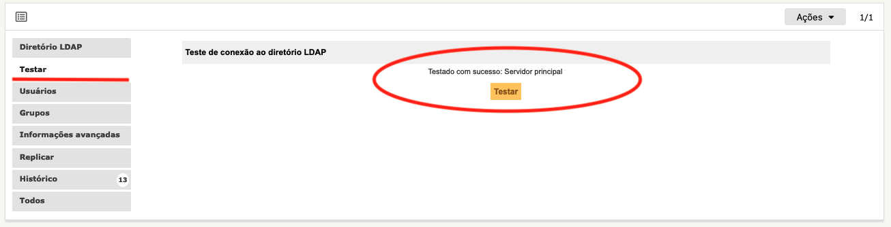

Caso a mensagem retorne: **Testado com sucesso** deu tudo certo, vamos seguir em frente com o restante das configurações:

No menu lateral, clique em **Usuários:**

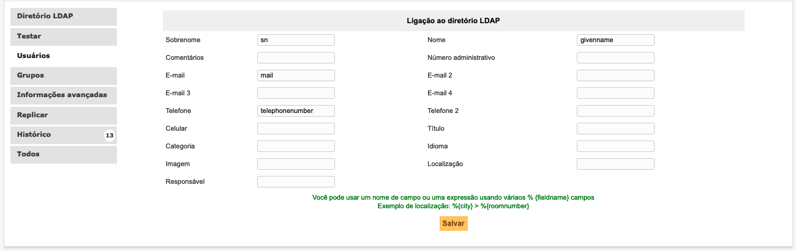

Ajuste sua tela com as informações abaixo:

**Sobrenome:** sn

**Nome:** givenname

**E-mail:** mail

**Telefone:** telephonenumber

Não se esqueça de salvar as configurações.

Em seguida, no menu lateral, clique em **Grupos:**

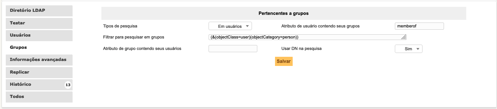
Ajuste conforme as configurações:

**Tipos de pesquisa:** Em usuários

**Atributo de usuário contendo seus grupos:** memberof

**Filtrar para pesquisar em grupos:** (&amp;(objectClass=user)(objectCategory=person))

**Usar DN na pesquisa:** Sim

Não se esqueça de salvar as configurações.

Agora que temos as configurações corretas, clique no Menu superior **Administração &gt; Usuários:**

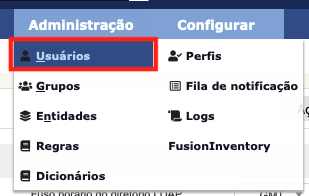

Clique em **Link do diretório LDAP:**

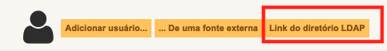

Selecione a opção **Importar novos usuários**

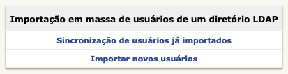

Clique em **Modo Avançado**:

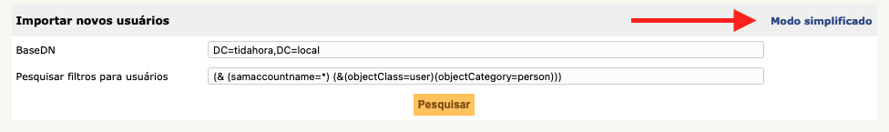

Insira os dados de filtro de pesquisa nos campos:

**BaseDN:** DC=dominio,DC=local

**Pesquisar filtros para usuários:** Pesquisar filtros para usuários

Depois clique em **Pesquisar.**

Em seguida irá aparecer os seus usuários do seu domínio.

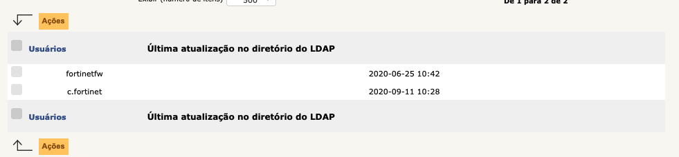

Selecione os usuários, e clique no botão de **Ações** e selecione a ação **Importar,** então clique em **Enviar:**

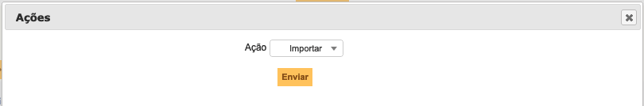

Repita o processo para o grupo, basta ir no menu **Administração &gt; Grupos** e selecionar **Link do diretório LDAP**.

Este é o processo de integração do LDAP/AD com GLPI.

Dúvidas, comentário e sugestões postem nos comentários…  
👋🏼 Até a próxima!

- - - - - -

**Johnny Ferreira**  
<johnny.ferreira.santos@gmail.com>  
<http://www.tidahora.com.br>

- - - - - -