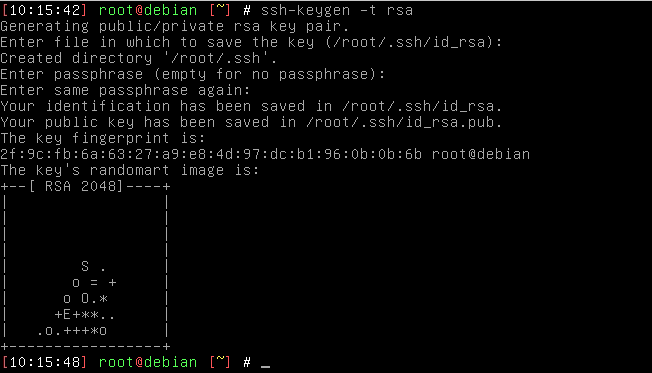
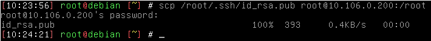
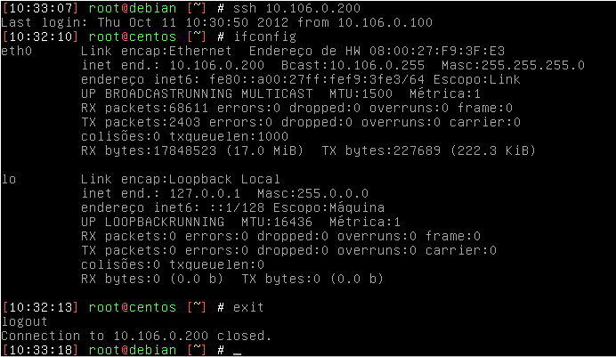

- - - - - -

Olá, 🐧

Mais uma dica da hora sobre ambientes Linux, aprenda aqui nesse post como ter uma conexão sem senha entre dois servidores linux, ou até mesmo um host e um servidor, 😉

Nosso ambiente de implementação utilizado é o seguinte:  
 **Um Cliente:** Debian Squeeze  
**IP:** 10.106.0.100

**Um Servidor:** CentOS 6.3  
**IP:** 10.106.0.200

#### Gerando as Chaves no Cliente (Debian Squeeze – IP: 10.106.0.100)

```
ssh-keygen -t rsa
```



Note que será pedido para digitar com a “passphrase” apenas tecle ‘enter’ para que fique em branco, se digitar algo está frase precisará ser digita quando solicitada. Feito isso, temos as chaves criadas.

Chave Pública encontra-se em *“/root/.ssh/id\_rsa.pub”* Chave Privada encontra-se em *“/root/.ssh/id\_rsa”*


#### Ajustando o Servidor

Para efetuar a conexão SSH sem a senha entre cliente e server, vamos precisar divulgar para o servidor a Chave Pública gerado em nosso cliente.

Vamos então copia-lá para o servidor:

```
scp /root/.ssh/id_rsa.pub root@10.106.0.200:/root
```



Agora vamos ao console do Servidor para continuar o procedimento:

```
cat /root/id_rsa.pub >> /root/.ssh/authorized_keys
```


Acabamos de fazer a cópia do arquivo `id\_rsa.pub` do cliente para o servidor, e na sequencia jogamos a chave para o arquivo `authorized\_keys`.

Com isso já podemos efetuar as conexões do cliente para o servidor sem senha.



**Observações:** Não é totalmente seguro. Sempre bom trocar a chave entre cliente e servidor.

👋🏼 Até a próxima!

- - - - - -


**Johnny Ferreira**  
<johnny.ferreira.santos@gmail.com>  
<http://www.tidahora.com.br>

- - - - - -