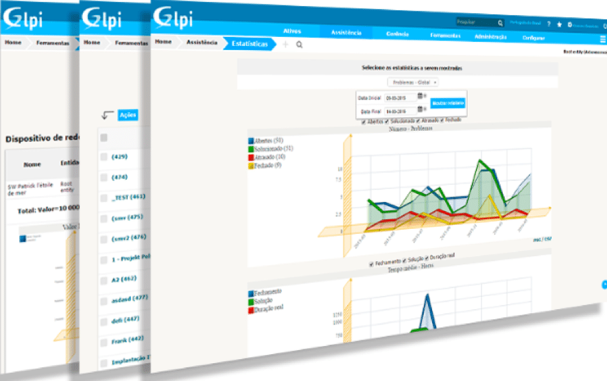

- - - - - -

Estruturar um departamento de atendimento de TI não é uma tarefa simples, ocorrem diversas dúvidas que surgem na hora de colocar o plano ou o MVP em prática, por exemplo, qual tipo de profissional contratar, quais ferramentas serão necessário para um departamento de Service Desk de TI e como monitorar a produtividade deste departamento e dos colaboradores.

Compartilho neste post algumas dicas que podem te ajudar a estruturar um ótimo departamento de Service Desk de TI.

Não existe uma formula mágica ou receita certa para este tipo de departamento, mas alguns pontos são essenciais para ter um bom departamento de Service Desk, os pontos que iremos tratar neste post são:

1 – Pessoas;  
2 – Sistema de Service Desk;  
3 – Ferramentas de Acesso Remoto;  
4 – Gestão de Atendimento;

### 1 – Pessoas
---------------

O ponto principal de um departamento de atendimento, independente do segmento que seja, são as pessoas, contratar as pessoas certas fará com que o seu departamento de Service Desk seja diferente de outros, que tenha mais qualidade, empatia e pró-atividade.

[]

**Abaixo listo algumas características essenciais que o profissional de Service Desk deve ter, fique atendo no processo seletivo aos itens abaixo:**

- Comunicação clara e objetiva; 
- Pró-atividade e facilidade em resolver problemas; 
- Ter empatia com os demais;  
- Ser colaborativo; 
- Saber trabalhar bem em equipe; 
- Organizado; 
- Ter boa escrita para responder os chamados; 
 
**Na lista de conhecimentos técnicos é interessante avaliar:** 

- Conhecimentos em Sistemas Microsoft Windows, Linux ou Mac OS, depende o que sua empresa mais utiliza; 
- Conhecimentos em Suítes Office, como Microsoft Office, LibreOffice ou Google Docs; 
- Conhecimento em Ferramentas de Acesso Remoto, como TeamViewer, VNC ou AnyDesk por exemplo; 
- Conhecimentos Básicos em Redes de Computadores, (IPv4, Ping, Traceroute e configuração de rede em sistemas Windows); 
- Conhecimentos Básicos em Banco de Dados, como MySQL, SQL Server ou Postgres por exemplo; 
 
Para obter um sucesso maior na efetivação do colaborador ideal para sua empresa é interessante contar com o apoio de um profissional de recrutamento e seleção, ele poderá auxiliar a encontrar no mercado o profissional que preencha os requisitos necessários para a vaga.

Além dos itens acima, elabore uma prova técnica com no máximo 10 questões sobre conhecimentos em informática, assim você conseguirá identificar 2 itens de forma indireta no candidato, são eles, a escrita e os conhecimentos técnicos necessários para exercer a função.

Faça perguntas do tipo: **"Qual o comando utilizado no prompt de comandos do Windows 10 para verificar o endereço IP do computador?"**

A resposta deve ser: **"ipconfig ou ipconfig /all"**, com este tipo de pergunta você consegue avaliar se o candidato realmente sabe o que precisa ser feito no dia a dia.

- - - - - -

### 2 – Sistema de Service Desk
-------------------------------

Um bom departamento de Service Desk precisa ter um sistema de chamados, hoje em dia existem uma variedades de ferramentas para esta finalidade, estarei mostrando aqui duas ferramentas que podem auxiliar o seu departamento de Service Desk a ser mais pró-ativo, organizado e facilitar sua vida na hora de gerar relatórios sobre o departamento para apresentar a sua diretória por exemplo.

[]

O **GLPI** é uma ferramenta de Service Desk que está sob a licença Open Source, ou seja, não possui nenhum custo com licenciamento de software para sua implementação.  
O **GLPI** é uma ferramenta completa para gerenciar os seguintes itens:

- Abertura de chamados;
- Documentações técnicas;
- Inventário de computadores e ativos de redes;
- Relatórios de atendimentos;
- Base de conhecimentos;
 
  
Se você deseja implementar o **GLPI** na sua organização, confira o post que fiz referente a Instalação do **GLPI** clicando [aqui](https://tidahora.com.br/instalando-o-glpi-no-linux-centos-7/).

Outro software semelhante ao **GLPI** é o **OTRS**, confira mais sobre ele em <https://otrs.com/pt/home/>

- - - - - -

### 3 – Ferramentas de Acesso Remoto
------------------------------------

Para que o atendimento seja feito com agilidade é necessário algumas ferramentas para tornar o trabalho dos analistas de service desk mais fácil, as ferramentas de acesso remoto podem auxiliar não somente o departamento de TI mas a empresa como um todo, tornando os processos de atendimento mais agéis, minimizando o tempo de um colaborador de outro departamento com problemas no computador por exemplo, reduzindo o tempo de baixa produtividade por uma falha operacional de TI.

[]

Abaixo listo algumas ferramentas que podem ser muito útil no dia a dia de um setor de Service Desk:

- [TeamViewer](https://www.teamviewer.com/pt-br)
- [AnyDesk](https://anydesk.com/pt)
- [VNC](https://www.realvnc.com)
- [Chrome Remote Desktop](https://remotedesktop.google.com/)
 
- - - - - -

### 4 – Gestão de Atendimento
-------------------------

A Gestão de Atendimento do setor de Service Desk de TI é o ponto chave para que todas as peças descritas anteriormente atuem de forma unificada na estrutura de TI. Não basta ter somente as pessoas certas mas não fornecer as ferramentas necessárias para que as mesmas possam executar sua função de forma pró-ativa e com qualidade, da mesma forma que não adianta ter ótimas ferramentas mas não ter as pessoas certas para as utilizarem.

A Gestão de Atendimento é formada pela gestão de pessoas do time de TI juntamente com a analise dos dados do departamento, esses dados são compostos pelo número de atendimentos realizados, o nível de satisfação dos usuários e o tempo médio de atendimento.

Defina algumas KPI’s para monitorar o atendimento do setor de Service Desk de TI, algumas KPI’s interessantes para este tipo de departamento são:

- SLA de Atendimento dos chamados;
- Nível de Satisfação dos Atendimentos;
- Tempo médio de atendimento VS Técnico
 
É interessante estruturar as KPI’s de acordo com as necessidades do seu ambiente, monitorar os dados de atendimento é uma tarefa que precisa ser feita diariamente, dessa forma você como gestor de TI estará a frente dos problemas, podendo identificar gaps operacionais não somente do seu departamento mas em outros departamentos, e assim poder ajudar os demais gestores da empresa a alavancarem suas operações com o apoio da TI.  
Dessa forma é possível identificar erros constantes em computadores, sistemas e até mesmo colaboradores que possuem dificuldades de executar ações que podem gerar erros em sistemas de informação.

Além do monitoramento das KPI’s é interessante utilizar ferramentas de BI para facilitar a visualização dos dados e tornar a tomada de decisões mais estratégicas, atualmente no mercado existem várias ferramentas para esta finalidade, cito aqui o [Google Data Studio](https://datastudio.google.com/u/0/navigation/reporting) para criar e automatizar relatórios de atendimentos.

Outro ponto que pode ser favorável é o alinhamento e a boa comunicação entre o gestor e os colaboradores de TI, o gestor deve ter a capacidade analítica, ser bom ouvinte e saber resolver problemas de conflitos internos, abaixo listo algumas dicas que pode facilitar o trabalho do gestor junto a sua equipe:

- Atue com uma gestão horizontal, seja parte do time, não o chefe, mas sim o ponto de apoio dos colaboradores;
- Faça reuniões de Feedbacks com seus liderados, busque apresentar o que vem dando certo e o que vem dando errado, seja claro, objetivo e direto nos apontamentos, e o mais importante, seja transparente com seus colaboradores;
- Crie uma rotina semanal de checklist dos itens a serem realizados na semana, crie uma agenda para as tarefas, isso pode ser feito via Trello por exemplo, defina datas de entregas e donos das tarefas;
- Faça reuniões de 1:1 de 5 a 10 minutos com seus liderados para conversar com eles, busque saber se eles estão felizes no trabalho, em casa, em seus relacionamentos, busque identificar qual é o propósito de vida daquele colaborador, assim você conseguirá ajuda-lo a alcançar seus objetivos alinhando o propósito de vida com as qualidades de entregas a serem feitas no ambiente de trabalho;
- Reconheça seus colaboradores, isso é essencial para que eles saibam que o que fazem faz a diferença para a empresa;
- Estruture um plano de carreira que sirva de apoio para guia-los a se desenvolverem dentro da empresa;
 
- - - - - -

### Conclusão

Este post tem por objetivo mostrar a base para estruturação de um setor de Service Desk, lembrando que cada empresa possui um cenário diferente, e o que pode ser funcional para uma empresa, talvez para outra empresa não seja o ideal, por isso é importante a avaliação das ferramentas a serem implementadas no cenário corporativo.

O ponto chave para o sucesso do departamento de Service Desk é um conjunto entre pessoas, ferramentas e gestão. Se você conseguir alinhar esses três itens certamente terá um departamento de TI que estará atuando de forma pró-ativa em busca dos melhores resultados de atendimento.

Espero que de alguma forma o conteúdo postado aqui seja útil em algum momento de sua carreira profissional.

Abraços!

Dúvidas, comentário e sugestões postem nos comentários.
👋🏼 Até a próxima!

- - - - - -

**Johnny Ferreira**  
<johnny.ferreira.santos@gmail.com>  
<http://www.tidahora.com.br>