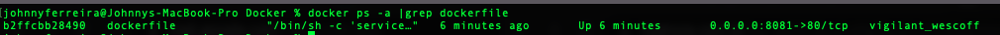
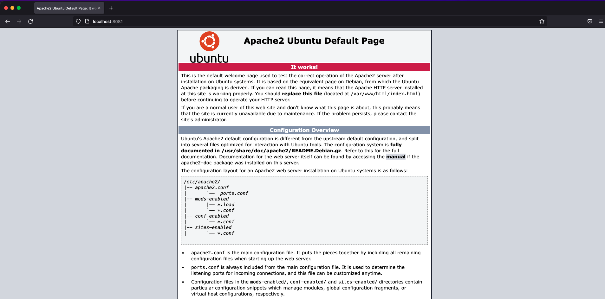

Uma dica para quem deseja levantar um ambiente web server para testar suas aplicações.

Neste exemplo, vamos utilizar o Apache Web Server no Ubuntu para construir nossa imagem do Docker File.

Para isso precisamos seguir os passos abaixo para construir nosso arquivo Docker.

- - - - - -

### Passo 1: Construção do Docker File

Utilizando o seu editor de texto vamos criar um arquivo Docker com o conteúdo abaixo:

```
FROM ubuntu:20.04

RUN apt update -y && \
apt upgrade -y && \
apt -y install software-properties-common && \
apt -y install apache2 libapache2-mod-fcgid composer && \
a2enmod rewrite actions fcgid alias proxy_fcgi && \
add-apt-repository ppa:ondrej/php && \
apt-get update && \
apt install -y php7.4 php7.4-cli php7.4-fpm php7.4-json php7.4-common php7.4-mysql php7.4-zip php7.4-gd php7.4-mbstring \
php7.4-curl php7.4-xml php-pear php7.4-bcmath

ENTRYPOINT service apache2 start && service php7.4-fpm start && bash
```

Salve o arquivo e em seguida iremos ao passo número 2.

- - - - - -

### Passo 2: Compilando a imagem

Agora que já criamos nosso Docker File do Web Server, o próximo passo é compilar a imagem que criamos.

Para isso execute o comando abaixo:

```
sudo docker build -t "dockerfile" .
```

- - - - - -

### Passo 3: Rodando a imagem

O próximo passo consiste em executarmos nossa imagem, para isso execute:

```
docker run -d -p 8081:80 --detach=true -t dockerfile /bin/bash
```

- - - - - -

### Passo 4: Verificando o Status do Container

Verifique se o Container está rodando.

Digite o comando abaixo para listarmos o container com nome de “dockerfile”, caso você tenha utilizado um nome diferente, não esqueça de altera-lo.

```
docker ps -a |grep dockerfile
```



- - - - - -

### Passo 5: Acessando o Web Server

Agora é só acessar o endereço localhost:8081 para visualizar a página inicial do Apache no Ubuntu.



Agora é só usar sua imaginação para hospedar suas aplicações ou alterar o conteúdo do Docker File e assim estruturar melhor seu webserver.

Dúvidas, comentário e sugestões postem nos comentários.
👋🏼 Até a próxima!

- - - - - -


**Johnny Ferreira**  
<johnny.ferreira.santos@gmail.com>  
<http://www.tidahora.com.br>