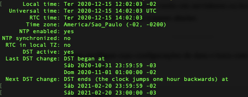
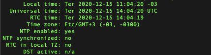

- - - - - -

Se você está enfrentando problemas em servidores Linux que podem não estar conectando a serviços de redes, atualizando de forma incorreta, alguns serviços de autenticação pararam de funcionar, provavelmente seja porque ele se encontra com o horário de verão ativo, como sabemos no Brasil não teremos mais o horário de verão conforme foi determinado pelo governo Brasileiro.

Para desativar o horário de verão em servidores ou hosts Linux é muito simples, confira o passo-a-passo abaixo.

- - - - - -

Antes verifique suas configurações de data e hora com o comando "timedatectl":


```
timedatectl
```




Na imagem acima temos a saída do comando "timedatectl", onde o parâmetro de DST active está marcado com yes, informando que encontra-se ativo o horário de verão no host.

Para desativar, iremos recriar o arquivo com as configurações que precisamos ter com o DST inativo.

Remova o arquivo abaixo:


```
rm -rf /etc/localtime
```

Após remover o arquivo responsável pelo armazenamento de ajustes de data e hora no sistema linux, precisamos criar um link simbólico para o diretório que contém o fuso horário sem o horário de verão ativo.


```
ln -s /usr/share/zoneinfo/Etc/GMT+3 /etc/localtime
```

Após isso basta executar o comando "date" para verificar se o horário foi alterado para a hora correta.


```
date
```

Execute novamente o comando "timedatectl" para checar se a opção de DST foi desativada como desejado:


```
timedatectl
```




Feito isso seu sistema não será mais atualizado para horário de verão sem que você o ajuste para isso.

Dúvidas, comentário e sugestões postem nos comentários.
👋🏼 Até a próxima!

- - - - - -


**Johnny Ferreira**  
<johnny.ferreira.santos@gmail.com>  
<http://www.tidahora.com.br>