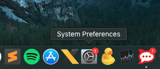
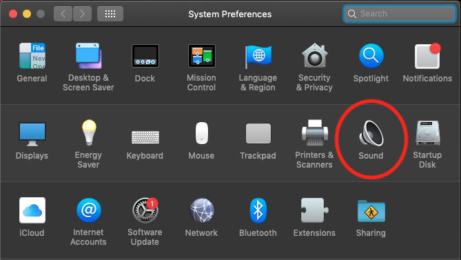
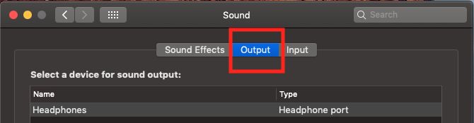
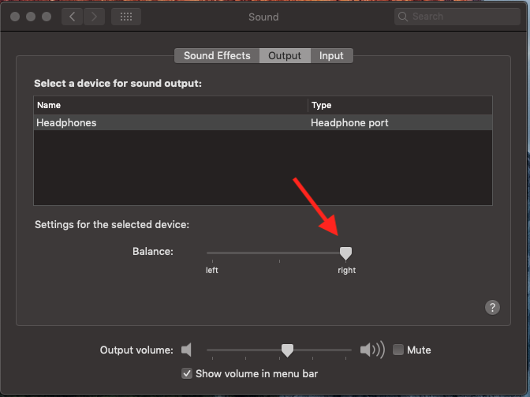
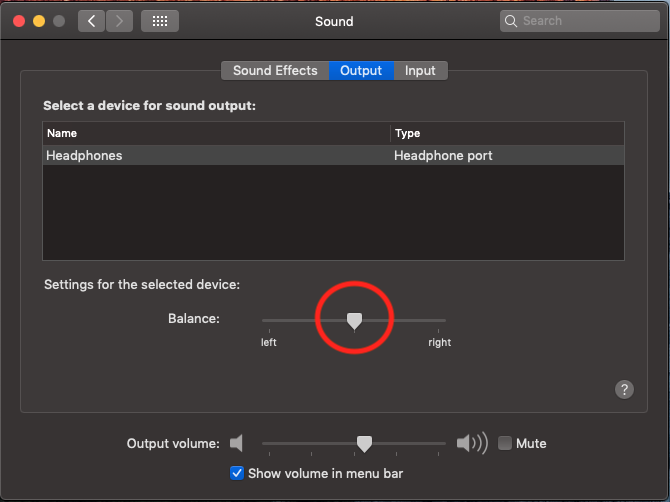

- - - - - -

Hello my friend, how are you?

Headphones always cause problems, right?
Right, but what about cases where you change the headset and the problem still persists. What to do?

Well, if you are a user of Apple equipment, be it any line of Macbook, Mac mini or even iMac, you may at some point realize that your headphones, the beloved headphones, only work on one side.

I went through this recently, I put on a headset and it only worked on one side, I thought, the headset broke, shit! But then I put another headphone in, and the same side still worked. Stranger! Either I'm deaf on one side or my Mac is defective.

I thought about formatting and reinstalling OS What did I do here to solve it and avoid formatting or even wanting to buy another Macbook.

Click **System Preferences:**

Then click on **SOUND:**

Then click on the **Output** tab:

Now comes the unknown witchcraft, lol.
Note that the sound balance is only for the right side:

It's simple to solve, just leave it centered.

Problem solved, well, at least here in this case that happened to me, and maybe the same thing could happen to you too!

I hope this solves it for you, but if it doesn't, it's a good idea to contact Apple support.

Questions, comments and suggestions post in the comments…
👋🏼 Until next time!

- - - - - -

  
**Johnny Ferreira**  
<johnny.ferreira.santos@gmail.com>  
<http://www.tidahora.com.br>  